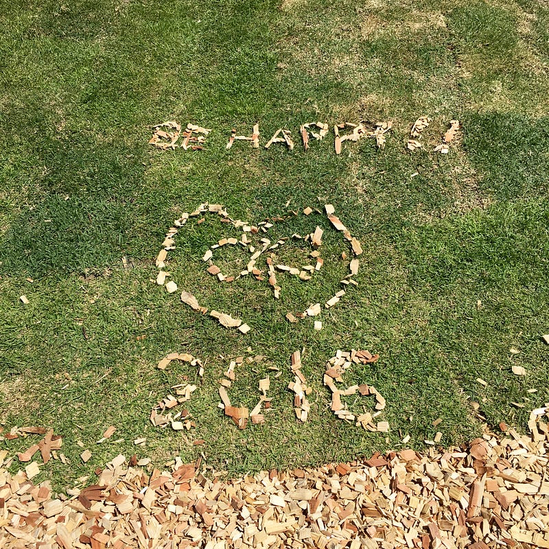

大晦日ということで今年を振り返ってみる。

今年は、映画「ピンクとグレー」で始まった1年だった。見に行ったのは1月10日。まだ年が明けた実感すら薄いタイミングである。そのほか、映画「リップヴァンクルの花嫁」や映画「SCOOP!」はとても印象強く残った。「君の名は。」や「シン・ゴジラ」は見ていないけれども、記憶に残るいい演技と演出を見れた。

音楽について目新しいものはなかったように感じる。これまでの継続という印象。YEN TOWN BANDの復活アルバムがこの1年の１番の目新しさだったかも。

macOSやiOS、そのほかのガジェットもこれまでの継続の意味合いが強いかな。昨年から毎日使うイヤフォンの無線化が進行していたのが、決定的になったのがこの1年かもしれない。

この1年自分の中での決定的な変化は写真やカメラへの興味だ。新しい写真を撮る、新しいレンズを追加する、新しいカメラを追加する、そういうことがほぼなくなった。iPhoneで散歩しながら適度にシャッターを押すくらい。ここ２、３年続けていた行動パターンが変わったというのは大きい。

今年は久しぶりのJ1を楽しんだ。久しぶりのJ1は、よりエンターテイメント性が増していて、イベントとしてのサッカーの進化を感じた。来年はJ2だけれども、Jリーグ放送のDAZNへの移行という最大のトピックがあり、すでに移籍市場含めて様々な動きがある。

これからの1年は変化の1年になる予感がしている。そしてこの1年はそのためのhop-stepの1年間だったのだろう。だからかな、あまり年末感が強くない。