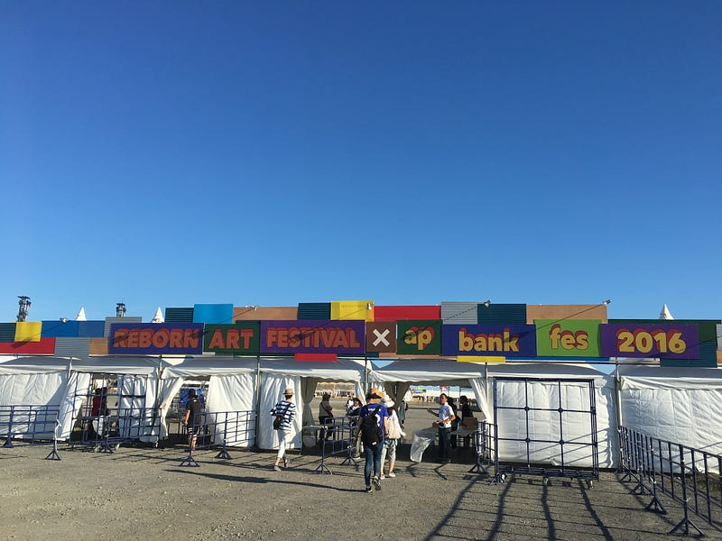
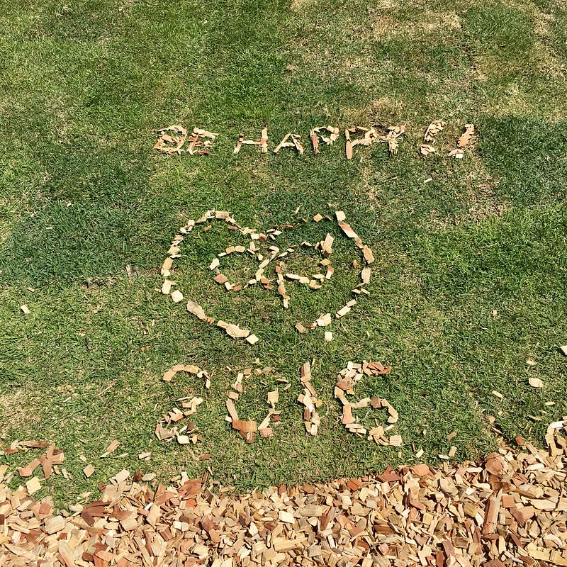

参加してきた３日間を時間を追って書いておく。来年のために。

#### 前夜祭

7月29日15時ごろ、仙台に到着した。あらかじめ予約しておいたホテルに向かう。その途中で、Apple Watchが通知が来て震える。今日のシャトルバスは乗り場所が変更になったというtweetが公式アカウントに来ていた。

ホテルでチェックインを済ませ、荷物を整え、バス乗り場に向かう。仙台からバスに乗って、40分くらい経っただろうか。高速道路に乗って移動したバスは石巻の海のそばに到着した。そう、ここが、4年ぶりのap bank fesが開催される場所。

芝生が敷き詰められた風が吹き抜ける丘があるわけでもない。ただの砂と石が混ざった、どちらかというと石の割合が多い土地。時折吹き抜ける海風が涼しい。2日目のMCで、ここが震災以降、大事な瓦礫を集め、処理した場所だという事を聞く。2年前、STAND UP WEEKを見にきて、そのついでに行った日和山からみたあの場所がここだ。

29日の前夜祭は、平日にもかかわらず集まったちょっと少ないオーディエンスながら、いつもの前夜祭らしいまったりした空気で進んでいく。

その中でも注目は、冒頭のSalyuセッションと、LEGO BIG MORLだった。

Salyuセッションでは、デビュー1周年の桐嶋ノドカとHanah Springが登場し、salyuxsalyuをカバーする。

LEGO BIG MORLは、曲数が少ないながら、いつものライブハウスと変わらないパフォーマンスとトークで進行していく。[ap bank fes 10 に登場した時](http://archive.eco-reso.jp/fes10_report/18/lego_big_morl/)は、緊張してるのかな？と感じたけど、今回はいつも渋谷で見る彼らだった。

#### 1日目

起床し、朝食を済ませ、シャトルバスに乗り込む。シャトルバスの乗り込む場所では、行列ができ、仙台から熱気を感じた。

一週間前まで、雨が心配された1日目は、晴天すぎるほど晴天。過酷な夏フェスの始まりだ。

到着すると、太鼓の音がなっていた。すでにオープニングセッションが始まっている。地元の人たちとbank bandがコラボしたオープニングセッションは、ap bankと石巻が一緒に作り上げたステージという、ap bank fes を象徴するようなステージが繰り広げられた。

やがて、15時ごろからMr.Childrenのライブが始まる。ap bank fes の客層はやっぱりMr.Childrenのファンが多い。というわけで、ライブは最高潮に盛り上がる。ライブエリアだけではなく、どこにいても音楽が楽しめるようになっている会場で、みんながMr.Childrenに集中していた。

そして、このフェスのホストバンド Bank Bandの演奏が終わるころには、陽は傾き、そろそろ日没時間が短いことがわかる。Bank bandの新曲"こだま、ことだま"のイントロは、まさに新しい復興へのファンファーレのように響く。

ホストバンドのあとは、それこそアフターパーティのノリだ。すでに帰りのシャトルバスも動き出していて、帰る人もいる。

ap bank fesといえば欠かせない GAKU-MC のライブも終わり、SPECIAL OTHERSの曲を聴きながら1日目は帰路に着いた。

#### 2日目

バスの行列はあったものの、車渋滞はない。

30日は石巻川開き祭りの1日目が別の会場で行われる日。そこでは、震災で亡くなった人を弔う灯籠流しを行う。

そんな日、前日同様のオープニングセッションから始まる。何度見ても感動のステージだ。

そんな中登場したのが赤い公園。LEGO BIG MORL主催の対バンイベント Thanksgiving でも素晴らしいパフォーマンスを見せてくれた彼女たち。そういえば、六本木で開催された小林武史がプロデュースしたイベントでも、赤い公園はいいパフォーマンスを見せてくれた。そして今回も。

２日目もMr.ChildrenとBank bandが終わるとafter partyの開始。今日はその前にYEN TOWN BANDの演奏があった。東京をイメージして作ったという my town も石巻で心地よかった。YEN TOWN BANDがいうmy townは円都以外は考えられないのだけど(設定上は)。

after partyのあと、MEMORIAL TIMEが始まった。ちょうど石巻の灯籠流しの時間帯。20分を超える追悼のサウンドが会場に響く。

ap bank fes 2017のラストは、OVERGROUND ACOUSTIC UNDERGROUND。単独のライブにはあまり行ったことがなく、毎年年末CDJで聞くことが多いので、なぜか年末を感じながら聞いていた。

最後にゲストとして、リラックスした櫻井和寿と小林武史が登場し、Reborn、それこそ蘇生をOAUで演奏して終わった。

終わった時間は23時近く。長い長い音楽のたびが終わり、シャトルバスで帰路に着いた。

#### 最後に

石巻で行われたap bank fes。出演者も石巻に縁がある方々多く、音楽バカが集まるフェスというより、出演者も来場者も少し追悼の感じがあった。でも、石巻は、このイベント、そしてReborn-Art Fetivalを通して、「観光都市」として生まれ変わろうとしている。そういう印象を強く感じた。

東日本大震災の復興は、震災前に戻すだけの復興ではない。筋肉が超回復して強くなるように、震災以前から東北にあった課題の解決を目指す"復興"なのだ。Reborn (蘇生)によって、石巻・牡鹿は以前にも増して魅力ある土地になるのだろう。

