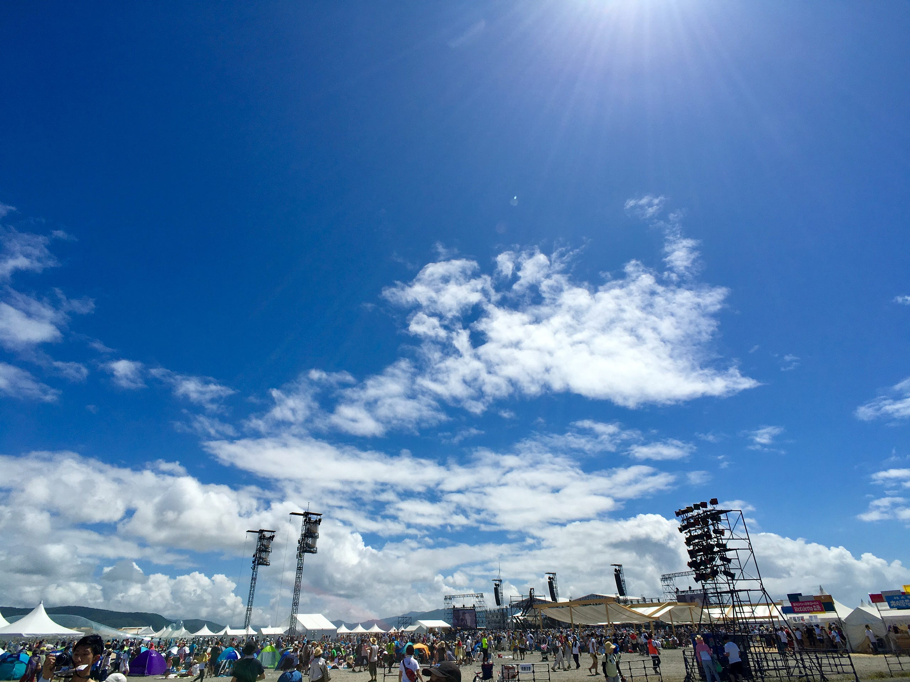

東日本大震災の前、ap bank fes に何度か参加していた。

そこは、小林武史が継続性のある環境問題の解決に向けて作った組織 ap bankが主体となって、資金集めのために音楽の力を借りる形で実施されたフェスで、同時に来場者に環境のことを、楽しみながら教えてくれたフェスだった。

震災後、割とすぐだったと思うけれども、その流れで、Chim↑pomというアーティスト集団を知る。彼らは、そのあと渋谷駅に設置されている<明日の神話>に東日本大震災のコンテキストを付け足すことで世間を騒がすことになり、それがきっかけで岡本太郎記念館で個展を開いたりすることになるのだけど、それが自分自身が初めてちゃんと”アート”に向き合うきっかけになった。

その後、JRという存在を知る。彼は、世界の貧しい人たちを写真で撮る、inside outという作品をやっていたのだけど、今回の震災を受けて、石巻で写真を撮って、東京ワタリウム美術館で個展を開くんだけど、資金が足りないので、ということで、クラウドファンディングをやっていて、そこで出資したりもした。

2017年、[Reborn-Art Festival](http://www.reborn-art-fes.jp)が開催される。そして、7月30日31日そのプレイベントとしてap bank fes 2016が開催された。

bankbandの”こだま、ことだま”が、石巻の新しい始まりを告げるファンファーレのように聞こえた。そこにはinside outもあったし、2017年にはchim↑pomも出展が決まっているという。

来年の牡鹿半島に震災以降に触れたものが全て集まる。そんな感覚がある。

震災後、自らアクションを起こし、さらに別の課題を解決するために日々頑張っている人がいる。一方で、自分は日常をただ生きていて、ap bank fes 2016のために、石巻に行って日焼けしてきたくらいで、ほとんどが受け身だ。それでも、その行動が行動する人を勇気づけたり何かにつながればいいなと思う。

石巻は、観光都市になろうとしている。震災前夜、自分は石巻の位置もよくわからなかったし、全く興味もなかった。東北新幹線は縁がないものだと思っていた。

それがこの状態である。ぜひ来年夏は牡鹿半島に行きたいと思う。