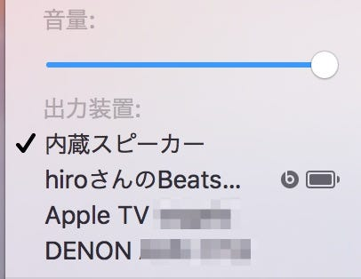

iPhone発表会で発表された中で、とても興味を持ったのが「W1チップ」だった。

Bluetoothのペアリングはとても煩雑な作業で、SonyなどはNFCを使って解決する仕組みを使ったりしているが、機器ごとにペアリングする必要があった。

例えばApple Watchでは、セットアップの流れの中でカメラを使ってペアリングをするという方法をとっている。

というわけで、Beats Solo3を使ってみた。AirPodsはあの形状のつけ心地などで興味はあるが、発売まで待てなかった。

Beatsといえば、最初モンスターケーブルやDr.Dreとコラボしてヘッドフォンを作ったのが最初で、今ではAppleに買収されたヘッドフォン・スピーカー企業だ。Appleに買収されて以降、Beats Pillを出していたものの、ヘッドフォンの新モデルが出ていなかったので気になっていた。

ちなみに彼らの最初の製品であるBeats Studioを持っているが、今ではほとんど使っていない。その後、オシャレなイメージが付いたようで人気が出ているのだけどよくわからないのが個人的な感想。

### Beats solo3 ファーストインプレッション

#### 開封とペアリング

Beats solo3のunboxingはyoutubeに動画があったりするのでそれを見てもらえばいいと思う。

Beats solo3はiPhone7のカラーリングと合わせて色が用意されている。今回はiPhone7 マットブラックに合わせた、Beats solo3 ブラックだ。

最初に電源を入れるときに「アンロックされた」iPhoneが近くにあると、それに反応して \*\*自動的に\*\* ペアリングが始まる。ペアリングとは？という声が聞こえてきそうなくらいの \*\*繋がって当然なのだ\*\* という気配を感じるペアリングだった。

一度iPhoneで繋がってしまえば、Macでも繋がる、というのがこのペアリングの特徴で、メニューバーの音量ボタンをクリックすると、他のAir Playデバイスと並んでBeats solo3が表示される。（メニューバーの音量ボタンは最近標準で非表示になっているようなので注意）

ここで気になったのは、Macの音量ボタンとiTunesのペアリングボタンである。Macの音量ボタンからはMac全体のサウンドが、iTunesのペアリングボタンからはiTunesで再生しているサウンドだけが、転送されるようなのだけど、これらは同じサウンド面なのに独立して動いているので、混乱しやすい。

#### 機能面

Beats solo3には、電源ボタンの他に音量ボタンとbボタンがある。bボタンは再生・停止やSiriの起動などができる。シンプル。

普段はApple Watch使いそう。WatchOS3から出たミュージックコンプリケーションを使って、音楽を聴きながら、曲名を腕時計感覚で確認したりできるのはとてもスムーズ。

#### 音漏れ

インイヤーではなく、オンイヤーなので、音漏れは当然それなりにある。ので、音量をあげると結構音漏れが激しいと思われる。もう構造的な問題なので音漏れを気にする方はこれを外で使わないほうがいいと思う。

ちなみにBluetoothの宿命なのですが、場所によって切れやすかったりしますし、朝ラッシュくらいの混雑している電車ではほぼ繋がらないです。駅の近くではよく切れやすいので、何かと干渉しているんでしょうね。

#### サウンド面

Beatsは初期からそうだけど、「聴いて楽しいサウンド」を作っているので、音質云々を語る必要はないと思う。Beatsサウンドは久しぶりなのだけど、やっぱり低音は強めに出ているし、ドラムの音はよく聞こえる。

とはいえ、高音もよく出ているように思えるので、クラシックを聞くときにどうかという問題はあるけど、J-POPなら問題ないんじゃないかと。

### まとめ

オンイヤーである点、ヘッドフォンである点がきになるようであればこれからBeatsXも出るようなので待っておくのがいいと思う。価格帯から行ってAirPodsで、サウンド面の向上はないと思うので、音楽を聴いている時間が長い人でW1チップを早めに体験したい人はBeatsをどうぞ。

W1チップもライセンスにして他のメーカーが使えるようにして欲しいですけどね。そういえば Beats solo3は充電はLightningではなくUSBです。