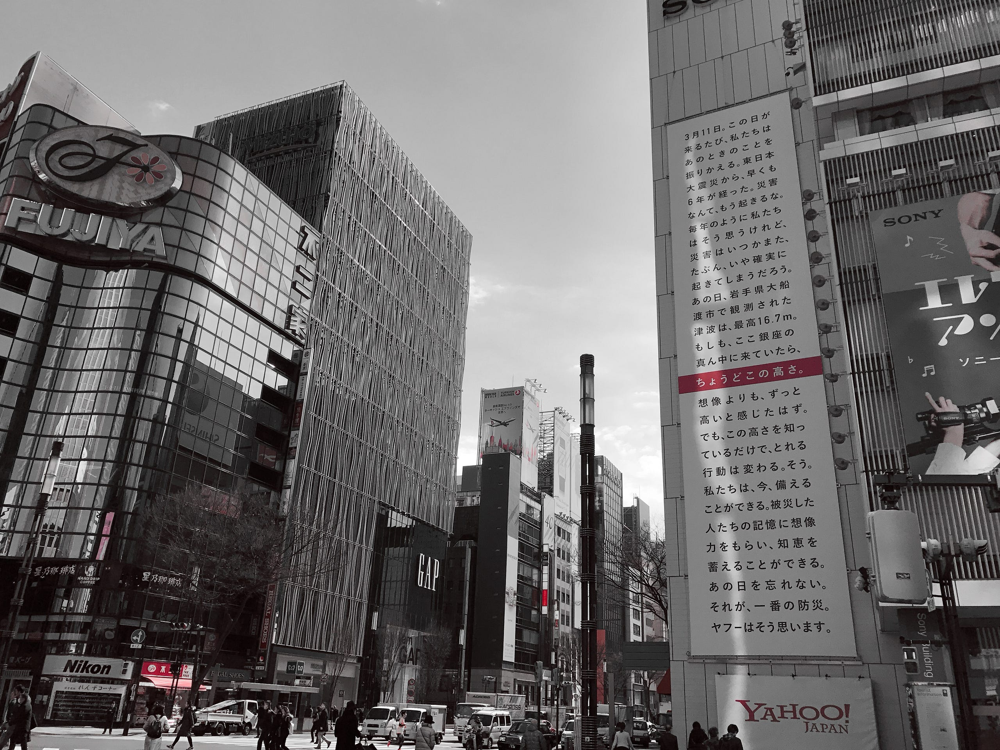

6年目。6年目になっても、3.11といえばあの日のことだし、原発は廃炉までの道筋は遠いし、現地では復興はまだまだだと言っていて、一方東京は、オリンピックをなんとか安くできないかと思案している。

2005年、12年前の3.20に、生まれ故郷である福岡で地震があった。福岡は地震との縁はあまりなく、東京では通り過ぎてしまいかねない震度3で大きく騒ぐ土地柄である。その福岡で大きな地震があった。結果として、大きな被害もなかったことはよかったけど、それが故に日本の中ではあまり記憶されていないできごとかもしれない。

その日はJリーグマッチデーだった。アビスパ福岡の、福岡で暮らしている選手たち、そしてサポーターは試合のため仙台にいた。地震はキックオフ3時間前に起きたため、選手たちは自分の家族の安否を確認できないまま試合開始のホイッスルを聞くことになる。

[http://data.jleague.jp/SFMS02/?match\_card\_id=8734](http://data.jleague.jp/SFMS02/?match_card_id=8734)

その試合でエールを送ってくれたのが仙台の人たちだった。

3.11のあの地震のあと、3.11が来るたびに3.11の6年前のあの出来事を思い出す。

今日は仙台で、神戸との試合が行われる。サッカーがあるよろこびを噛みしめたい。