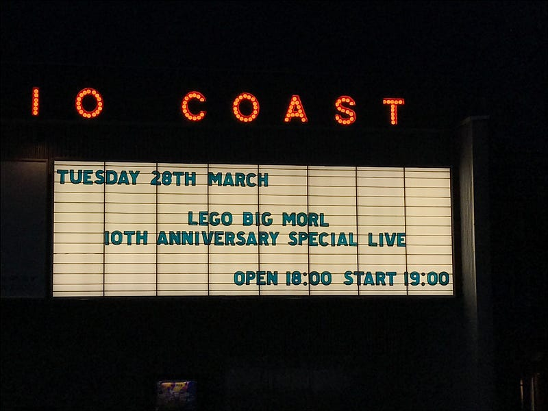
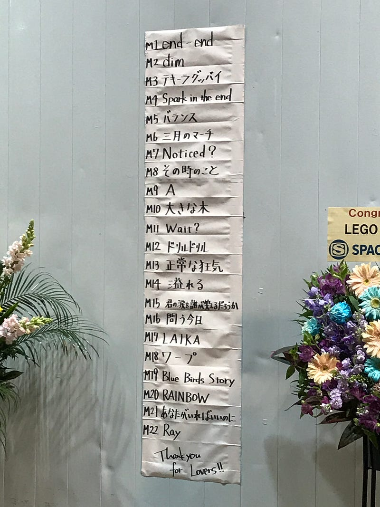

LEGO BIG MORLの10周年イヤーは、新木場スタジオコーストの2時間のライブで終わりを告げた。

end-endで始まり、その第一声を聞いた瞬間、いや正しくは、その1音目を聞いた瞬間、このライブへの意気込みがただならぬものであることを感じた。そして、それは会場に伝わり、それに応えるように会場全体がヒートアップしていく。

RAINBOWで本編を締めくくられたそのライブは、10年間の想いとこれからを感じさせるものだった。そして、今日彼らは11年目を迎え アルバム「心臓の居場所」を発表した。

彼らをライブで初めて見たのは2009年11月6日、BBO Reception Partyにて。まさにOORONG RECORDSからメジャーデビューを果たした後になる。それからもう7年近くが過ぎた。

[**BradBerry Orchestra Reception Party**  
qli.jp](https://qli.jp/bradberry-orchestra-reception-party-e562bee00b51 "https://qli.jp/bradberry-orchestra-reception-party-e562bee00b51")

SHIBUYA AXで無料ライブをやった(2009年)こともあるし、ap bank fes ’10＠つま恋で、音を奏でたこともある。そして、TOKYO DESIGNERS WEEKでライブをやったこともある(2011年)。

[**エコレゾトーク - エコレゾ ウェブ**  
_エコレゾ…_archive.eco-reso.jp](http://archive.eco-reso.jp/talk/lego_big_morl/ "http://archive.eco-reso.jp/talk/lego_big_morl/")

音楽性で言えば、2013年に起こった大きなピンチをきっかけに、Pro Toolsという大きな武器を得たのが大きかったのではないだろうか。最新アルバム「心臓の居場所」でもデジタルとアナログの融合された、ただただかっこいいサウンドが鳴り続けている。10周年では飽き足らないといっているようだ。

[**LEGO BIG MORLが明かすバンドの転機「これまでやったことのない領域に挑戦した」**  
_昨年2月にギターのタナカヒロキが交通事故で負傷し、予定されていたツアーが中止となるなど、バンドとしての活動停止を余儀なくされたLEGO BIG…_realsound.jp](http://realsound.jp/2014/04/post-477.html "http://realsound.jp/2014/04/post-477.html")

本人たちがどう考えているのかはわからないけど、自分が見てきた7年間で、LEGO BIG MORLは自分たちが奏でるべき音と、奏でるべき場所を見つけたように思う。だからかもしれない。「心臓の居場所」に収録された、」あなたがいればいいのに”は小林武史プロデュースで、彼の特徴であるストリングスが鳴っているにもかかわらず、等身大のサウンドとして聞こえてくる。

[**LEGO BIG MORLの「心臓の居場所」を iTunes で**  
_"最終回は透明"、"あなたがいればいいのに"、"真実の泉"とその他を含む、アルバム「心臓の居場所」の曲をプレビュー、購入、ダウンロード。 アルバムを ¥2,100 で購入。 曲を ¥250 から。_itunes.apple.com](https://itunes.apple.com/jp/album/shinzou-no-ibasyo/id1210255804 "https://itunes.apple.com/jp/album/shinzou-no-ibasyo/id1210255804")