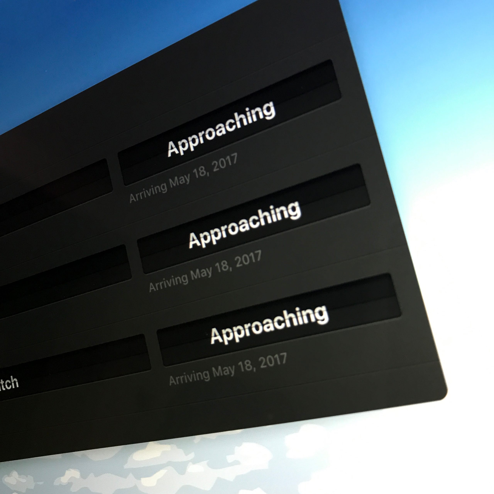

「5月リリースとは言ったけど、さすがに1日じゃねーよ」

と言っていた Things 3 のリリース日がようやく発表されました。

リリース日は5月18日。WWDCには間に合いました。ベータテストの段階で、すでに Apple Design Awardになるべきだという声も上がっているようです。

個人的にベータテスターとして呼んでいただけて、すでにメインのタスク_整理_アプリとしてフル活用していますが、詳細はThings 3リリース後に記事を書きたいと思っています。