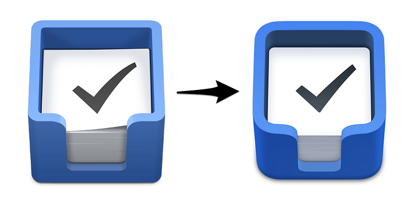
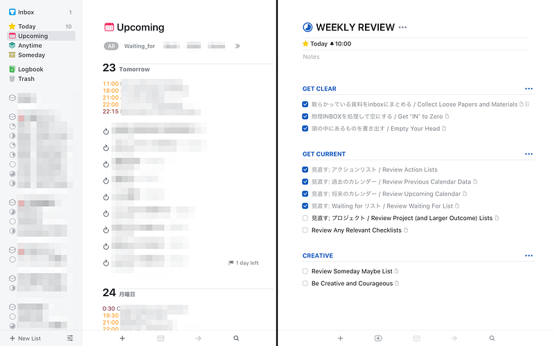

[**Meet the All-New Things - Things Blog - Cultured Code**  
_It's here! We've been working hard on a completely new version of Things for the past years and we're incredibly proud…_culturedcode.com](https://culturedcode.com/things/blog/2017/05/meet-the-all-new-things/ "https://culturedcode.com/things/blog/2017/05/meet-the-all-new-things/")

[**Things 3 を Mac App Store で**  
_「Things 3」のレビューをチェック、カスタマー評価を比較、スクリーンショットを確認、詳細情報を入手。Mac OS X 10.11.0かまたはそれ以降対応の Things 3 をダウンロードして Mac で利用。_itunes.apple.com](https://itunes.apple.com/jp/app/things-3/id904280696?mt=12 "https://itunes.apple.com/jp/app/things-3/id904280696?mt=12")

[**Things 3を App Store で**  
_「Things 3」のレビューをチェック、カスタマー評価を比較、スクリーンショットを確認、詳細情報を入手。Things 3をダウンロードして iPhone、iPad、iPod touch で利用。_itunes.apple.com](https://itunes.apple.com/jp/app/things-3/id904237743?mt=8 "https://itunes.apple.com/jp/app/things-3/id904237743?mt=8")

[**Things 3 for iPadを App Store で**  
_「Things 3 for iPad」のレビューをチェック、カスタマー評価を比較、スクリーンショットを確認、詳細情報を入手。Things 3 for iPadをダウンロードして iPhone、iPad、iPod touch で利用。_itunes.apple.com](https://itunes.apple.com/jp/app/things-3-for-ipad/id904244226?mt=8 "https://itunes.apple.com/jp/app/things-3-for-ipad/id904244226?mt=8")

[2013年12月の突然の発表](https://culturedcode.com/things/blog/2013/12/a-million-things/)から約3年。ついにThings 3がリリース。

4月にブログにて告知されたBetaテストに呼んでいただけたので、それを元にレビューします。 ちなみに、すでにメインのタスク整理アプリは Things 3となっています。

この記事では、Things 3になって変わったところを中心にまとめます。

なお、Things 3は新しく購入する必要があり、またCloud Syncデータの下位互換性はありません。使っているデバイスどれか一つでも３にアップデートすると全てのデバイスでアップデートが必要なのでご注意ください。

### 新しい変化

#### プロジェクトがエリアごとに並ぶように

Things 2まではプロジェクトはプロジェクトリスト、エリアはエリアリストに表示されていました。もちろんエリアを表示すれば、そのエリアに入っているプロジェクトは表示されるのですが、”At Glance”な感じではなかったのは確か。

Thigns 3では、エリアとプロジェクトの関係が”At Glance”な感じで表示されるようになりました。それに引き換えとなりますが、デメリットとして、あまり多くのプロジェクトを抱えていると一覧性が悪くなってしまう形になりました。ですので、アクティブなプロジェクトは少なめにしたほうが良さそうです。アクティブなプロジェクトを少なくし、フォーカスすべき項目を減らした方が、脳内の切り替えが減り、生産性の向上に大きく寄与するとも思います。

#### Today, Upcoming にカレンダーが表示

これまでThingsはカレンダーとの連携は特にありませんでした。Things 3からToday(今日), Upcoming(明日以降)で、カレンダーと一緒にタスクの一覧を見ることができるようになったので、自分のやるべきことが”At Glance”な感じでわかるようになりました。

#### TodayにEveningが追加

Todayには実に様々なタスクが並びます。そして、多くの人は昼間と夜間のコンテキストが異なっているはずです。例えば「これは帰宅してから実施しよう」と考えるタスクがTodayに含まれていることもあるでしょう。そのようなタスクを”Evening(今夜)”に指定することができるようになりました。Eveningにしたタスクは自動的にTodayの末尾に並ぶので、仕事中のノイズになりにくくなります。

#### タスクに階層が追加

これまでのThingsは、エリア-プロジェクト-タスク という単純な３階層でした。Things 3からは、プロジェクトに “Heading”を追加することでタスクを束ねたり、タスクの中にチェックリストを追加できるようになりました。チェックリストは実施する日程やタグなどは追加できません。 例えば、今日実施するタスクとして「カレーの材料を買う」というタスクがあるとしたら、そのチェックリストに買うものが並んでいる感覚で使うとよさそうです。

ちなみに、これまでのThingsと同じように、小さいサイズのものから大きなサイズのものに変更することは可能なので、チェックリスト作ってみて、「これタスクにしてはサイズが大きそうだな」と思ったらプロジェクトに変更するという使い方もできます。

#### リマインダー機能が追加

やっと、というか、今更、というか。タスクにリマインダーを追加するできるようになりました。リマインダーは、時間指定で、その時間になると通知してくれます。

#### 1Password と連携

これもやっと、という感じ。Cloud Syncを使うにはログインが必要なのですが、その画面で1Passwordのデータを読み出すことができるようになりました。細かいですが、アプリを入れなおす時に手間が減りました。iPhoneだとアプリ切り替えて、とかやるの面倒なんですよね。

#### 検索はフォームではなく、どこでも、なんでも

これは新しいUIの提案となりました。Macアプリで検索するには、アプリをアクティブにした状態でキーボードを叩くだけ。タスク名でもタグでもプロジェクト名でも検索できます。ただ、仕組み上、変換が必要な日本語入力との相性が良くないので気をつけてください。 ちなみにiOSではどこでもいいので下に引っ張ると検索フォームが現れます。

#### プロジェクトには簡単に”フォーカス”(Mac)

プロジェクトリストを表示している左サイドバーを隠すことができるようになりました。またプロジェクトだけを新しいウインドウで開くことができるようになりました。プロジェクトの中だけに簡単に集中できるようになりましたし、例えば２つのプロジェクトを別のウィンドウで開いて、両脇に表示するということも可能です。

#### 自由に動く＋ボタン(iOS)

iOSアプリに現れる右下の＋ボタン。一見、Androidなどに多いアクセスしやすい+ボタンかと思いきや、＋を押したまま動かすことで、タスクの挿入先を選んだり、Headingを挿入したりできるようなインターフェイスに。動きも滑らかで少しくせになりそうです。

#### 使い心地

すでに手に馴染んでいます。なぜかThingsを使っていると、iPhoneというデバイスにも愛着を感じるんですよね。この感覚は大事だなと思います。

#### まとめ

変わったところが多いのですが、それでもスムーズに移行できたと思います。Things 2と大きく使い勝手を変えることなく、とはいえ痒いところに手が届くアップデートだと思います。

これまで目立つところにあったNext(次)が、Anytime(いつでも)になって控えめなところに移動しました。これは、タスクツールのスタンダードが、Omnifocus的な”コンテキストリストから選ぶ”ではなく、Todoist的な”あらかじめ実施日を計画する”に変わったことの表れではないかと思います。Things 3は3年以上の時間をかけて開発されました。もしかしたら、新しいタスクツールのあり方を議論してたのかもしれませんね。