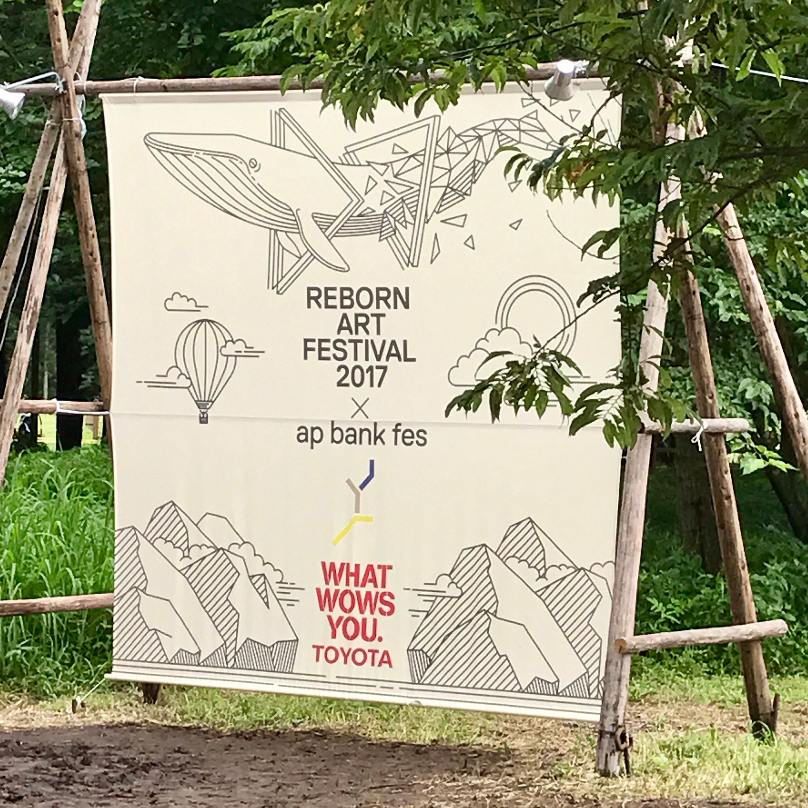
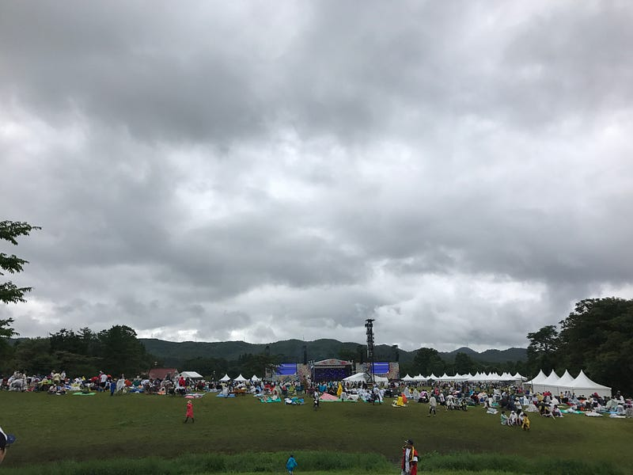

東北で復活して2年目。今年のap bank fes(Reborn-Art Festival 2017　× ap bank fes)は、宮城県国立みちのく杜の湖畔公園で行われた。実は、2012年、ap bank fesが本拠地つま恋だけではなく、宮城と淡路島という記憶に新しいヒサイチをつないで開催した時に使われたのもこの場所だった。もちろん、昨年に比べて場所が大きくなったこともありキャパもそれなりに増やしたんだろう(と思う)。

フードは昨年石巻で開催された時にも出ていたお店を中心に揃っていて、東北の味を堪能した。また、フィッシャーマンズなど、石巻で活動している団体も雑貨を販売していたりしていた。

音楽は本当にバラエティ豊かなラインナップが揃った。フジロックと並行しての日程で、持ち時間30分から40分という短い中でここまで来てくれたミュージシャンには本当に感謝したい。

音楽に関して触れておくと、つま恋時代のラインナップは、どうしてもbankbandが中心にありすぎて、小林武史と愉快な仲間たちという世界観に閉じこもっていた感覚がある。昨年、石巻でWANIMAが出たことで、その感覚を払拭できた印象が強い。それ故に、その世界観が好きだったファンは馴染めない感じになっているようだけど。

apbank fesといえばその強いメッセージ性が特徴的だ。もともと、apbankは環境に優しい新しい事業を支援し、広げて行く活動をやっていて、apbank fesでは、その活動の紹介や、その活動の下地となる知識や体験をする場だった。だから、現地で提供されるフードの食器はリサイクルできる素材だし、カトラリーセットは持って来てね、というメッセージだった。

去年は津波の被害にあった石巻の、まさに港の一部で開催ということもあって、石巻のフードを楽しむことに主眼が置かれていたし、プレイリストもどこか、鎮魂の祈りを捧げるようなものが多かった。

それが今年はどこかに消えた。

今年のapbank fesは確かにreborn art fesのための大きな宣伝祭りだった。けど、仙台から石巻と反対方向の会場で、会場にアートが散りばめられることもなく、セットリストも、みんなが知っているであろう曲ともっともいま聞いて欲しい曲(売りたい曲)の繰り返しで、「音楽を楽しもう」という感じが強かった。

イベント自体はずぶ濡れになったり足元が泥まみれになりながらも、楽しいのだけど、コンセプト、企画のレベルで、持ち帰って欲しいものはなんだったのだろうと疑問に感じている。その苦肉の策が、きっとwhat is art? だったんだろう。

[**櫻井和寿「What is Art? - Single」を iTunes で**  
_"What is Art?" を含む、アルバム「What is Art? - Single」の曲をプレビュー、購入、ダウンロード。 アルバムを¥250で購入する。 1曲 ¥250から。_itun.es](https://itun.es/jp/ZUh_kb "https://itun.es/jp/ZUh_kb")

本家Reborn Art Fes は9月10日まで開催している。日程さえ合えば行ってみたいと思うものの、仙台に行くのと石巻に行くのでは、あまりにも事情が違うのでまた考えたい。

そして、Reborn Art Fesがトリエンナーレになるかはわからないし、その時音楽イベントとしてのapbank fesが開催されるかはわからないけど、次の開催を待ちたいと思う。

さて、3日間参加したわけだけど、1日目の夕方から降り出した雨が2日目の朝には本降りになり、通称どろんこフェスとなり、会場内を移動するにも苦労する感じだった。

昨年美味しかった東松島ビールは出てなくて残念だったけど、それでも、鹿肉やほやや、豚肉など、東北の美味しいものをたくさん食べた。ライブエリアよりもフードエリアにいた時間の方が長かった。

石巻のようにフードエリアからもステージが見えるというロケーションだったら最高だったんだけど、地形的にそれは贅沢すぎましたかね。

フードエリアには、小さめのトラックステージにがあって、そこに出てきた、桐嶋ノドカさんや、GAKUさん、いちろーとせんせい(from 東京カランコロン)のステージはさすが、楽しかった。もちろんメインステージも楽しかったけどね。