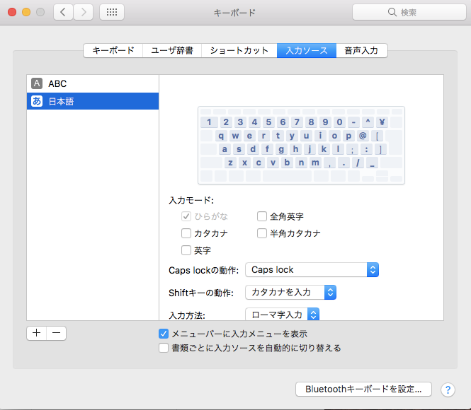

日本語OSを使っていると、特にWEB周りで不具合を感じることがあります。ほとんどの場合、開発者が英語圏の方で、日本語圏を想定して作っておらず、他の欧州の言語ならまだしも日本語のような特殊なケースへの対応が困難になっていることがほとんどです。というのが今回のお話。

例えば、Todoistではキーボードショートカットが用意されています。他にも Mediumのエディターは、キーボードからのインプットによって様々なレスポンスを返してくれます。

ところが、自分の環境ではそれがうまく動かない。ということが多くありました。Todoistでは、”@”を押すことで動作するはずのタグのサジェスト機能が動かなかったり、していました。

どうやら、Safariを使っている時だけらしいというところまで突き詰めたのですが、その詳細はわかりませんでした。同じWebKitを使っているChromeでは再現しないのですから。

そのうち、どうやら「日本語の英字」を使うとダメらしいということもわかりました。

というわけで、今ではこのような言語設定にしています。

“日本語の英字を使わず、英語キーボードで英字を使う”という設定ですね。

どうやら、SafariだとKeyCodeの反応がおかしいところまでは突き詰めたのですが、その先は突き止められませんでした。

以上、Workaround でした。