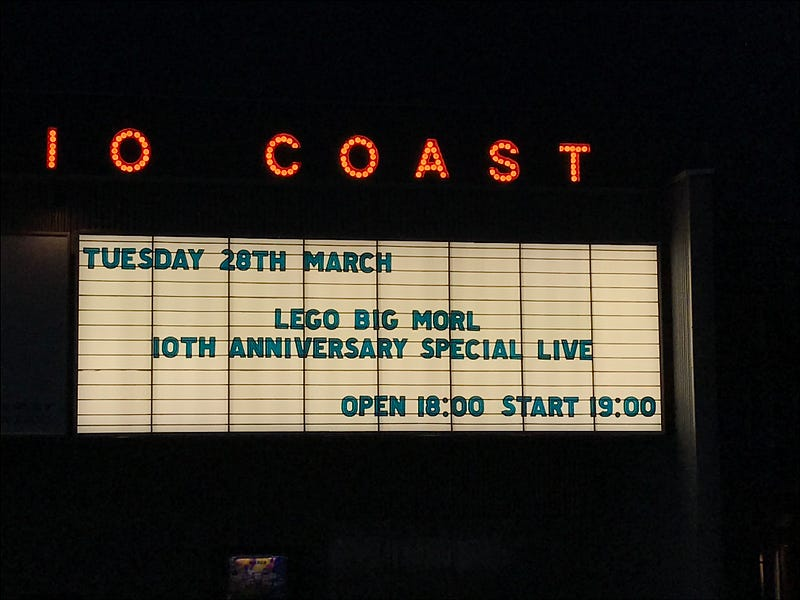
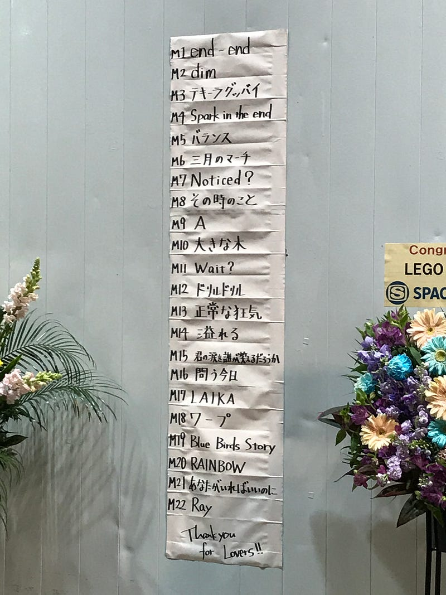

LEGO BIG MORL の 10 周年イヤーは、新木場スタジオコーストの 2 時間のライブで終わりを告げた。

end-end で始まり、その第一声を聞いた瞬間、いや正しくは、その 1 音目を聞いた瞬間、このライブへの意気込みがただならぬものであることを感じた。そして、それは会場に伝わり、それに応えるように会場全体がヒートアップしていく。

RAINBOW で本編を締めくくられたそのライブは、10 年間の想いとこれからを感じさせるものだった。そして、今日彼らは 11 年目を迎え アルバム「心臓の居場所」を発表した。

彼らをライブで初めて見たのは 2009 年 11 月 6 日、BBO Reception Party にて。まさに OORONG RECORDS からメジャーデビューを果たした後になる。それからもう 7 年近くが過ぎた。

[BradBerry Orchestra Reception Party](/posts/80369213-660f-4080-a268-5a9ef39a47f1/)

SHIBUYA AX で無料ライブをやった(2009 年)こともあるし、ap bank fes ’10＠つま恋で、音を奏でたこともある。そして、TOKYO DESIGNERS WEEK でライブをやったこともある(2011 年)。

[**エコレゾトーク - エコレゾ ウェブ**  
\_エコレゾ…\_archive.eco-reso.jp](http://archive.eco-reso.jp/talk/lego_big_morl/ "http://archive.eco-reso.jp/talk/lego_big_morl/")

音楽性で言えば、2013 年に起こった大きなピンチをきっかけに、Pro Tools という大きな武器を得たのが大きかったのではないだろうか。最新アルバム「心臓の居場所」でもデジタルとアナログの融合された、ただただかっこいいサウンドが鳴り続けている。10 周年では飽き足らないといっているようだ。

[**LEGO BIG MORL が明かすバンドの転機「これまでやったことのない領域に挑戦した」**  
\_昨年 2 月にギターのタナカヒロキが交通事故で負傷し、予定されていたツアーが中止となるなど、バンドとしての活動停止を余儀なくされた LEGO BIG…\_realsound.jp](http://realsound.jp/2014/04/post-477.html "http://realsound.jp/2014/04/post-477.html")

本人たちがどう考えているのかはわからないけど、自分が見てきた 7 年間で、LEGO BIG MORL は自分たちが奏でるべき音と、奏でるべき場所を見つけたように思う。だからかもしれない。「心臓の居場所」に収録された、」あなたがいればいいのに”は小林武史プロデュースで、彼の特徴であるストリングスが鳴っているにもかかわらず、等身大のサウンドとして聞こえてくる。

[**LEGO BIG MORL の「心臓の居場所」を iTunes で**  
\_"最終回は透明"、"あなたがいればいいのに"、"真実の泉"とその他を含む、アルバム「心臓の居場所」の曲をプレビュー、購入、ダウンロード。 アルバムを ¥2,100 で購入。 曲を ¥250 から。\_itunes.apple.com](https://itunes.apple.com/jp/album/shinzou-no-ibasyo/id1210255804 "https://itunes.apple.com/jp/album/shinzou-no-ibasyo/id1210255804")
