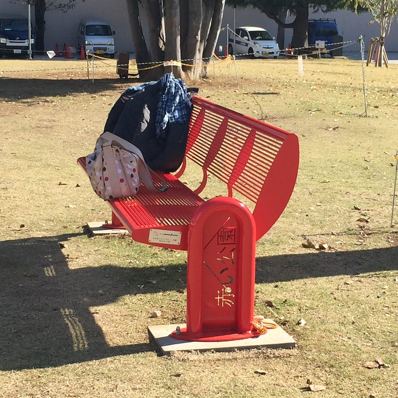

赤い公園の新しいアルバムが出た。前作「純情ランドセル」が2016年3月リリースなので、約1.5年ぶりのアルバム。

そして発売直前に（正しくは発表と同時に）、ボーカル佐藤千明が脱退するというニュースがついた。アルバム制作前に決めたことなのだそうで、このアルバムは、4人で作る最後のアルバムとなることを前提として作られている。

[**赤い公園「熱唱サマー」を Apple Music で**  
_"カメレオン"、"闇夜に提灯"、"AUN" とその他を含む、アルバム「熱唱サマー」の曲を聴こう。 アルバムを¥2,200で購入する。 1曲¥250から。 Apple Music に登録すると、無料で利用できます。_itunes.apple.com](https://itunes.apple.com/jp/album/nesshou-summer/id1266062129 "https://itunes.apple.com/jp/album/nesshou-summer/id1266062129")

アルバムを再生してまず最初に聞こえてくるのは、まるでファンファーレのようなサウンド。そして2曲目の盆踊りサウンドに移行する。そして、4人の赤い公園の新しい面を見せつつ、journey 、そして合唱「勇敢なこども」にで終わる。

赤い公園のアルバムは、これまでもそうだったけど、実にしっかりコンセプトが決まっていて、パッケージングがしっかりしている印象が強い。でも、このアルバムは（4人で最後というエピソードが影響しているのかはわからないが）、12曲を好きになるというより、1枚を好きになる、そんなアルバムだと思う。もちろん、それぞれの曲のクオリティも素晴らしいのだけど。

赤い公園、そして、佐藤千明の4人は、これから新学期を迎える。でも、それを見守っていきたいと思う。立川の赤いベンチから。

