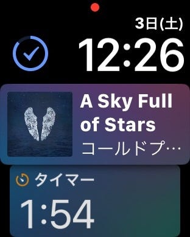

リリースされてしばらく経つのだけど、watchOS 4.0 で追加されたSiriの文字盤について書いておきたい。とりあえずこれが便利だという話。

これは、簡単に行ってしまうと「タイムライン」だ。

実行中のタイマー、再生中の音楽、そして、現在地の天気が表示されるようになっている。もちろん、予定表に入れてある次の予定も。

Apple標準の天気は「日の出」「日の入り」時間の情報も持っているので、それも表示される。これこそが常に表示されるべき情報なのだと思う。

今後の展開として、このSiri文字盤に情報を追加する方法が開発者に公開されてほしいなと思う。たとえば、天気情報元のアプリを変更したり、OmniFocusやThingsの締め切りが近いタスクが表示されたりするとさらに便利になるなと思う。もちろん、これはSiriの機能によって「予測」の元に情報過多にならないように調整されるはずだ。