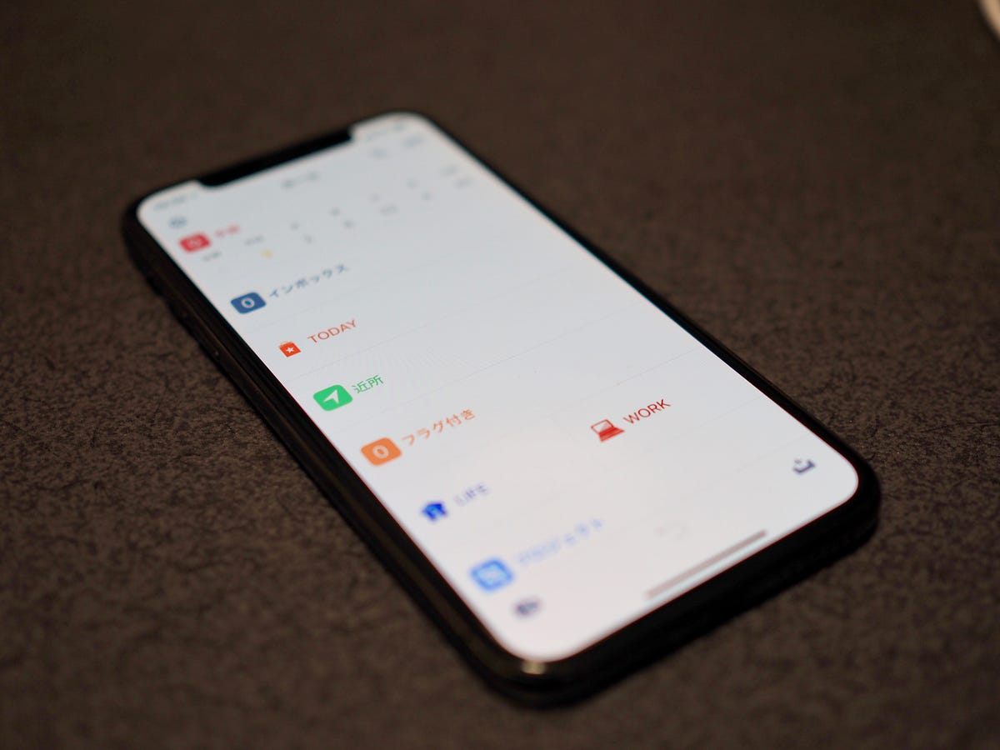

OmniFocus 3 for iOS が5月30日にリリースされました。

[**「OmniFocus 3」をApp Storeで**  
_「OmniFocus 3」のレビューをチェック、カスタマー評価を比較、スクリーンショットと詳細情報を確認することができます。「OmniFocus 3」をダウンロードしてiPhone、iPad、iPod touchでお楽しみください。_itunes.apple.com](https://itunes.apple.com/jp/app/omnifocus-3/id1346190318?mt=8 "https://itunes.apple.com/jp/app/omnifocus-3/id1346190318?mt=8")

OmniFocus は、2008年に誕生しました。

[**Announcing OmniFocus 1.0 - The Omni Group**  
_Creators of Mac, iPad, and iPhone productivity software. Proud to bring you OmniFocus, OmniOutliner, OmniGraffle, and…_www.omnigroup.com](https://www.omnigroup.com/blog/Announcing_OmniFocus_1.0 "https://www.omnigroup.com/blog/Announcing_OmniFocus_1.0")

2001年に出版された “Getting Things Done”を発端として、GTDのブームのようなものが広がっていくわけですが、その中で OmniOutliner でGTDを実践する人が出始め、そして、OmniFocusが誕生したと記憶しています。ですので、OmniFocusの中心部分でもあるタスクの一覧は、アウトラインプロセッサーとなっています。

そして、今日、OmniFocus 3 for iOSが登場しました。アウトラインプロセッサーベースであることは変わりません。OmniFocus2 から変更があったのは、タグの導入、柔軟になった繰り返し、そして、任意のリマインダーです。Mac版はこれからリリースされるとのことですが、OmniFocus 3 for iOS は OmniFocus 2 for Mac とデータ互換性があります。

下の階層やタスクに行き来したりするときの細かいアニメーションなど、OmniFocus 2 for iOS ではイマイチだったところが、OmniFocus 3 for iOS では、整理され、iOSの新しいスタイルにも馴染むような感覚があります。

これから出てくるOmniFocus 3 for Mac、そして、OmniFocus 3 on the Web が楽しみです。