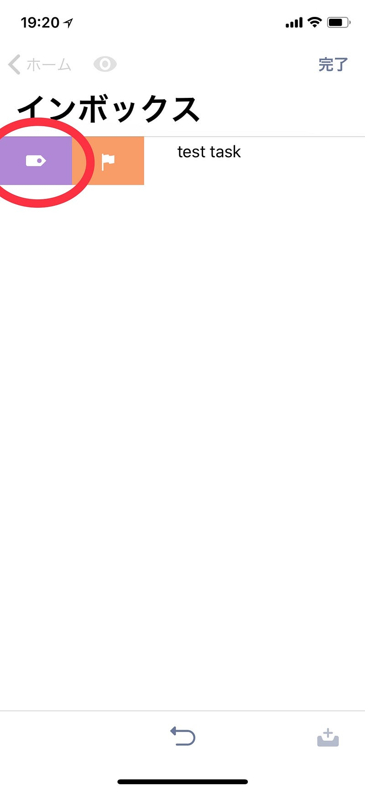
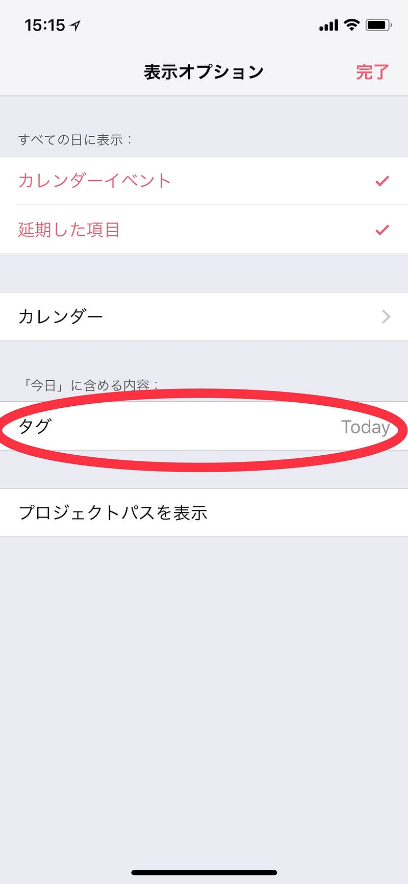

OmniFocus 3 for iOSには、細かいですが、簡単に特定のタグを脱着できる機能がつきました。

タスクを右にスワイプするだけです。

ここに掲載するタグは、「予測」の設定から”今日に含めるタグ”を変更することで、変更されます（なぜ設定がここにあるんだ）

この設定は予測画面だけではなくアプリ内で有効なので、「予測」の画面から自由に脱着したり、他のパースペクティブから自由に脱着することができます。なんて簡単なんでしょう。

自分はこれを”Today”タグを指定しようと思っています。つまり”Today”タグは「今日やろうと思っているタスク」ということです。

OmniFocus3の発表があった時、Omni GroupのCEO Ken Caseはこんな発言をしていました。これはちょうどその機能だと思ったのです。

> If you also want to put it on … tag it for today, then you can have a “Today” list that you could see it in as well.

[**Ken Case on Omni's 2018 Roadmap**  
_Ken Case, CEO and one of the founders of The Omni Group, talks about what we accomplished in 2017 and what we plan to…_theomnishow.omnigroup.com](https://theomnishow.omnigroup.com/episode/ken-case-on-omnis-2018-roadmap "https://theomnishow.omnigroup.com/episode/ken-case-on-omnis-2018-roadmap")

こうすることで、「Today」は今やるべきタスクのリスト。「予測」は時間に余裕があるときに、少し先を見通すための場所と区別して使うことができます。どうしても「予測」と「Today」が混合してしまいがちになのです。

ところが。ここからは注意点です。

現在のところOmniFocus 3 for Mac はリリースされていません。そしてOmniFocus 2 for Macとのデータ互換性はありますが、コンテキストと認識されるのは、タグのうち最初のタグのみです。そして、この機能は、指定されたタグを末尾に追加します。

カスタムパースペクティブで “Today” タグがついたタスクをフィルタリングして表示、なんてことは OmniFocus 2 for Mac ではできません。OmniFocus 3 for Macをお待ちください。_（夏くらいにリリースされると聞いていますが、WWDCで大きなプラットフォームの変更があった場合はこの限りではないかもしれません）_

フラグでも同様の機能は実現可能なわけですが、左にフリックすることで脱着できるのはとても楽だし、楽しいUIのひとつだと思います。

これから出てくるOmniFocus 3 for Mac、そして、OmniFocus 3 on the Web が楽しみです。