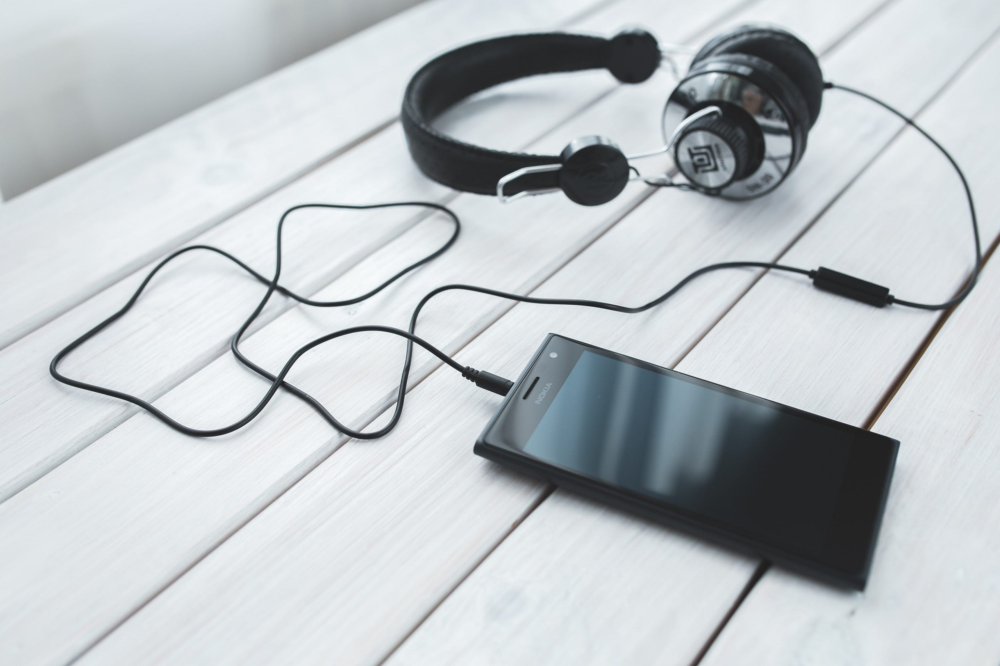

この時期になるとなぜか無性に音楽が聴きたくなる。つい新しいヘッドフォンを買ってしまうのもそれが理由な気がしている。普段は、iPhoneで聞いているけど、この時期は長い夜を、DENON DA-10とSONY MDR-1AM2 とともに過ごしたい。ソースは、Apple Musicだけどね。

というわけで、今年1年に出会ったアルバムの中からお気に入りのアルバムを紹介していく。リンクは全部Apple Musicなので、Spotify派やGoogle Music派の場合は検索してみてください。

#### Songline by くるり、重力と呼吸 by Mr.Children

Mr.Childrenとくるりのこのアルバムは、それぞれのキャラクターの安定感を感じる。ずっと同じ曲だと飽きてしまうけど、新しいアルバムにそれぞれのバンドの味が滲み出ていて、安心感がある、そんな感じ。

[**‎くるりの「ソングライン」**  
_‎アルバム・2018年・12曲。 Apple Musicに登録すると利用できます。無料で体験する。_itunes.apple.com](https://itunes.apple.com/jp/album/songline/1413641821 "https://itunes.apple.com/jp/album/songline/1413641821")

#### スポットライト by FLOWER FLOWER

最初 FLOWER FLOWER を聞いた時に、YUIとの違いを意識してるのかなと思ったこともあったけど、自由にロックをやっている印象が強くなった。「パワフル」のキャッチーさとかは、とてもYUIを彷彿とさせる。

[**‎FLOWER FLOWERの「スポットライト (Extra Edition)」**  
_‎アルバム・2018年・15曲。 Apple Musicに登録すると利用できます。無料で体験する。_itunes.apple.com](https://itunes.apple.com/jp/album/%E3%82%B9%E3%83%9D%E3%83%83%E3%83%88%E3%83%A9%E3%82%A4%E3%83%88-extra-edition/1350314975 "https://itunes.apple.com/jp/album/%E3%82%B9%E3%83%9D%E3%83%83%E3%83%88%E3%83%A9%E3%82%A4%E3%83%88-extra-edition/1350314975")

#### Luby Sparks by Luby Sparks

もともと聞いていたYuckのtweetで知ったんだと思うけど、Luby SparksもYuckのように、ギターを歪ませるタイプのロック。Yuckみたいなサウンドをやるバンドが、日本から出てくるということに最初は驚きを感じた。

[**‎Luby Sparksの「Luby Sparks」**  
_‎アルバム・2018年・11曲。 Apple Musicに登録すると利用できます。無料で体験する。_itunes.apple.com](https://itunes.apple.com/jp/album/luby-sparks/1329831656 "https://itunes.apple.com/jp/album/luby-sparks/1329831656")

#### REI by Rei

やっとアルバムを出してくれた、という印象が強いRei。ギターテクニックとかが言われることが多いですが、このアルバムを通して聞いてみて、改めて、アイデアの豊富さとか、バックグランドにある音楽の厚みみたいなものを感じることができた。

ぜひパッケージとして、通しで聴いてほしい。

[**‎Reiの「REI」**  
_‎アルバム・2018年・12曲。 Apple Musicに登録すると利用できます。無料で体験する。_itunes.apple.com](https://itunes.apple.com/jp/album/rei/1437479390 "https://itunes.apple.com/jp/album/rei/1437479390")

#### 誕生 by チャットモンチー

今年の大きなトピックはいくつかあって、そのひとつがチャットモンチー。これを聞いて、武道館の最後のライブを見て、走り抜けた気持ちよさみたいなのが伝わってきて、チャットモンチーがお休みすることに強い肯定感があった。

[**‎チャットモンチーの「誕生 (Bonus Track Edition)」**  
_‎アルバム・2018年・8曲。 Apple Musicに登録すると利用できます。無料で体験する。_itunes.apple.com](https://itunes.apple.com/jp/album/%E8%AA%95%E7%94%9F-bonus-track-edition/1388774324 "https://itunes.apple.com/jp/album/%E8%AA%95%E7%94%9F-bonus-track-edition/1388774324")

#### DISTANCE by Attractions

やっぱこれ紹介してしまう。もう知ってる人は知っているので解説の必要はないと思うけど、記事を貼って解説がわりにしておく。

[**福岡から世界へ、Attractionsが考える"アジアで通用するということ"**  
_Spotifyが注目する、ニューカマー発掘プレイリスト『Early Noise Japan 2018』と、リアルサウンドのコラボ企画「Signal to Real…_realsound.jp](https://realsound.jp/2018/07/post-228184.html "https://realsound.jp/2018/07/post-228184.html")

アルバムを通して、いろんなバックグラウンドが綺麗に混ざり合っていて、それでいて、とてもロック。実はアルバムのファーストインプレッションは自己満足的な部分、勝手に鳴っている感じがあったんだけど、聞いているうちにどんどん引き込まれる。何と言っても完成度が高すぎる。

東京拠点のメジャーレーベルとかに行かずに勝手に世界でウケてしまえばいいと思う。それくらいのことはできるサウンドだと思うし、それが福岡っぽい。

#### 最後に

今年入手したアルバムを出してみて、いくつか選んでこういう記事を書くんだけど、今年は新しいバンドやミュージシャンが目立った一年だなと思うし、アルバムは出なかったので記事にはないけど、あいみょんがブレイクした1年だったかなと思う。

テレビで毎週やる音楽番組が少なくなって久しいし、たまにある大型音楽番組でも、80年代、90年代の「昔流行った音楽」がいまだに存在感を増している。90年代は自分も親しみが強い時期だし、それもいいんだけど、新しい才能も出てきているし、CDショップに行かなくてもインターネットの力で出会える環境は整っているし、むしろそっちの方がちゃんと音楽に向き合えるので、テレビなんかほっといて「今の音楽」を聞いていきたいなと思う。

数が多いので、取り上げなかったけど、

[**‎Celeina Annの「Departures」**  
_‎アルバム・2018年・13曲。 Apple Musicに登録すると利用できます。無料で体験する。_itunes.apple.com](https://itunes.apple.com/jp/album/departures/1354875010 "https://itunes.apple.com/jp/album/departures/1354875010")

なんかも気になっているサウンドだったりする。

商業的には難しい部分もあるのかもしれないけど、文化的にはとてもいい方向に向かっているんじゃないかな。そういうのを感じさせてくれる1年でした。