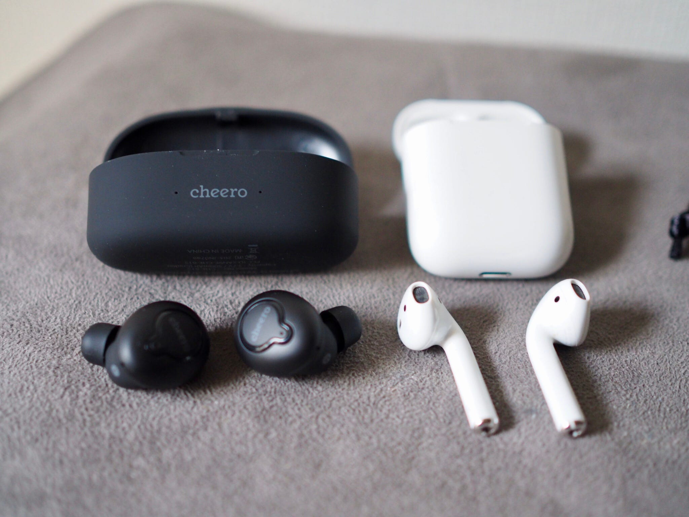

Twitter見てたらふらっと流れてきたので、ポチッとしたら今日届きました。

[**cheero Wireless Earphones**  
_高音質な完全ワイヤレスイヤホンの登場です。_www.cheero.net](http://www.cheero.net/products/wireless_earphones/ "http://www.cheero.net/products/wireless_earphones/")

[**［レビュー］cheero Wireless Earphonesがやってきた！左右独立式の高音質ワイヤレスイヤホンがcheeroより登場！【PR】**  
_みなさま、こんにちは。Kazuto Tanabe（@WWDC1999 ）です。 今回は、2018年3月8日より販売が始まるcheeroの新製品「cheero Wireless Earphones」をレビューします。 ..._xn--p9j1ayd.net](https://xn--p9j1ayd.net/archives/25686 "https://xn--p9j1ayd.net/archives/25686")

AirPodsは持っているんですが、AirPodsはインナーイヤー型なので、カナル型を試したいと思っていたのと、ちょうどよくCheero Wireless Earphonesの話を聞いたのと、値段がとても手頃感だったので、お試し感覚です。

ざっと視聴した感じ、AirPodsの代わりになるなと感じました。１万円以内のイヤホンの音を聴くのがとても久しぶりなので、比較が難しいのですが、サウンド的には値段なりの音かなと感じます。AirPodsはインナーイヤー型でかなり損している(特に低音が）ので、それよりは「きちんと音楽を聴けている」感じはします。

ただ、付属のイヤーチップでは低音が落ちている印象が強いのと、構造上耳への入りが甘いと落ちそうなので、たまたま手元にあったコンプライ TSX500をつけたところ、低音も大きく補強され「音楽を聴いている」感が増しました。解像度とか音場の広さとかは好みや音楽ソースの問題もあるので、実際に聞いてもらえればと思いますが、10分くらい視聴した感じでは気にはならなかったです。（ただしコンプライは合っているものを選ぶ必要があるので、メーカー側から型番のアナウンスが欲しいです）

個人的に気になる点は２点。第１に、コンプライをつけてしまうと、遮音性が高すぎて、周りの音がほとんど聞こえないこと。これはカナル型の宿命とも言えます。そのために環境音集音機能がついているそうなのですが、まだ試していないので、それはこれから。3回押しらしいんですがわざわざ説明書きがついているくらいなので難しそうな予感。

第２は、デザイン上の問題。全体的にプラスチックにチープな感じが漂っているのと、使用中にイヤホンのLEDが光ること。一昔前のBluetooth機器は繋がっていることを示すためなのかどうなのか、必ず「光るLED」がありますが、結構ダサいと思っていました。”かっこよさ”はあまりないです。

### 結論

電車の中で、iPhone 7/8/Xに、Lightning変換アダプタをつけて、わざわざワイヤードイヤホンを繋げて音楽を楽しんでいる人をよく見かけます。

通常価格6980円（税込)とのことなので、5000円から6000円のワイヤードカナル型イヤホンを使っている人には、この製品を気にワイヤレスの世界を楽しんで欲しいなと思います。

自分は、街で入ったお店の店員さんとお話しするときに、すぐに耳から外して首にかけておけるヘッドフォンの方が好きなので、こちらを常用にすることはないと思いますが、遮音性も高いので飛行機や新幹線の移動中に使うのもありかなとは思っています。ケースも大きくないので、荷物になりにくいですしね。