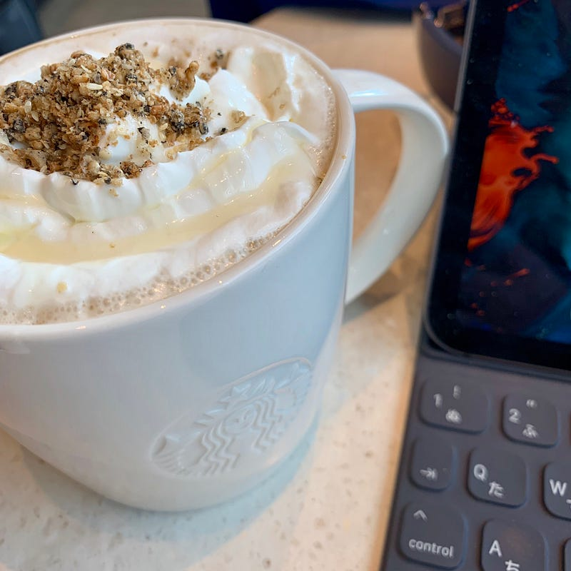

音楽と映画を振り返る記事を書いていて、今回は映画編。音楽は1週間前くらいに早々と書いてしまった。

さて、とりあえず今年みた映画を書き出してみる。映画館だけではなく、BS/CS/ストリーミングでみたものも含まれている。

*   巫女っちゃけん
*   東京無国籍少女
*   民生ボーイと狂わせガール
*   パーフェクトレボリューション
*   二重生活
*   トリガール！
*   勝手にふるえてろ
*   我がチーム墜落事故からの復活 mossachape
*   世界は今日から君のもの
*   コードブルー
*   カメラを止めるな
*   銀魂2
*   寝ても覚めても
*   SUNNY
*   音量小さいんだよタコ
*   search
*   あさひなぐ
*   COLDPLAY; A HEAD FULL of DREAMS
*   祈りの幕が下りる時

普段洋画には興味を示さないんだけど、今年はわりと洋画を見た年と言える。見たい邦画が多い年だったようにも感じていたけど、並べてみるとあんまりみてない。

個人的に好きなのは「寝ても覚めても」。原作の柴崎友香さんの小説は好きで、よく読んでいる。その中でも、小説版「寝ても覚めても」は、ほかの柴崎さんの作品とはスピード感があまりにも違うこともあって、気になっていた。映画版には、小説版にはない、エピソードがふんだんに盛り込まれていて、それはとても映画的に映えるものになっていて、でも柴崎さんの文章の手触りがあって、好印象だった。

今年の年初めにも、福津市で撮られた巫女っちゃけんをみた（JALのCMで有名になった宮地嶽神社が舞台）けど、来年の年初めには江口カン監督の「めんたいぴりり」の全国公開が控えていて、これはただの偶然なんですかね。

みたい映画のリストは Things に入れていて、30作品くらいはあるので、年末年始の時間があるときを使って、少し消化したいところ。