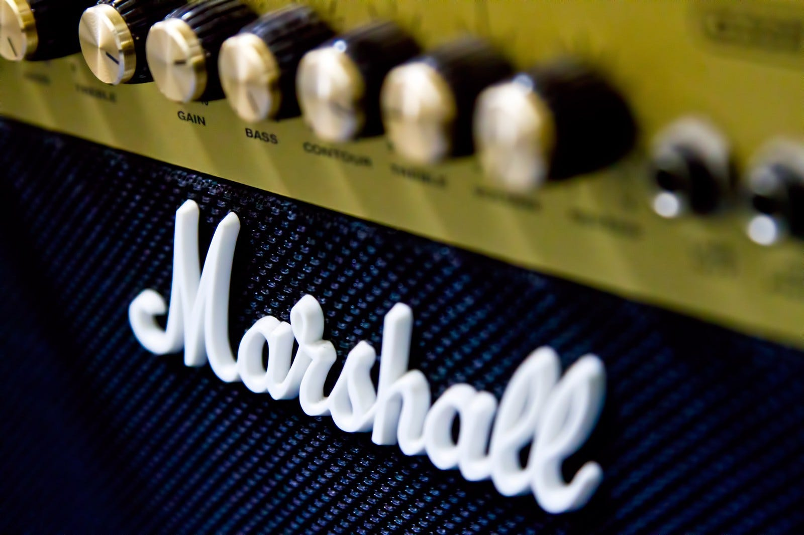

2019年は音楽視聴環境のアップデートの年だった。待ち望んでいたHomePod、そして、Beats Solo Pro、AirPods Pro が日本で発売された。

そんな2019年に出会った音楽の中からお気に入りの音楽を紹介する。

#### CROSSING by ecke

どうやって出会ったのかすでに覚えていないけれども、ずっとバスの中で聞いていたのを覚えている。久しぶりに出会った新しい音楽だった。

#### SEVEN by Rei

彼女のサウンドは、古いものを下敷きにしながらも、新しいものになっているのを感じられ、そして聞いていて心地いい。

#### Everyday life by Coldplay

TikTokやinstagramを中心に、短い時間にキャッチーな音楽が注目されている一方で、あくまでアルバムを通した作品を出してくるバンドの信念を感じる。

#### HAO by NYAI

今年の音楽はNYAIに出会ったことが大きかった。福岡を中心に活動するNYAIはついにインディーズレーベルと契約することになった。

#### 消えない by 赤い公園

新体制となった赤い公園。１年間のインディーズ生活に区切りを打ち、メジャー再デビューのEP。「消えない」には、このままでは終わらない強い気持ちを感じた。そして、彼女らにはこのままでは終わらない力強い未来が待っている気がする。

#### NEGOTO BEST by ねごと、まぼろし by 蒼山幸子

本当はmiidaも紹介したいのだけど、シングルはいったん除外したいのでこの２つを。ねごとの解散とメンバーの再始動。新しい鼓動が聞こえてくる気がする。

#### 最後に

昨年 あいみょんがブレイクしたのに続いて、今年は King gnuやOfficial髭男dismがブレイクした年だった。

それ以外にもいつブレイクしてもおかしくないようなバンドもたくさんある。毎年新しい才能に出会えるのはとても楽しい。