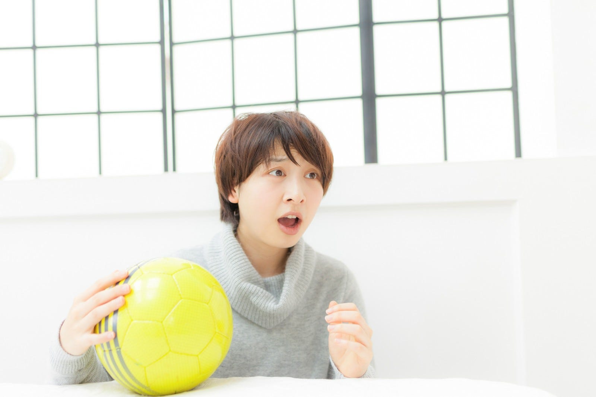

まずは基本のフォーメーション。4–2–3–1。最初は、鈴木惇のワンボランチだったようだが、彼は視野も広いし、ロングキックも正確なので、もしかしたら、チェルシーのジョルジーニョのような役割を期待したのかもしれない。練習試合をしてアンカーシステムからツーボランチにしたようなので、ジョルジーニョの横にはカンテが必要だと判断したか。カンテ役はそーたん。

ネガティブトランジションは、まずボールを奪いに行って、成功したらカウンター、失敗したらバランスを整えるという感じのようなので、ゲーゲンプレスはやるものの、リバプールやRBライプツィヒほどのイケイケスタイルではないのではと想像している。（もしそうだったら夏場が心配）

去年までの井原スタイルは、ボールがミドルサードに入ったらバスを止めることをやってたけど、今年はディフェンシブサードまで来ないとバスを止めることはなさそう。ポジティブトランジションの時に少ないタッチ数で裏を狙えるように、が基本コンセプトみたいなので、守備時の立ち位置はそれを頭に入れたものになる。つまり、CBとGKにはボールを跳ね返すという責任が去年よりは大きくなるし、ボランチにはボールを拾うという責任が大きくなる。

相手がひいた時は、惇アンカーにしつつ、SBが前に上がって相手に幅をもたせたところで、そーたん、喜田、大河あたりが内（ハーフスペース）をドリブルで突破する、もしくは、トップの城後、石津あたりと連携して突破するという形が見えるのでは。

ミコルタはまだきてないけど、スピードがあるということなので、裏にスペースがある相手、例えば新潟（第5節 3/23）、千葉（第6節 3/30）では強みを発揮できそう。アバウトに前に蹴ったボールの拾い役として。早めに来日してほしいところ。

ネガティブなポイントをいくつか。

ファビオ監督の指示は細かいようなので、負けが続いた時に、今のサッリ監督のような状況になってしまう可能性はあるかも。ある意味で戦術が全てなので、その戦術に信頼が置けなくなってしまうのが一番怖い。

ケガ人やスタミナは大丈夫そうという話は聞いているし、キャンプを見ている限り、去年みたいにずっとケガ人が続くという状況はなさそう。小さい怪我は心配していないが、24名しかいないので、特に終盤に大怪我の選手が出てしまうと厳しいかも。あと、ファビオ監督は夏にサッカーをするという状況をおそらく知らないので、夏場の不安要素はある。

夏場の時期に、ファビオ監督が抜かれたり、レンタルの選手が大活躍して「戻ってこい」なんてこともありうるので、そこはクラブがマネジメントとして、補充も含めてしっかりやってほしい。

以上。ともかく楽しみなので、一度戸田さんのような、きちんとサッカーを言語化できる解説者に解説してほしいなと思っている。