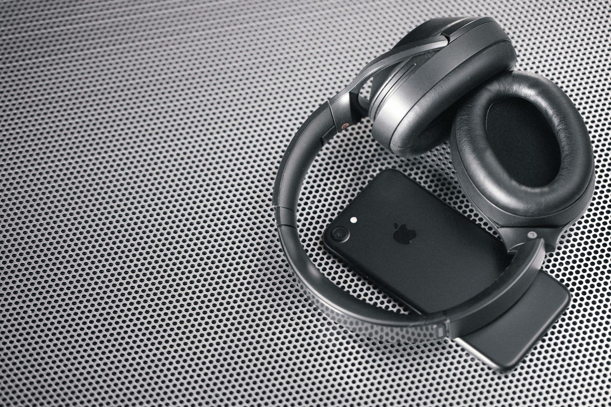

某ミュージシャンの騒動で急にサブスクリプション型サービスにフォーカスがあたり始めた。TBSラジオ LIFE でテーマになったばかりだったりするし、今月末にはAppleが新しいサービスを発表するという噂もある。なんというタイミングなのだろう。

[**【音声配信】「文化系大忘年会2018」Part1▽鈴木謙介、速水健朗、文月悠光、永田夏来、海猫沢めろん、ひらりさ、倉本さおり、塚越健司、宮崎智之、伊波真人、斎藤哲也（TBSラジオ「文化系トークラジオL…**  
_・某公共放送で貰ったクリスマスセーターを着てきました（塚越） ・毎週水曜に熊本からやってきて深夜放送（海猫沢） →Vtuber、会社作り、ラジオなど様々な仕事（海猫沢） →BL翻案版「古事記」は過激すぎて一部カットに（海猫沢）…_www.tbsradio.jp](https://www.tbsradio.jp/life/2018/12/2018part1tbslife20181223.html "https://www.tbsradio.jp/life/2018/12/2018part1tbslife20181223.html")

ただサブスクリプションとダウンロードの違いを認識しておかないと議論は空中戦にしかならないので、簡単にまとめておく。

#### Subscription vs Download

音楽のオンラインサービスには大きく２つの形式がある。サブスクリプションとダウンロードだ。

サブスクリプション型はApple MusicやSpotifyがある。一般的には、再生する権利をユーザーが得るタイプのサービスだ。つまり、ラインナップは常に動的に変わっているので、タイミングによって再生できる楽曲が変わる。再生するたびにレンタル手続きをするレンタルサービスで音楽を聴いているに近い。

ダウンロード型はiTunes StoreやOTOTOYなどがある。一般的には楽曲ファイルそのものを販売するタイプのサービスだ。iTunes Storeは以前は強いDRMが付いていたが、今はDRMフリーになっている。つまり、いつでも再生可能だ。もちろん、店舗側のラインナップは動的に変わっているので、タイミングによって購入できる楽曲が変わるが、ラインナップから無くなったからといって、再生ができなくなるものではない。

[**_【更新】アップル、iTunes Store全曲をAAC 256/DRM無しの「iTunes Plus」に_ - PHILE WEB**  
【更新】アップル、iTunes Store全曲をAAC 256/DRM無しの「iTunes Plus」にwww.phileweb.com](https://www.phileweb.com/news/d-av/201202/22/30376.html "https://www.phileweb.com/news/d-av/201202/22/30376.html")

言いたいのはデジタル販売全てが「誰かの意図」によって再生ができなくなることはないということ。ただ、現在の音楽はほとんどApple Music / Spotify で再生されていると推定されるので、Apple Music / Spotifyにない音楽は “世界に存在しない音楽” と言ってしまうこともできる。（一種のネタ的な感じ）。

ダウンロードとサブスクリプションの違いによって、ダウンロードにはあるのにサブクリプションにはないといったことがおきるし、またその逆も起きる。これは、レコード会社など制作者側の意図によるところが大きい。

#### 僕がApple Musicを使う理由

自分がSpotifyではなくApple Musicを使い続ける理由はまさにここまで述べたことに尽きる。Apple Musicで気になった音楽はiTunes Storeで購入することで「自分のもの」にできる。もしものための保険をかけておけるのだ。

そして、Apple Music + iTunes Storeでは、どちらかを区別せずに再生できる。これが最大の利点だ。