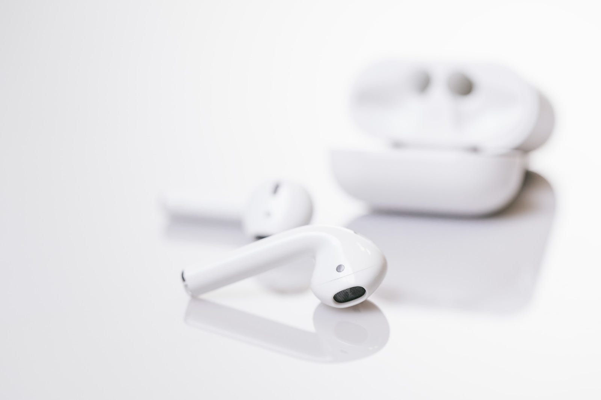

４月に入って、LEGO BIG MORL “KEITH” と スガシカオ “労働なんかしないで光合成だけで生きたい” を聴きまくっています。

Powerbeats Proのメディア向け説明会が開催されたそうで、日本の発売が後ろにずれたそうで。

[**Beats by Dr. Dre、完全ワイヤレスイヤフォン「Powerbeats Pro」の拘りを聞く | Beats | Macお宝鑑定団 blog（羅針盤）**  
_Beats by Dr. Dreが、メディア向けに完全ワイヤレスイヤフォン「 Powerbeats Pro」の製品説明会を開催しました。 Beats by Dr. DreのプレジデントLuke…_www.macotakara.jp](http://www.macotakara.jp/blog/Beats/entry-37372.html "http://www.macotakara.jp/blog/Beats/entry-37372.html")

また、Air Podsの新モデル発売でイヤホンレビューが活性化しているので、イヤホンに求めることをまとめてみることにしました。

#### 聴き疲れしない音・形状であること

必須ですね。たまに高い音が耳に痛いものも存在するので。あと低音が強くて酔うみたいなこともありました。

#### 音楽が聴ける環境であること

飛行機とか地下鉄ならノイズキャンセリング欲しいなとか、街歩きならそこまではいらないなとか、そういうことです。

耳の健康を考えると、必要以上に音量を上げたくないので、イヤホン自体がなるべく環境を整えて欲しいですね。

#### 音漏れが比較的少ないこと

大音量で聞いたりはしないのでそんなに心配はしていないですが、これも必須

#### 脱着しやすいこと

音楽を聴く時間のほとんどは街歩き中。途中コンビニに寄ってドリンクを買うということもあるのですが、イヤホンつけたままレジの応対はしないので、脱着が簡単なことはとても大事なことです。

イヤホンでもT字とY字がありますが、どちらかというとT字の方が好みです。

#### 最後に

Powerbeats Proは、脱着しずらいので買わないと思います。AirPodsもこれが理由であまり外では使っていません。Beatsでは、BeatsXとかはこれらの条件にマッチしていますね。

[**Beats by Dr.Dre BeatsXイヤフォン - ブラック**  
_Beats by Dr.Dre BeatsXイヤフォン - ブラックがイヤホン・ヘッドホンストアでいつでもお買い得。当日お急ぎ便対象商品は、当日お届け可能です。アマゾン配送商品は、通常配送無料（一部除く）。_www.amazon.co.jp](https://www.amazon.co.jp/dp/B07JVHZSMS/ "https://www.amazon.co.jp/dp/B07JVHZSMS/")