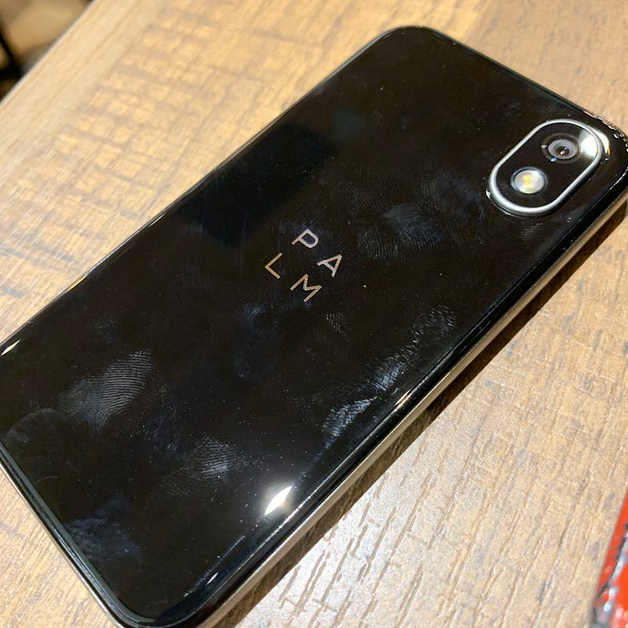

Palm Phoneをちょっと使って旅行してきたので、簡単なレビューを。

[**Palm Phone 3GB/32GB 防水 IP68 Oreo 8.1 小型 スタイリッシュ SIMフリースマートフォン【日本正規代理店品】**  
_Palm Phone 3GB/32GB 防水 IP68 Oreo 8.1 小型 スタイリッシュ…_www.amazon.co.jp](https://www.amazon.co.jp/dp/B07QL6W6V5/ref=as_li_ss_tl?ie=UTF8&linkCode=ll1&tag=qli-22&linkId=1e9fc579f9d3b0107231fc30a5c08871&language=ja_JP "https://www.amazon.co.jp/dp/B07QL6W6V5/ref=as_li_ss_tl?ie=UTF8&linkCode=ll1&tag=qli-22&linkId=1e9fc579f9d3b0107231fc30a5c08871&language=ja_JP")

iPodが登場した頃、自分はCLIEを使って音楽を聴いていました。スケジュール管理もその頃からデバイスでやっていましたし、PCメールも受信できるようにしていました。Air H” のCFカードを頑張って挿していたりもしました。懐かしいです。

Palm Phoneは、ちっちゃなAndroidデバイス。Androidのセットアップが終われば使えるようになります。ちっちゃいので、ジーンズのコインポケット（右側のポケットの中にある小さいポケット）にも納めやすい。

質感はちっちゃなiPhone X。周囲がアンテナ部とか、上部にイヤホンがあって下部にマイクがついているのもほぼ同じ。

右側の電源ボタンを押すと起動して、顔認証でロックを自動的に解除して使えるようになります。セキュアなのにスムーズというのは、AppleがFace IDで目指していることと同じですね。

Palm Phoneで特筆すべくなのがライフモードと呼ばれる機能。これは画面がオフの時に、モバイル通信やWi-Fi通信を切断します。音楽は聞けるようなので、Bluetoothだけはつながっているようです。これにより、ロックしている間はPalm Phoneで着信や通知は発生しません。ロックを解除した時に通知されます。

自分なりに使えると思うシチュエーションは、at glance な状況確認です。Apple Watchの立ち位置に似ているかもしれません。メールの着信やスケジュールの確認、簡単なニュースチェックにとても便利だなと。旅行中はもっぱらGoogle now機能を使っていました。

画面が小さくキーボードも小さいため、キーボードでの文字入力は向きません。フルで使おうとするのであれば、Xperia Ear Duoのようなデバイスを使って声で操作するのがストレスが少なくなるのではと思います。

サブ的な立ち位置としてキーホルダーにつけて、ちらっと確認する時に使うというのが理想的ですね。そのためには次のデバイスでは無線充電できるようになると嬉しいです。

[**Palm, the perfect sized smartphone.**  
_With phones getting bigger and bigger, Palm made a smaller and sleeker smartphone that keeps you connected but not…_www.palm.com](https://www.palm.com "https://www.palm.com")