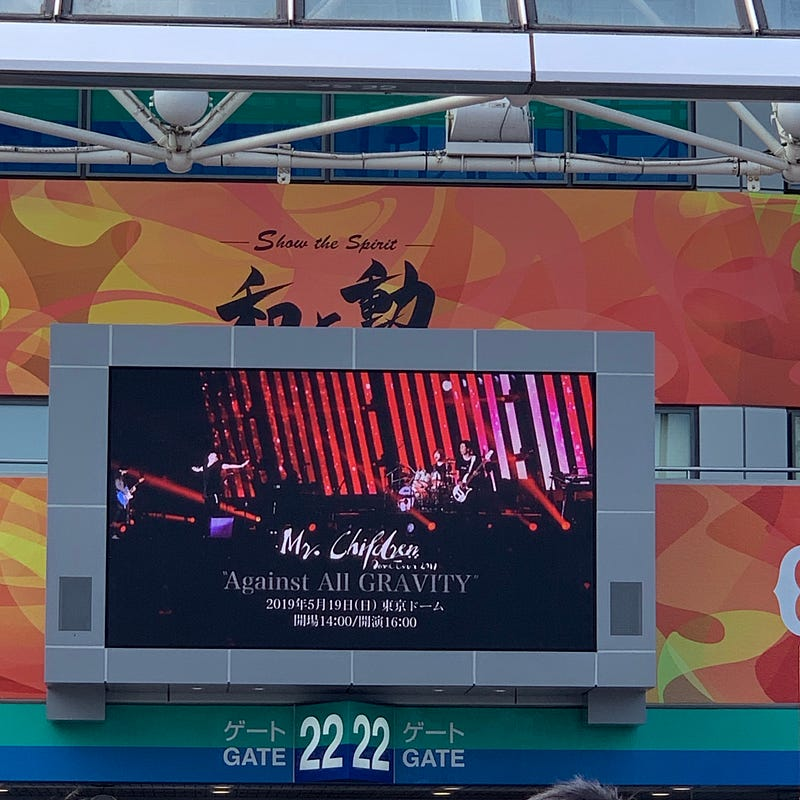

本編の全ての演奏が終わり、「海にて、心は裸になりたがる」が終わった時、「もうそんなに時が経ったのか」と思った。そう感じさせてくれるMr.Childrenのライブは本当に久しぶりだった。

7年ぶりのMr.Childrenのライブ。別にスルーしてたわけじゃない。Mr.Childrenが電子チケットシステムを導入してからなぜか毎回当選しなかっただけだ。

Mr.Childrenのライブといえば、定番の構成というものがあった。大きなテーマがあり、そのテーマにのっとったオープニングから始まり、アップテンポな曲があり、その後ミドルテンポ・スローテンポの曲をはさみつつ、落ち着いたところでシングルカットされた曲やアップテンポな曲をはさみ会場の熱量をあげながら本編が終わっていき、壮大なクロージングを迎える。

このライブでは定番の構成を廃した。音楽を聴かせつつ、ドームという広い会場をいかんなく使ったステージ装置、そして演出に驚かされた。Mr.Childrenのドームツアーの定番である花道、そしてこれは毎回最新のテクノロジーで驚かされる映像装置など、さまざまなところに工夫があり、そして、説得力があった。  
フェスでは遠い席の人のための補助装置として機能するステージサイドのディスプレイを、曲によっては消し視線をステージに集中させ、曲によってはエフェクトをつけた映像を流す。  
ステージバックの映像も大きなディスプレイ9枚をクレーンで傾きを変えることで、ON/OFFを切り替えたりもした。（あのクレーン、よくノイズにならないなと感心してた）  
花道のギミックは…この後発売されるだろう映像パッケージで見た方がいいんじゃないだろうか。

セットリストでは、Dance Dance Dance、innocent world、Tomorrow never knows、名もなき詩、everybody goes、sign、HANABI といったど定番を入れつつ、addiction、Prelude、Candyといったアルバム曲をちりばめられ、さまざまな人が集まる「ドーム」という空間を満足にさせてしまう。個人的にはもっとマニアックなセットリストの方が嬉しかったりするが、最初にStarting Overを入れてしまうあたりがとてもニクい。

最近、ライブハウスに行くことが多くて、ドームという広い空間のステージを見ることが本当になくなってしまったので、とても刺激になったし、とても楽しかった。