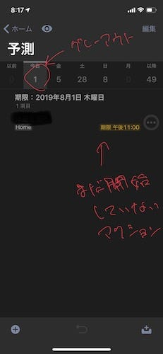
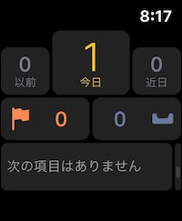

あまり特定のプロダクトについて気になるポイントをあげるのは好みではないのですが、OmniFocusの他のポイントは素晴らしいがゆえにどうしても個人的にひっかかっているポイントがあるので取り上げます。

それは以下の２つです。

1.  Apple Watchで、「今日」の残りのアクションが始まっていないものだけに関わらず、アクション数が強調される。
2.  繰り返しのアクションが「引き継ぎ制」であること

順に説明していきます。

#### Apple Watchで、「今日」の残りのアクションが始まっていないものだけに関わらず、アクション数が強調される

Apple Watchの画面は、「予測」画面を軸に作られていて、その画面を見るだけで急ぎのアクションがどれだけあるのかがわかるようになっています。Apple Watchで確認したいのは時間がないときであることが多いと言う配慮なのかもしれません。

もともとiOSやmacOSの「予測」は、アクションの期限ベースで数字が表示されており、これが「その日に期限を迎えるアクション数」を表しています。「期限間近」のアクションがあると黄色で表示し、すぐに着手すべきであることを知らせてくれます。

「期限間近」は設定で変更できるのですが、自分は「今日」で使うことが多いので、その場合で説明します。また「期限間近」のアクションの前提条件は「処理可能であること」です。例えば、 “今日期限で、かつ、まだ処理可能ではないアクション” は「期限間近」ではありません。例えば、夜の間に実施するアクションで 延期を18時、期限を21時に設定しているようなアクションはこれに該当すると思います。

ところがApple Watchは処理可能ではないアクションも含めて、今日期限を迎えるアクションを黄色で表示します。大したことではないのですが、このUIはノイズになります。

#### 繰り返しが「引き継ぎ制」

繰り返しアクションの実装方法は、大きく２つあります。１つはベースがあって、それを常にコピーする方法。ThingsやTodoistはこれのようです。もうひとつはOmniFocusが取る方法で、完了したアクションの複製する方法です。

どちらもメリットとデメリットがあると思うのですが、特にOmniFocusでは、Forecast Tagやフラグがついたまま複製されるので、繰り返しのアクションが突然「予測」に登場したり、フラグ付きパースペクティブに表示されたままになったりします。

Forecast Tagやフラグがコントロール範囲外の部分でアクションについていると予期せぬノイズになるので、難しいところです。

#### まとめ

今日時点のOmniFocus3の気になるポイントでした。このポイントはOmniGroupにもフィードバックを定期的にしていますが、こちらの拙い英語が伝わっていないのか、OmniGroupの想定上この動きの方が使いやすいと思われているのか、なかなか修正されません。

OmniFocusは、「今日のリスト」のようなアクションをこなすプレッシャーを過度に与えることなく、やれること、やるべきことに集中させてくれる素晴らしいソフトウェアであり、また、レビュー機能は秀逸だと思っています。

もしこの2つの動きで「自分はこう考えてるよ」というのがあればコメントでも、記事の紹介でももらえると嬉しいです。