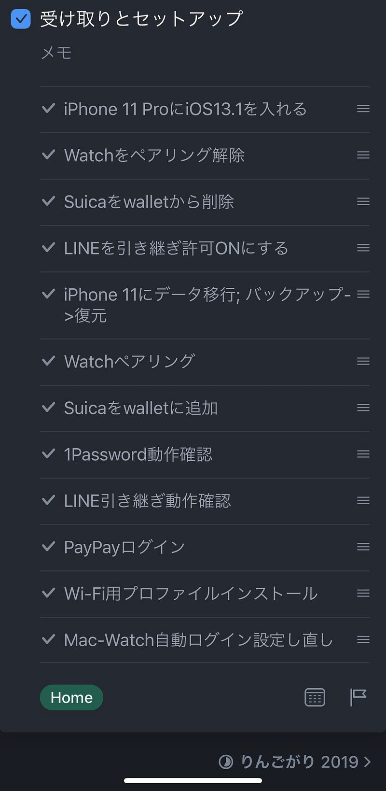
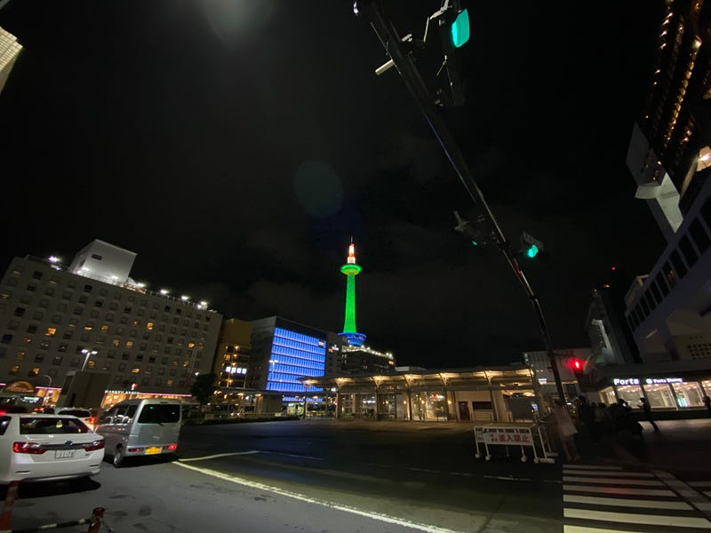

iPhone 11 Proに移行しました。Apple Storeで購入することが多かったのですが、今回はのんびり配送を選びました。

開封とかファーストインプレッションよりも、3ヶ月後生活が変わっているかどうかの方が大切だと思っているので、その辺りは割愛しますが、背面にiPhoneや技適の刻印が消えて、AppleマークだけのiPhoneが戻ってきたことにとても嬉しく思います。また、背面の仕上げは iPhone5 を思い出させます。

今回の端末移行はスムーズでした。これまで毎年やってきた端末移行の経験に加えて、iOS12.4でリリースされた、iPhone間データ移行が便利すぎました。

ここでThingsのチェックリストを使った今回やったことリストを掲載します。

ゲームとかしてるとデータの移行が面倒という話も聞いたりしますが、iPhoneに全くゲーム入れていない人なので、そこに関する作業はありません。

事前にやったことが１個だけあります。それは写真アプリの整理です。写真＋iCloud Photoで管理していますが、これだと、iTunesバックアップの中に写真は含まれないはずです。ところが、なぜか含まれてしまう問題が続いています。そこで、一度iCloud Photoをオフにして、iPhone上に保存されている写真を消すということをやっています。消した後iCloud Photoをオンにしてしまえば元どおりです。

これをすることで、70GBのiTunesバックアップが8GBになりました。この作業のおかげか、iPhone間のデータ移行は約1時間で終わっています。

端末移行して、Suicaのカード番号変わるかと思っていましたが変わらなかったですね。スマートEXの登録変更も必要なさそうです。

