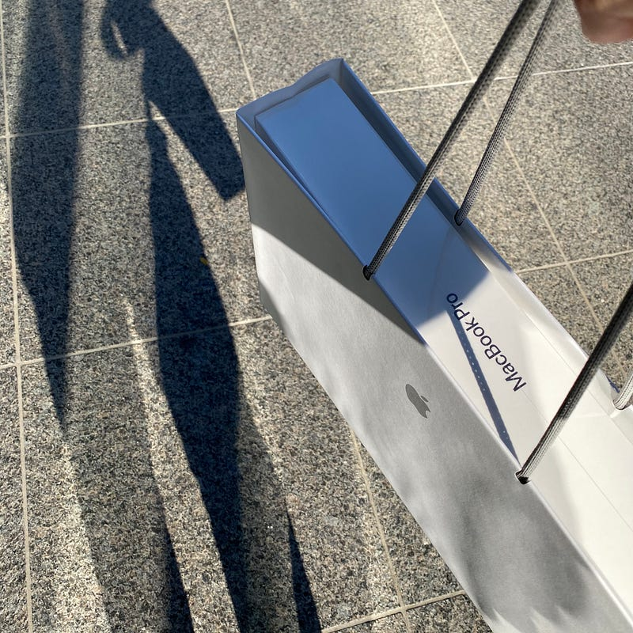

動画を編集するとか、重い作業をするとかそういうことでもないのですが、16インチのMacBook Proを導入しました。

重い作業はあまりしないので、モバイルを重視して、MacBook / MacBook Air と使ってきていたのですが、モバイルは iPad Pro で十分になってきたので、自宅から持ち出さない前提で、ハイスペックのものを、ということで選びました。

目的を考えると、iMacという選択肢ももちろんあります。過去使っていたこともあるのですが、デスクに縛られるのは苦手なので、選択しませんでした。Touch Barを体験したかったというのもあります。

新しい、いえ、久しぶりのキーボードは慣れないですね。バタフライ式に慣れすぎていたみたいです。まだまだtypoが多いです。

久しぶりの更新で T2チップ搭載になりました。SiriもApple Payも使えます。

16インチのディスプレイは、十分大きいので、これでApple TV+見ちゃってもいいかもと思えてきます。

かつて21インチなんてものがありましたね。

