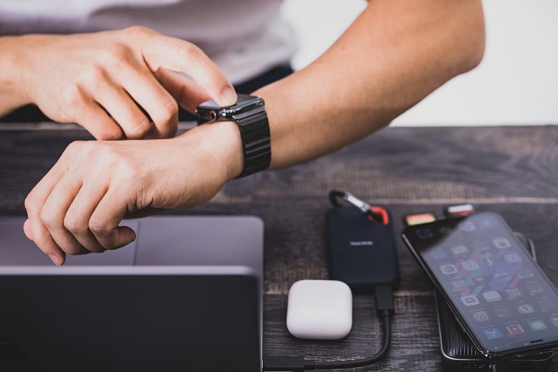

おそらく準備もちゃんとしないままに、Work from home をせざるを得なくなった人もたくさんいるのかなと思います。普段チームで話しながら仕事進めていたような環境であれば、いきなりの環境の変化は戸惑いが大きいと思います。

JIRAやTrello、Backlogなどを使ったカンバン化を進めてみるのもアリかもしれません。カンバンの本も出ているので、この機会に読んでみるのも良いかもしれません。

[https://www.amazon.co.jp/dp/487311764X/](https://www.amazon.co.jp/dp/487311764X/)

個人的な Productivity Toolを使い始めて、10年以上になります。GTDに出会ったことがきっかけでしたが、今では Things を使っています。

Things for watch は先日アップデートがあり、watchアプリが直接クラウド上のThings Cloudと直接同期が取れるようになりました。

[**New Things for Apple Watch**  
_Since New Year, we've been working on a big update - and it's all about modernizing Things for Apple Watch. All the…_culturedcode.com](https://culturedcode.com/things/blog/2020/03/new-things-for-apple-watch/ "https://culturedcode.com/things/blog/2020/03/new-things-for-apple-watch/")

Apple Watchは LTEにも対応しているので、iPhoneが近くになくても同期が取れるようになりました。ただし、一時的な同期のみで iPhoneなしで使えるという形ではないようです。

ここから本題。突然のWork from homeで仕事環境が変わった方も多いと思いますし、新生活の季節でもあるので、記録がわりに自分のProductivityの環境を紹介します。

#### まずはinboxに入れる

ミーティング中やメールを読んでいたりするときに多く新しくやることが発生します。別のことをやっているときに思いつくこともあるかもしれません。その時はそのままinboxに入れておきます。

また、ブラウジング中に「あとで読む」場合もそのままinboxに入れます。

RSSリーダーとして Feedly を使っていますが、気になる記事は Read Later 機能を使います。実は、Zapier で Feedlyで新しくRead Laterした記事を inboxに入れる機能を使っており、あとで自動でinboxに入ります。

Zapierは最近使い出したのですが、とても簡単なUIなので使いやすいです。ZapierからThingsのinboxに入れるのは Things Cloudのメール機能を使っています。

Siriを呼び出して、声で一旦リマインダーに入れてそこからインポートするという手順をとることもあります。HomePodのSiriは大体意味不明な日本語を提供してくれます。

#### inboxを整理する

inboxに入れたtodoは整理します。タグをつける、日付を決める、そして、プロジェクトを決める、の3つです。

使っているタグは、大きく Home（プライベートの作業） / Office （業務としての作業） / Errand （外出用事） の3つ。Thingsではタグによる細かい整理はしていません。

日付は「最初にやりたい日」を入れます。いつやりたいかを詳細に計画したりはしません。ざっくりです。そして必要があれば期限も入れます。

プロジェクトは入るべきものがあればそこに入れます。そうでなければエリアに入ることになります。ここで注意したいのは、そのtodoが実現したいことは何かです。_「牛乳を買う」_のは何のためかを考えます。_パンケーキを作りたい_のかもしれないですね。おっと、薄力粉はあります？

これは性格的なものに依存するので人によって異なりますが、自分の場合は “達成したいこと” よりもそれを実現するための todo が先に出てくることが多く、一旦考えることにしています。人によってはまず “達成したいこと” が出てくる場合もあるようです。

inboxは時間さえあればいつでも整理してしまうのですが、忙しい時は時間を決めて1日1回やるといいと思います。自分の場合は、息抜きも兼ねて、午後3時になったらカフェに行って、整理することにしています。ちょっとしたデスクワークもこのときに一緒にしちゃうかも。

#### 「今日」を決める

Things で特徴的なのは「今日」というリストがあることです。inboxを整理するときに触れたように、ざっくりやりたい日として「今日」を指定したtodoが一覧で表示されています。

毎朝これを整理するのが最初のやることです。やりたい順に並べましょう。期限が近いものは上の順位になることが多いかもしれません。仕事の時間が終わってやることは、ざっくり「今夜」のリストに入れてしまいましょう。

やっている中で今日やらなくていいものは「次にやりたい日」を決めて日付を再設定すれば「今日」から消えてくれます。やりたい順はいつでも並び替えられます。そして、「今日」をゼロにすることを目指しましょう。

#### エリア

プロジェクトをさらに大きな単位で区切るのがエリアです。自分の場合は、業務として担当していることが大きく3つあるので、業務として3つのエリアがあります。

それとは別にプライベート部分、生活に関することや趣味に関することのエリアがあります。生活に関することは衣食住を基準に分けています。趣味に関することは、音楽とサッカーとそれ以外に分かれています。もちろん、このブログのネタを溜めるためのブログエリアも存在します。

エリアをどう分けていいか難しい場合は、自分に関するマインドマップを書いてみるのがいいかもしれません。todoをKJ法のようにグルーピングしていくことで自ずと見えていくこともあるかもしれません。

エリアは（そしてプロジェクトもそうですが）、新しくやるべきことを思い出すときのトリガーになってくれることがあります。todoからでは見つからなかったけど自分としては大事にしている領域を見つけられるかもしれません。

#### 最後に

こういう感じの記事では、_タスク_や_タスク整理術_という単語が出てきますが、ここでは敢えて使うのを避けています。プロダクティビティ (Productivity) ではやるべきことを達成していくことを大切にすべきですが、_タスク整理術_という単語は整理することに重きを置いているように感じられるからです。

すぐに着手できて完了できるtodoは記録しておく必要はありません。やるべきことを達成することに重点を置き、Productivityのツールはそれをサポートするためにあります。

ここでは Things を紹介していますが、人によってモノの捉え方が異なるのと同時に、同じことでも人によって取り組み方が異なり、それに伴って手に馴染む Productivityツールも人によって異なります。世の中には多くのツールがあります。いいツールが見つけられますように。