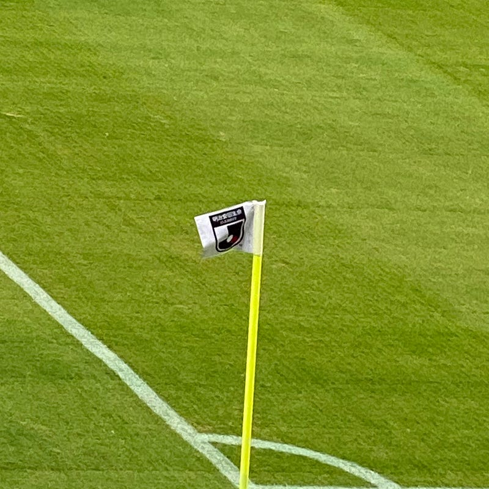
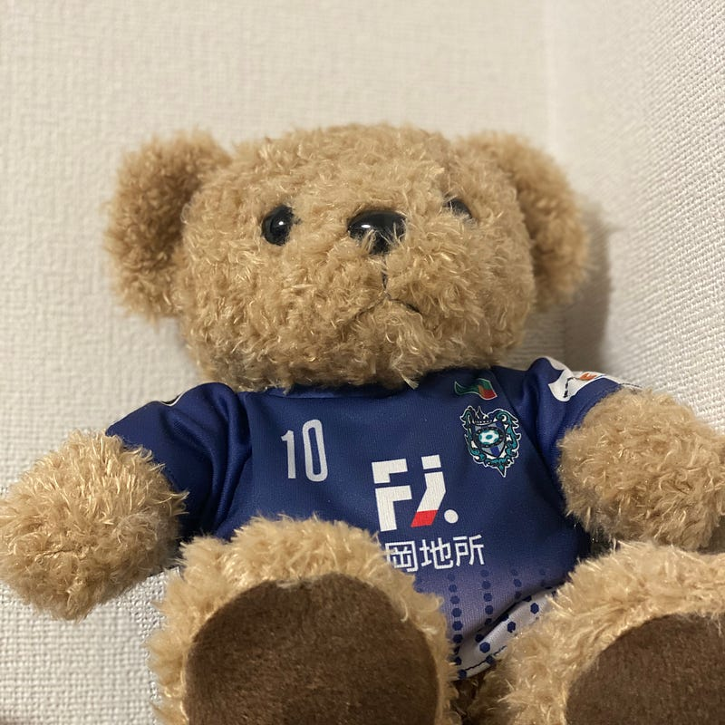

1993年5月15日 19時29分にJリーグのキックオフのホイッスルは吹かれ、Jリーグはスタートしました。それから27年、今年はJリーグの試合のない5月15日を迎えています。

開幕戦、とてもワクワクした気持ちで、その試合を見ていたのを覚えています。サッカーがブームになり、小学生の自分は完全にそれに乗り込まれ、ただのサッカー好きになっていました。それまでプロ野球には興味を持ったことがないのに。

その5ヶ月後、1993年10月28日にはドーハの悲劇と呼ばれる同点劇がありました。「この試合に勝てば日本は初めてW杯に行ける」という試合で、眠い目を擦りながら深夜に試合を見るという体験をし、頭の整理がつかないまま寝たのを覚えています。

そうこうしているうちに、福岡ではサッカークラブ誘致が盛り上がり、1995年に福岡ブルックスがやってきました。自分が住んでいる場所と福岡市は少し距離が離れていたこともあり、新聞やテレビでは見ていましたが、なんだか遠いところで起きていることのような気がしていました。

当時はテレビで中継されることも多く、中継される試合はなんとなく見ていたのを覚えています。あっという間にJリーグに昇格し、アビスパ福岡に名前を変え、気づいたらJ1/J2のエレベータクラブになっていました。博多の森という言葉は知っていたけど、当時は博多駅は生活圏ではなく、博多と天神の間しかよくわかっていなかったので、それがどこにあるかも知りませんでした。

自分がアビスパ福岡の試合を初めて見にいったのは[2003年6月21日、大宮アルディージャとのアウェイゲーム](https://data.j-league.or.jp/SFMS02/?match_card_id=7367)でした。東京に移住してすぐ、アビスパが好きだという人と盛り上がって見に行くことになったのを覚えています。彼がフットサル用のシューズを買うというので途中寄り道したのですが、mizunoを指名買いしていたのを覚えています。mizunoは当時のユニフォームサプライヤーでした。当時はよく感覚がわかりませんでしたが、今ならわかります。

地元の方言が飛び交うゴール裏の居心地の良さ、そして何より芝生の匂いが心地よかったのを覚えています。梅雨時ですが、当日は運良く晴れていました。

その後アビスパは2006年にJ1を戦い降格してしまう訳ですが、そのくらいだったかな、Twitterで声かけしてもらって、関東サポーターの人たちと出会うことになります。

気がついたらJリーグは地上波でほとんど中継がなく、スカパーで中継しているというのもちゃんと認識していなかった気がします。関東サポーターの人たちとは、新宿のスポーツバーで毎週集まって試合を見るということをやっていました。

リティ監督時代の勝てない時代、そしてSライセンス取得翌日に監督に指名される篠田監督時代。全国の方に明太子買っていただいた経営危機。

これくらいになると関東アウェイの試合にはゴール裏にいくくらいには教育されていくわけです。そして、今に至ります。

_本当は福岡にいたかったけど訳あって上京してきました_、くらいの感覚なので、なんだかんだ地元が好きなんですよね。地元を応援する、地元に貢献する、そういう意味を込めて、好きなサッカーの地元のクラブであるアビスパをこれからも応援し続けると思います。

