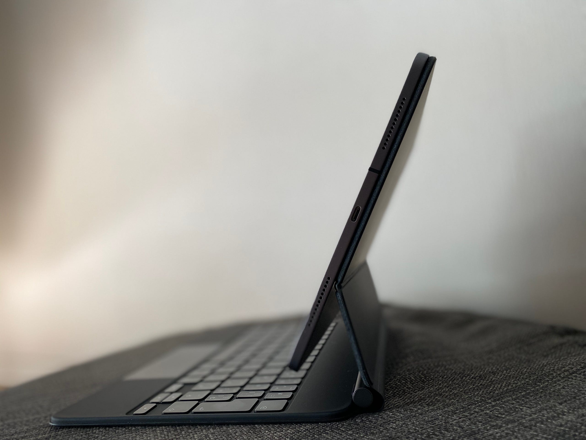

まずは簡単にiPad Proの使い方を。自宅ではMacBook Pro 16 inchを使っていて、iPad Proは持ち出し用のコンピュータという立ち位置で使っています。少ない荷物で歩き回りたい派なので、日帰りくらいのお出かけで持ち出すことはほとんどありません。宿泊を伴うようなお出かけの時に持ち出すことが多いです。

例えば、飛行機内でYouTubeなどの映像を見たり、iBooksやKindleで読書したり。YouTube Premiumに加入したので、YouTubeをオフラインで見ることができるようになりました。

主に1時間30分から2時間程度のフライトに乗ることが多いのですが、この時間では映画などの2時間くらいのコンテンツを見終わるのが厳しいので、YouTubeのような短い動画の集まりがちょうどいいです。

さて、Magic Keyboard for iPad Proの話題に戻ります。

外出する機会がない状態が続いているので、モビリティについてのレビューはまだできません。発売時は重さについての話題が多くをしめていたように思います。

確かに重さはありますが、旅行用の荷物の一部だと気にならない範囲かなと思います。毎日持ち運ぶものとすると気になるかもしれません。もっとも、Keyboard Folioでも重いなと思っていたので、Smart Folioも揃えていたりします。

次に操作性・機能面についてです。

iPad本体が持ち上がっていて、かつ角度がついていることで、見やすくなったし、操作しやすくなりました。iPadのタッチ操作はKeyboard Folioでは、奥に手を伸ばす感じでしたが、Magic Keyboardは近くにあるので自然です。また、本を読む場合でも、文章に集中しながら読むことができます。

トラックパッドの操作も違和感なく始めることができました。ジェスチャーがmacOSのそれなので、新しく覚える必要もなく、頭を切り替える必要もありません。ただアプリによってはトラックパッドだと動きがぎこちなかったりします。

またボタンに吸い付くアクションは、操作のしやすさを与えてくれます。macOSだと「ボタンの領域」を認識して操作をする必要がありますが、ボタンに吸い付くのでその認識の必要がありません。

もし、iPad用のアプリ開発者であれば、スクロールなどトラックパッドでの操作を自分のアプリで試してみてください。できるだけ多くのアプリで快適に使えるようになって欲しいなと思います。マウスカーソルについての話は、Tech Crunchが興味深いストーリーを書いていました。

[**アップルの再発明、新iPadOSマウスカーソル開発秘話 | TechCrunch Japan**  
_Apple（アップル）はマウスポインタを発明したわけではないが、マウスポインタの存在を世に知らしめ、一般に使用されるまでにした会社であることは確かだ。 Xerox Parc（ゼロックスパロアルト研究所）で開発され…_jp.techcrunch.com](https://jp.techcrunch.com/2020/05/15/2020-05-06-how-apple-reinvented-the-cursor-for-ipad/ "https://jp.techcrunch.com/2020/05/15/2020-05-06-how-apple-reinvented-the-cursor-for-ipad/")

iPadを「閉じる」動作は、Keyboard Folioだと２段階の動作が必要になりますが、Magic Keyboardは１段階の動作で閉じることができます。ノート型のコンピュータを閉じているような動作で、より自然になりました。

Magic Keyboardは満足しています。ディスプレイが浮いて少し高い位置にあるのが、いい効果を生んでいるように思います。長く使ってみて、気づいたことがあればまた記事を書きたいと思います。

最後に、この記事のほとんどもiPadで書いたものですが、Mediumアプリの動作がイマイチで仕上げはMBPで実施しました。