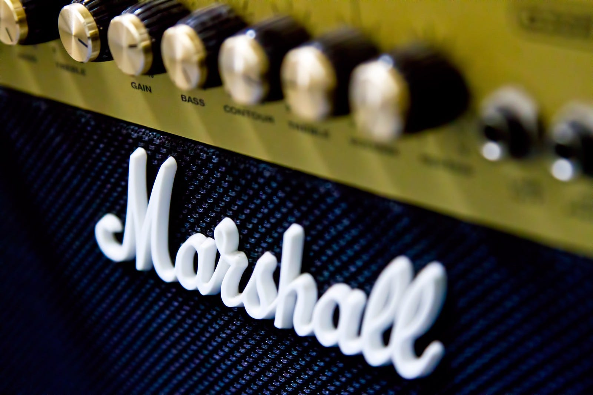

過去を振り返って、音楽をより好きになるきっかけになった曲を5曲選びました。すべて懐メロですが、気になった方はどうぞ。

#### BOY MEETS GIRLS by TRF (1994)

一曲目はこれでした。急に深夜ラジオを聞き始めた頃がありました。ラジオって時間によって流れているCMがやや固定なんですよね。毎日23時30分ごろラジオをつけると、当時のコカコーラのCMが流れていて、それに使われていたのがこの曲でした。

まわりに音楽好きという人も特になく、ただ流れている音楽を享受していた状況で、この曲を聴くためにラジオをつけていた思い出があります。

ちなみに福岡では韓国のラジオも拾いますが、さっぱりわかりません。

[**TRFの"BOY MEETS GIRL"**  
_曲・4:49・2007 · Apple Musicのサブスクリプションに登録すると利用できます。無料で体験する。_music.apple.com](https://music.apple.com/jp/album/boy-meets-girl/306461871?i=306462248 "https://music.apple.com/jp/album/boy-meets-girl/306461871?i=306462248")

#### 深海 by Mr.Children (1995)

当時はまだアルバムを一周聞くということが普通でした。このアルバム全体も好きなのですが、アルバムのフィナーレのこの曲でこもっていた感情が吐き出されていくような感覚を覚えます。

「深海」はアルバム全体を何周も何周も聴いていますが、このアルバムでMr.Childrenの深みにハマったと言っても過言ではありません。

[**Mr.Childrenの"深海"**  
_曲・4:50・1996 · Apple Musicのサブスクリプションに登録すると利用できます。無料で体験する。_music.apple.com](https://music.apple.com/jp/album/%E6%B7%B1%E6%B5%B7/1375009919?i=1375010177 "https://music.apple.com/jp/album/%E6%B7%B1%E6%B5%B7/1375009919?i=1375010177")

#### グライド by Lily chou-chou (2001)

[**Lily Chou-Chouの"グライド"**  
_曲・3:40・2008 · Apple Musicのサブスクリプションに登録すると利用できます。無料で体験する。_music.apple.com](https://music.apple.com/jp/album/%E3%82%B0%E3%83%A9%E3%82%A4%E3%83%89/1297925080?i=1297925371 "https://music.apple.com/jp/album/%E3%82%B0%E3%83%A9%E3%82%A4%E3%83%89/1297925080?i=1297925371")

2リリイホリックという名前のWEBサイトにたどり着き、掲示板を読んでいました。誰でも書き込める掲示板で、ストーリーが展開されているのが、リリイシュシュのすべてという映画の原作でした。

そのWEBサイトのトップページで流れていたのがこのグライドでした。透明感のある歌声と、なんともいえないサウンドに魅了されたのを覚えています。

これを歌っているのがSalyuという名前の人であることはその後知ることになります。

#### Song2 by Blur (1997)

FIFAという名前のサッカーゲームがありまして、FIFA98からやっているのですが、そのFIFA98のテーマソングになっていたのがこの曲でした。

その当時でも十分有名なバンドだったはずですが、この曲で彼らを知り、過去のアルバムや新しいアルバムを聞きまくることになります。洋楽でちゃんと聴いた初めてのバンドでした。

#### I’m in Heaven by the brilliant green (1998)

[**ザ・ブリリアントグリーンの"I'm In Heaven"**  
_曲・4:44・1998 · Apple Musicのサブスクリプションに登録すると利用できます。無料で体験する。_music.apple.com](https://music.apple.com/jp/album/im-in-heaven/575512349?i=575512352 "https://music.apple.com/jp/album/im-in-heaven/575512349?i=575512352")

初めて聴いたときの衝撃を覚えています。というのも、イントロから自分の好みをど直球で射抜かれた感じがしたんですよね。

もともとマイペースなバンドで、フェスに出ても時間枠いっぱい使わなかったりしたこともあるバンドですが、また新曲出して欲しいなと思います。

#### まとめ

今回は古めの曲を選んだのですが、発表年が近いものになってしまいましたね。今日紹介したのは、聞く音楽の幅を広げてくれた曲です。その他にもcibo matto、クラムボン、Cymbalsなどありますが、5曲縛りのなかに入りませんでした。

どれも懐かしい曲ですが、サブスクにもありますので、聴いてみたい方はどうぞ。