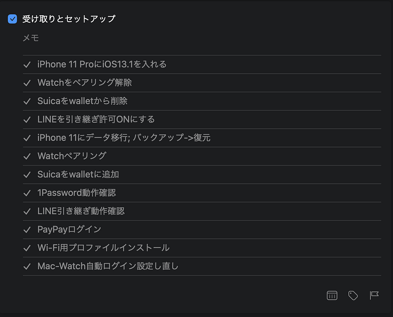

Thingsのログブックを探したら、去年の機種変更した時の手順が残っていました。

手順は固定化してきましたね。一番ハマりやすいのは、LINEの引き継ぎ。機種変更前の端末を初期化してしまうと復旧できなくなっちゃうので注意です。

Watchの設定も初期化されるので、もっとも大事なのは、これらの手順が終わった後、電源とWi-Fiがある環境で半日ほど置いておくこと。

iCloudなどからのダウンロードや、Siriの検索インデックスの構築など、さまざまなデータ生成をすましておくとこの後の利用がスムーズになります。

au(KDDI)の場合はSIM（au ICカード）の変更が必要という話があって、Q&Aに情報が出ていました。

[**よくあるご質問 │ サポート │ au**  
_5G対応のSIMフリー版 iPhone 12、iPhone 12 Pro、Google Pixel 5 を購入しました。現在利用中の4G LTE契約のSIMカードを引き続き利用できますか？_www.au.com](https://www.au.com/support/faq/detail/01/a00000000301/ "https://www.au.com/support/faq/detail/01/a00000000301/")

どちらにしても混み合いそうですね。

切り替えをスムーズに実施して、素晴らしいiPhone12生活を。新しい生活が始まりますね。