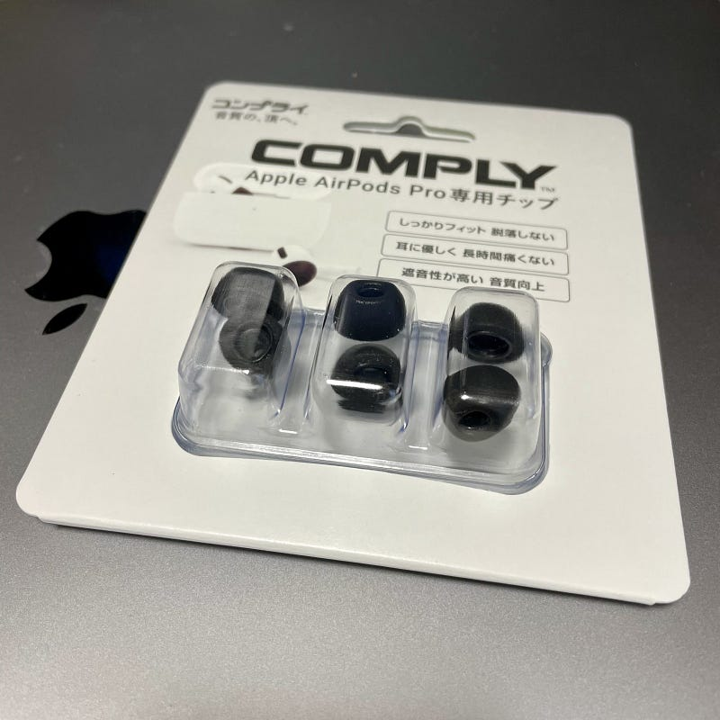

ComplyのAirPods Pro モデルを導入したので、簡単に使ってみた感想を。

#### Complyとは

まずはComplyの説明を。知ってるよ、という方は飛ばしてください。

Complyは、サードパーティのイヤホンチップ専門メーカーで、温度で伸縮する材料を使ったイヤホンチップを販売しています。伸縮性を使って、耳の穴を埋めるようにピッタリと密着するので、密閉感が強くなり、余計な音が入りづらくなったりします。家電量販店でもイヤホンコーナーの脇に専門コーナーが設けられていたりします。

[**コンプライのイヤホンチップで生まれ変わるあなたのイヤホン**  
_コンプライ™イヤホンチップは、ハイテックな粘弾性のあるポリウレタンフォームで構成されています。この通気性のあるヒートアクティブフォームは、どんな耳穴の形にもピッタリフィットします。そしてパッシブノイズリダクション技術が、音漏れや騒音をシャッ…_www.comply.jp](https://www.comply.jp "https://www.comply.jp")

ComplyのAirPods Pro モデルは、ずいぶん前にUSで販売されていました。自分が見つけたのは5月なので、半年待たされたわけです。

一度モデルチェンジをしたそうで、日本で販売されているのは第二世代です。

#### 力強く聞こえる音

まず気になるのはつけると何が変わるのか、と言う点です。音質という点では何も変わりません。標準のイヤホンチップでも十分に本体の能力をいかせていたということかと思います。

変わったところをあげると、音が力強く聞こえるようになったように感じたというところです。これはイヤホンチップの材質が変わったこと、耳の穴の隙間がなくなったことが影響しているのかもしれません。

また、AirPods Proはノイズキャンセルの性能でパッシブノイズキャンセルの部分、つまり、物理的に音を遮断する部分の影響が大きいのですが、Complyを導入してその性能が増したため、通常以上にノイズキャンセルの性能が上がっています。そしてそれは、外音取り込みモード（Transparency mode）で会話をしてもより自然に聞こえることにもあらわれています。会話が聞き取りやすくなりました。

#### ケースの開け閉めは問題なし

サードパーティのチップを導入する時に気になるのが、ケースにはまるのかという話。結論から書くと何も支障はありませんでした。標準のイヤホンチップと全体の大きさはそれほど変わっていないようにも思えます。

#### 最後に

発表されてすぐにオーダーしたので、事前の試聴はしませんでした。SMLのサイズアソートのパッケージは用意されていません。標準のイヤホンチップでMサイズを使っていたため、ComplyもMサイズを購入しましたが、サイズ感で気になることもありませんでした。AirPods Pro をつけて移動してみましたが、つけているのを忘れるくらい。

Complyチップを導入したデメリットは、つける前にイヤホンチップを潰すという作業が必要なこと、くらいでしょうか。これは地味に面倒ではあります。

[**COMPLY(コンプライ): _AirPods Pro_**  
AirPods Proamzn.to](https://amzn.to/393XbJx "https://amzn.to/393XbJx")