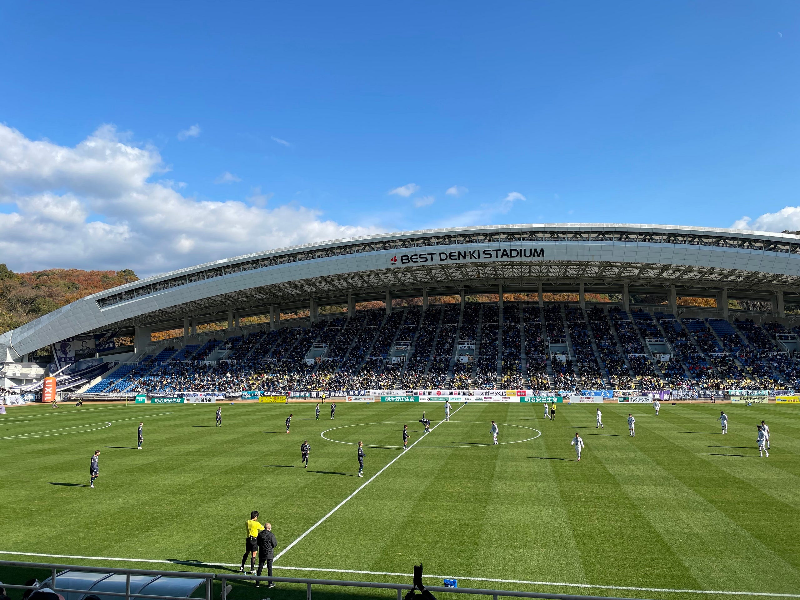

2020年シーズンが終わりました。アビスパ福岡は、目標として掲げたJ1昇格を達成した、実りのあるシーズンでした。

開幕戦、久しぶりに実現した北九州との試合をミクスタで見ました。Jリーグがスタジアムにフルに観客を入れられたのはいまだにこの日が最後となっています。

試合は1–0で勝利、スタメンのほとんどが新加入のメンバーで構成されており、強さを感じつつ、戦術的にはまだ仕上がっていないチーム。さぁこれからという気持ちが強くなったことを覚えています。

長谷部監督は当初から、「無失点、複数得点で勝つ」ということを掲げていました。しかし、アビスパは前シーズン、16位勝ち点40、降格ラインとの勝ち点差４でかろうじて残留したチーム。メンバーの入れ替えも激しく、そんな中で初めに着手したのはセオリー通り “無失点できる守備” だったように思います。そしてアビスパのセンターバック陣はそれができる高さと強靭さを備えていました。プレミアリーグでよく見るタイプのセンターバックは信頼できる強さでした。

第15節から徐々に無失点で勝てる試合が増えていき、そして12連勝へ。終盤の５バックが注目されましたが、５バックにしたあと、低いセンタリングや中央の縦パスを入れさせない守備も効いていたように思います。ふんわりセンタリングを入れさせて高さで勝つ、それが５バックの守り方でした。

得点数が増えない中、山岸選手が加入します。フアンマ選手が強いターゲットマンとすれば、山岸はしなやかさを備えたターゲットマン。これまでエミル選手からのセンタリングが主な攻撃パターンだったチームに、前線でのパスサッカーが次第に出てくるようになりました。引き分けてしまったけれども、第36節東京ヴェルディ戦、第39節ツエーゲン金沢戦で見せたパスワークは、サポーターを魅了した戦い方でした。

第40節、第41節のピッチには、シーズン当初目指していた「無失点、複数得点で勝つ」を表現するチームがありました。最終戦、首位の徳島にダブルができるチームになっていました。結果と内容が両立したチームを見るのは、自分のサポーター人生の中でも初めてかもしれません。そして得失点差で2位になるという、最もタイトルに近いチームでした。

長い中断期間、急遽発生した試合延期、制限の強い過ごし方など、さまざまな制約の中でここまで成長できた今年のチームに拍手を送りたいと思います。できればこのチームで戦い続けていきたい。けれども、そこは契約があるプロの世界。

5年周期という言葉もありますが、自分が何度か経験したここまでの昇格は、どこかボタンを掛け違えたまま上がってしまったという雰囲気を感じていました。今年は強いアビスパが誕生するためのまずはワンステップ。今年のチームを目に焼き付けながら、来年J1を楽しみたいと思います。

最後に。いろんな状況の中で福岡に集まってくれた選手・コーチたち、ありがとうございました。そして、難しい状況の中でJリーグ全日程消化を達成した全ての関係者の皆様、サポーターの皆様、おめでとうございます。ありがとうございました。

さぁ、次のシーズンの始まりは2ヶ月後です。