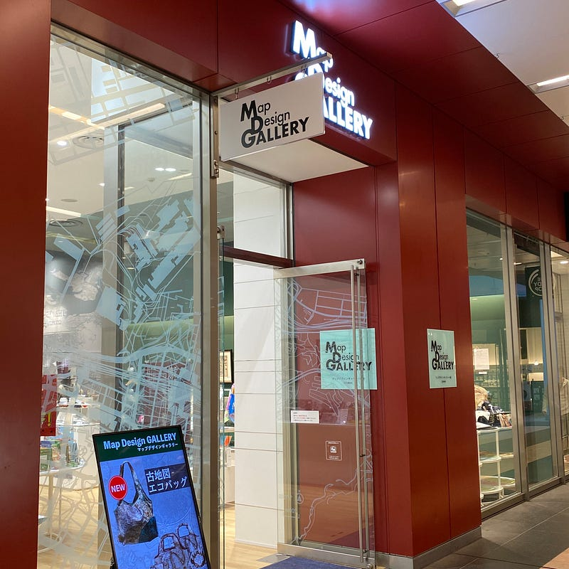
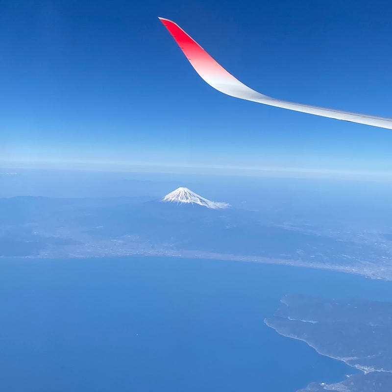

2020 年 2 月 23 日、ミクニワールドスタジアムで開催された ギラヴァンツ北九州 vs アビスパ福岡の試合を見に行きました。

ギラヴァンツがやっと J2 に帰ってきてくれて、ミクニワールドスタジアムにいけるということと開幕戦ということで行くことを決意。COVID-19 の影響もあり、前日まで開催されるかどうか気が気じゃない状態でしたが無事に開催されました。

今回は３連休の中日の開催ということもあり、実家に宿泊しました。実家からミクスタまで電車で約 1 時間ほど。小倉はあまり馴染みもなかったので、ちょっと早めにいって散策してました。

ゼンリンさんのグッズが全部揃う全国唯一のショップに行ってみたり、小倉城に初めていったり。

ミクスタは海のそば（バックスタンドが海の上？）にあるスタジアムで、海ぽちゃがみられるスタジアムもここだけです。今回は残念ながら海ぽちゃは発生しませんでした。

今年のアビスパ は、昨年の J2 主力級を揃えたチームになっていて、チームの空気の入れ替えも一気にやってしまった印象も受けます。

北九州は J2 昇格の勢いそのままに、ワイドに開いて、スペースを作りつつ、うまくスペースをついて攻めてくる印象。福岡も、インターセプトからのフアンマの高さ・強さと、大弥のはやさ・うまさを軸に組み立てていくことでチャンスを作っていく。

北九州が最後の最後からだで守っていて、なんとか凌いでいるという展開が前半でした。その前半の最後に、ペナルティエリア内でうまくこぼれてきたボールを大弥がダイナミックなシュート。これが決まり福岡、先制。

後半は福岡側がちょっと立ち位置を調整して、北九州の幅を使った攻撃を牽制したりと、戦術的にも面白い試合でした。

これまでアビスパの試合を 15 年近く見ていますが、開幕戦はアビスパの試合を見ている感覚ではありませんでした。ここ数年のチームとは格段にレンベルが違います。でも、それは間違いなく、ずっと応援しているネイビーを纏ったチームでした。

試合の後は、実家に。福岡には住んでいましたが、上京するまでスタジアムに行ったことがなかったので、実家からスタジアムに行って帰ってくるということはしたことがなかったんですよね。「博多に帰ろう」を実践しました（実家は博多じゃないけど）

楽しい 3 日間でした。いいサッカーを見られたということが大きい。COVID-19 の騒動もあり、花粉症シーズンも始まり、日常に緊張感がありますが、こういう時こそ好きなことに没頭して、少し忘れることで肩の力を抜くことも大事かも。

J リーグも少し春休みに入ってしまいましたが、今年のアビスパ は期待できるし、今年の J2 も楽しみになりました。

