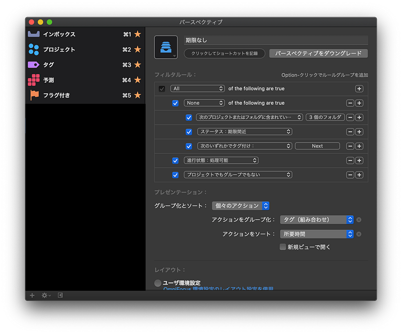

OmniFocusの設定変えたら、手に馴染む感じだったので淡々と書き残しておく。

#### やりたいこと

「予測」を見るだけで、これからやるべきアクションが選べるようになること

#### やったこと

予測タグは予測画面にタスクを表示できるので、予測に表示されていないアクションに予測タグをつける。予測タグは「Next」とする。

「Next」をつける候補として、カスタムパースペクティブを作成。対象は、期日が設定されていない or 期日が直近ではないもの。

#### 設定の理由

inside omnifocus を参照のこと。

[**What's The Forecast?**  
_OmniFocus gives you a great deal of flexibility to customize how you keep organized, including viewing your projects…_inside.omnifocus.com](https://inside.omnifocus.com/james-dempsey "https://inside.omnifocus.com/james-dempsey")

> The Forecast perspective shows two of the three categories I described earlier, calendar events and time window actions.

> For the third category, a new pro feature in OmniFocus 3 allows actions without a due date to appear in the Forecast as well

「期限間近」は状況によって変化するが試しに「3日」で設定。「今日」にしないほうが使い勝手は良さそう。

#### その他

予測タグは日付が経過した場合は次の日に持ち越されるので、完了する必要はない。また、これから買い物に行くための買い物リストは、フラグをつけてフラグリストで作るようにすると良いと思う。

以上、予測画面をもっと使いこなしたい方はどうぞ。