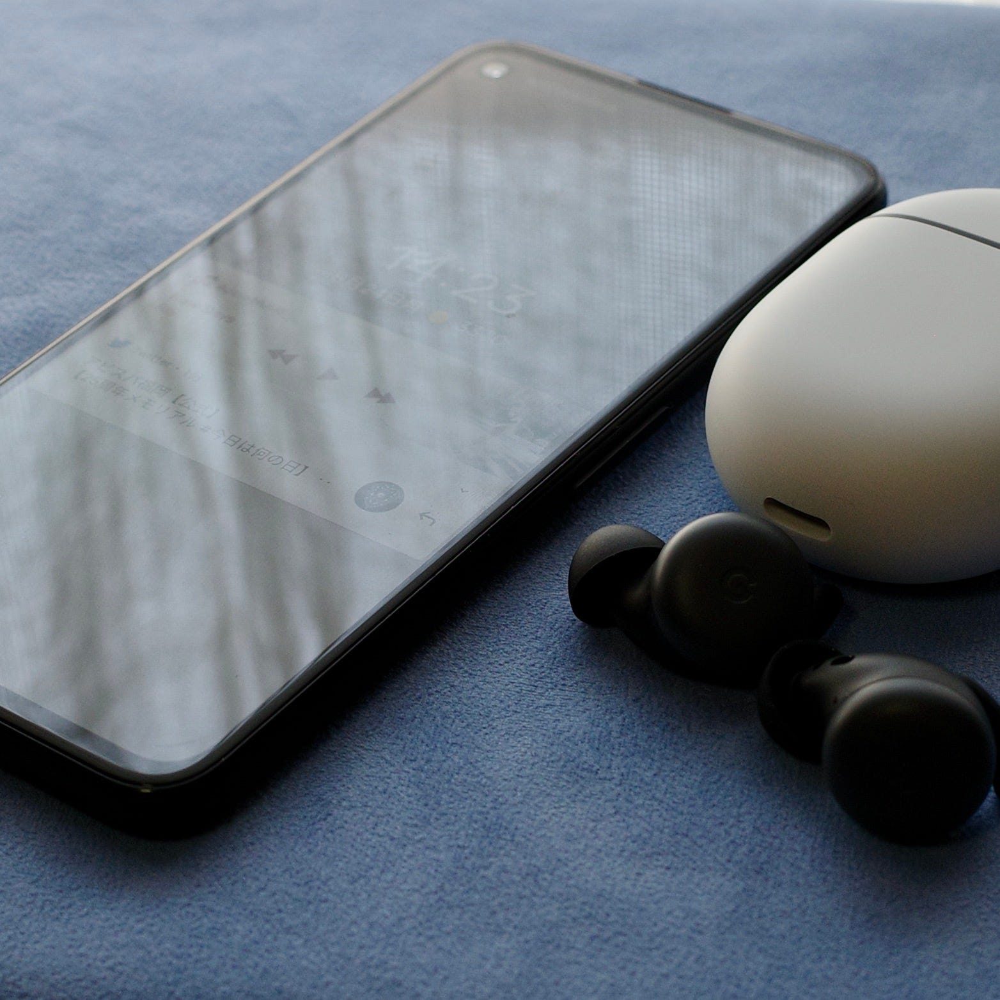

新しいスマホと新しいヘッドフォンを手に入れました。まずはファーストインプレッションです。

#### Pixel 4a

メインの端末はあくまで iOS / iPhone 11 Pro なのですが、業界的にAndroidのイマも体験しておく必要があるなと思っていて、Android端末も確保するようにしています。これまではEssential Phoneを持っていたのですが、今後の “Androidのイマ” を継続的に体験していくのに、新しい端末を導入する必要に迫られていました。比較的安価に導入できる Pixel 4a は、そう言った意味で待望のポジショニングにある端末でした。外出先で頻繁に使うという想定はしてないので、回線契約は最小限にしています。

Pixel 4aはとても軽く、そして使いやすい端末ですね。Android もバージョンを重ねるごとに使いやすいOSになってきている印象があります。背面の指紋認証はいまいち慣れないですけど。

アプリもiOSと同じものが導入できるし、Apple Music for Androidもあるので、macOSとの連携ができない以外は特に困ることはありません。

#### Pixel Buds

Pixel 4aを触っていて、一番困りそうだなと思ったのがイヤホンです。AirPods Proをメインで使っていて、MacBook / iPhone / iPad を切り替えて使っていますが、切り替えの対象デバイスにPixel 4aを含めると運用がめんどくさそうだなと思ったのです。なので、Pixel 4a専用のイヤホンがあるといいのではと思いました。

Pixel 4aと一緒に日本で発売されたPixel Budsの在庫がまだあったので、導入してみることに。なんと注文した翌日には届きました。

パッケージを開けたらPixel 4aに自動に繋がり、インタラクションが始まる。耳につけたり動作テストをしたり。ここまではAirPods Proと遜色ないなと思いました。

Google アシスタントを起動するときに長押しする機能はいいなと思いました。というのも、AirPods ProだとSiriが “Hey Siri” に反応してくれないことが多いからです。耳を押さえている間に Googleアシスタントに頼み事して終わったら押さえている指を外す、この動作はとても自然でした。

通知を読み上げてくれる機能やバッテリー残量を教えてくれる機能もいいなと思いました。

ちなみに、Pixel Buds でよく言われる “110秒ごとに音が途切れる機能” 、確かに現象を確認しています。

#### 最後に

Pixel 4a + Pixel Buds を使ってみて、全体的に使いやすいなと思います。本体が軽いとか、プラスティックベースの背面なので、気軽さが出るというのも良いのかもしれません。iOSにこだわりがなければ個人的にはとてもおすすめできるセットだなと思いました。

Androidにはいつも使っている OmniFocus、Things はありません。しかし、ルーティンとして使っている、YouTube、Feedly、HEY はあるので、それらを軽くチェックするくらいの用途であれば便利に使っています。

SonyもついにSIMフリーを売り出すようです。SIMフリーの選択肢が増えることはとても歓迎すべきことですし、キャリアに縛られず自由に端末が選べるようになりつつありますね。