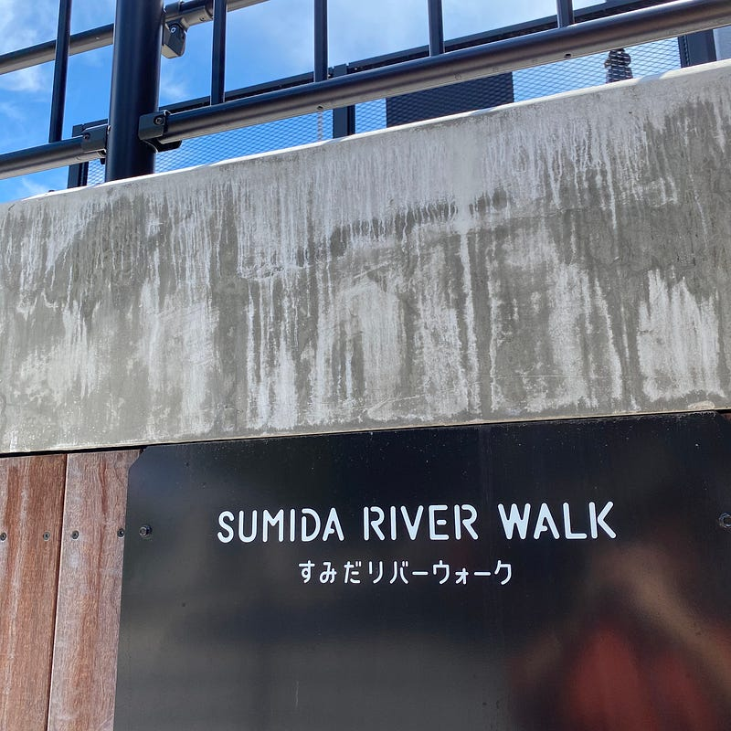

Blogだけじゃなく、vlogが登場するなど、 “logging”の方法もさまざまな方法が出てきたので、それについて少し考えてみました。

このブログを始めてずいぶん経ちます。このブログ自身は、何かについて深く探究するというよりは、自分がイマ考えていることを書き残す場として運営しているので、Personal Bloggingであることを意識して続けています。

最近は、といっても、もうずいぶん経ちますが、文章ではなく日常を写真で切り取ることで残していくという方法もあります。写真をもとに発信を行う、いわゆる「インスタ映え」とはちょっと趣旨が異なるものではありますが、それこそInstagramを使ってやってる方もいるのではないでしょうか。

ここ2、3年でvlogという表現方法をとてもよく見かけるようになってきました。動画によって日常を切り取り残していくという方法です。YouTubeで探すとたくさんありますが、HIKAKINさんに代表されるYouTuberのようにカメラに向かって何かを説明するのではなく、ちょうどFPSゲームのように、主人公目線で動画を撮り、それをアップしていくという形です。モーニングルーティン、ナイトルーティン、GRWMといったテーマを決めたvlogはみたことある人も多いのではないでしょうか。20代前半の大学生世代がやっていることが多く、似たようなサウンドやテンプレートを使ったvlogが多くあります。この世代は韓国の流行に影響を受けていて、vlogもそのひとつのようです。

最近は音声でログを残すという手法も出てきました。[Stand.fm](https://stand.fm) のようなサービスが出てきたことで、ラジオ感覚で残していくという感じも多いようです。ラジオ感覚といってもPodcastよりは軽い、それこそTikTokくらいの軽さを感じます。

自分はブログと写真を主にやっていて、vlogや音声はやっていませんし、やる予定もありません。

ブログは今考えていることを整理して文章にする、写真は目の前にある景色を撮る、という形で残すことが多いです。一方で、vlogは短い動画をたくさん撮って選び出し残すという作業になります。使えるか分からないけどとにかく撮りためておくという習慣付けが必要で、マインドチェンジが必要だなと思ったりします。

実際、YouTubeに上がっているvlogを見ると、お出かけのついでにiPhoneで撮る、お買い物のついでにiPhoneで撮る、ということをやっている人が多いことに気付きます。

ZV-1が Vlogカメラとして打ち出された背景にはそういうところがあるのだと思いますが、ピント合わせとか、肌補正とか機能を見ているとあれはVlogカメラではなく、YouTube用カメラだなと感じています。

個人的には Insta360 Go をおすすめしたいですね。気軽に30秒だけ動画を撮れる、撮ったたくさんの動画を自動で繋ぎ合わせて、一本の記録動画にしてくれる、これくらいの気軽さが必要だと思います。

[**Insta360 GO**  
_世界最小の手ブレ補正つきアクションカメラ！ ハイパーラプス、スローモーション、バレルロールを簡単に撮れる。防水、どこにでも固定可能！_www.insta360.com](https://www.insta360.com/jp/product/insta360-go/ "https://www.insta360.com/jp/product/insta360-go/")

ちなみに Insta360 Goは持っていますが、ほとんど使っていません。コンセプトは素晴らしいし、好きなのですが、使っていない間に勝手に放電するというトラブルがあり（既に解決したかどうかすらウォッチしていないですが）、使わなくなってしまいました。

発信しなくても良いのです。自分の考えや行動を残しておくということに意味を感じるようであれば、文章でも動画でも音声でも写真でも良いので、始めて見るといいのではないでしょうか。自分はブログとは別に [Day One](https://dayoneapp.com)も続けています。