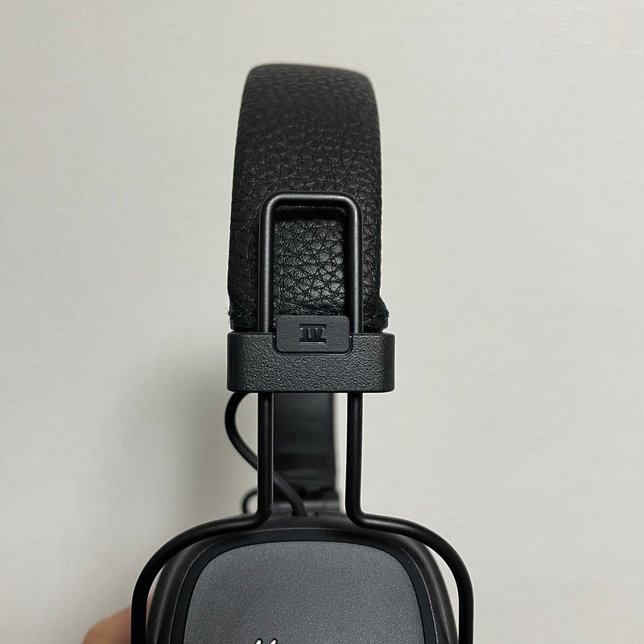

普段使っているヘッドフォンは、AppleやBeatsのものがほとんど。iOSから操作性が良い。移動中のBGMとして聴くには音の作りが十分。無線も強いので、音飛びがほとんどない。理由を探せばたくさんありますが、音の作りという意味では、大好きなヘッドフォンが別にあります。

以前にもこのブログで紹介したことがある Marshall Majorシリーズです。その最新版である Major IV が10月に海外では出ていたのですが、日本でもようやく入手できるようになりました。

[**Marshallの最新Major IVヘッドフォンは80時間駆動や無線充電などの機能搭載、有線接続も可能 | TechCrunch Japan**  
_Marshall（マーシャル）の新しい Major IV…_jp.techcrunch.com](https://jp.techcrunch.com/2020/10/18/2020-10-16-marshall-major-iv-wireless-headphones-offer-great-sound-plus-80-hours-of-battery-life-and-wireless-charging/ "https://jp.techcrunch.com/2020/10/18/2020-10-16-marshall-major-iv-wireless-headphones-offer-great-sound-plus-80-hours-of-battery-life-and-wireless-charging/")

Major I でデビューを果たし、Major II では全体的アップデートをはかり、Major III では Bluetooth を装備してきました。Major IVは Bluetooth ヘッドフォンとして全体的なアップデートが図られています。その最たる例は連続再生時間80時間。USB-Cで充電できるようになったのも、地味に嬉しいアップデートです。

このヘッドフォン、デザインの主張も好きなのですが、やっぱり特徴的なのは音の作り。ギターの音を綺麗に出してくれるヘッドフォンだと思います。

#### SOUNDTRACKS with Major IV

というわけで、早速Major IVを試聴してみました。聴いたのは Mr.Children SOUNDTRACKS。すでにシングルとしてリリースされた、turn over? / 君と重ねたモノローグ / Birthday を含む、10曲入のアルバムです。

シングルとして聴いている時にはあまり気にならなかったのですが、このアルバムを特徴づけているのは、鳴っている音で、その空間に漂う空気感。存在感は強いけど、バンドの音はかき消さない絶妙なストリングス。

どこにもベクトルがない歌詞の世界と合間って、「そこに存在している音楽」がとても強く、サウンドトラック、BGM的でありながら、いつも流れていて欲しい音楽。そんな感想が強いです。

全体45分という長さはパッケージとしてちょうどよくて、シャッフルで1曲それぞれを楽しむというより、１パッケージを楽しみたい、流していたい、そんな気持ちにもなります。

ポケットミュージック。以前 My Little Loverがデビュー当時に使ったフレーズで、意味したいところは異なりますが、そういうフレーズを当てはめてみたくなります。

#### 最後に

Marshallのヘッドフォンを使っている人を街で見かけることはあまりありません。AirPods Proが売れてから、余計ヘッドフォンをしている人を見かけることすら減ってしまった印象があります。（自転車ドライバーがイヤホンしているのはよく見かけます）

Marshallヘッドフォンは、デザインだけではなく、実は軽さも魅力です。これまで硬めだなと感じていたイヤーパッドも、IVでは柔らかめになり、ずいぶん装着しやすくなりました。

BeatsやApple、そしてSonyなど、よくあるヘッドフォンメーカーの音ではない違うものを探しているという方、ギターの音が好きという方にはぜひ試してほしい、そういうヘッドフォンです。