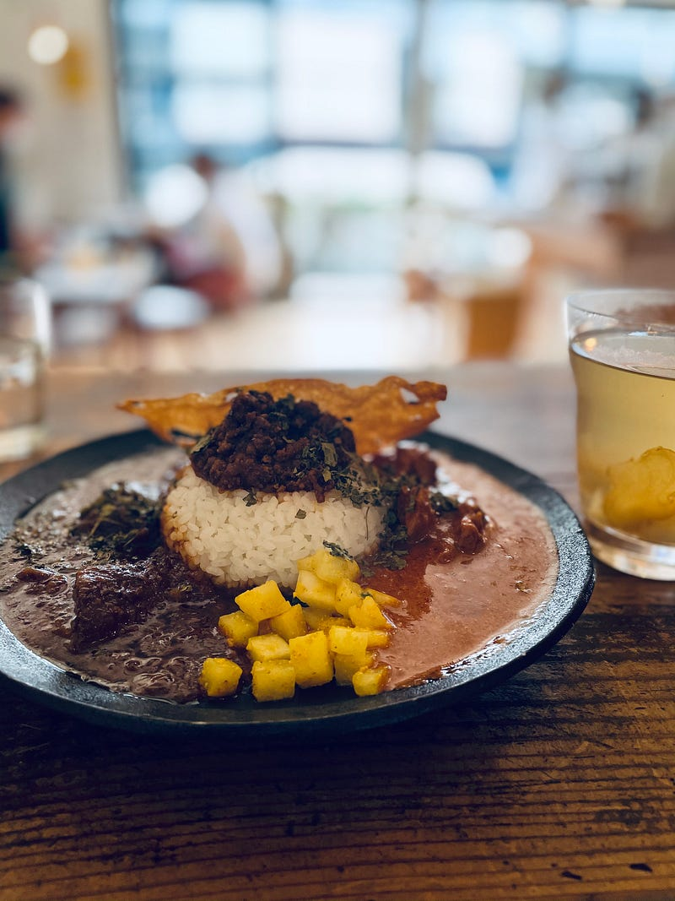

今年はずっと金曜日にカレーを食べてきました。いつから始めたのか記憶にないのですが、リモートで働くようになって始めたので、40回くらいは食べてきたと思います。近所の新しい店を探したりすることもありましたが、半分くらいはお気に入りのカレーです。

金曜日にカレーを食べるという習慣はもともと船乗りが始めた習慣です。長い航海でずっと船にいると曜日感覚を忘れてしまうため、１週間に1回カレーを食べることで、１週間のリズムを取れるようにするという目的で始まりました。

リモートは長い航海と一緒。ずっと家にいるので曜日感覚を忘れてしまいそうになります。金曜日のカレーは、それを防止するために始めた試みでした。

来年も続けるのかまだ決めていません。毎日のランチのメニュー決めるのも大変で、「金曜日はカレー」を決めておくと比較的楽なので、続けるかもしれません。