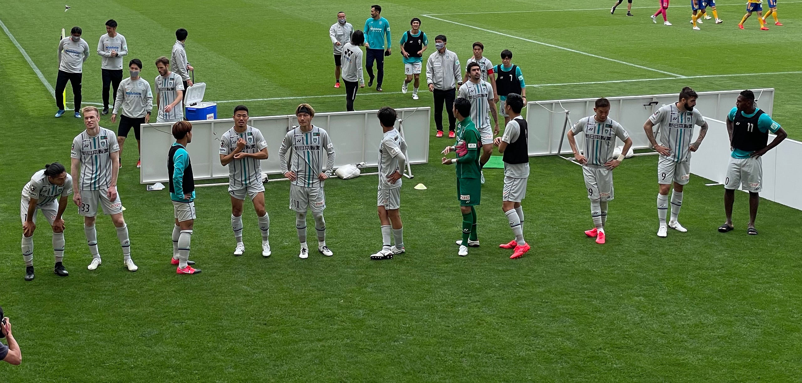

6月19日神戸戦が終わり、アビスパ福岡の前半戦が終わりました。第19節の川崎フロンターレ戦はACLスケジュールの関係ですでに終わっています。

シーズン前、選手たちが大幅に入れ替わり、キャンプでの練習試合も多くはできず、海外籍の選手たちが何名か入国待ちとなる中で、不安視されたシーズンの入りでしたが、J1のチームと練習試合ができなかった代償を最初に払ったものの、順当な立ち上がりを見せ、6連勝も達成しました。

10位以上（トップハーフ）を狙うチームとしては順当な、J1昇格チーム初年度としてはとてもよくできた前半戦だったのではと思います。

さて、サッカーにはxG(eXpected Goal)という指標があります。試合中どのくらい得点チャンスを作れたのかを元に計算されるゴール期待値です。これを元に振り返ってみたいと思います。

xGは、データスタジアム社が運営するFootball Labというサイトで公開されています。

[**データによってサッカーはもっと輝く | Football LAB［フットボールラボ］**  
_フットボールラボ(Football…_www.football-lab.jp](https://www.football-lab.jp "https://www.football-lab.jp")

19試合戦ったアビスパの成績は次の通り；

8勝6敗5分 得点数23 失点22

このうち、実際のゴール数がゴール期待値を越えた試合は、10試合。まさに「展開よりもゴールが取れている」ことになり、少ないチャンスを決め切れる決定力があることがわかります。

次に失点。相手のチームがゴール期待値よりもゴールを取れなかった数は10試合。「展開よりもゴールを取られていない」ことになり、最後の最後で体を張ったプレイでゴールを割らせない守備が続いていることがわかります。

特に6連勝となった第10節から第15節のうち、4試合は「展開よりもゴールが取れていて、ゴールを取らせていない」試合でした。

長谷部監督になってからのアビスパの戦術はまさに、相手のxGをどれだけ小さくするか、自分たちのxGをどれだけ大きくするかを重視しているように思えます。

これからは、チャンスを作っていく力をつけること、そして、相手がチャンスを作る前に奪い切ることが大事になると思います。すると、ボールキープ率も高くなっていくはず。これからのチームに期待したいと思います。