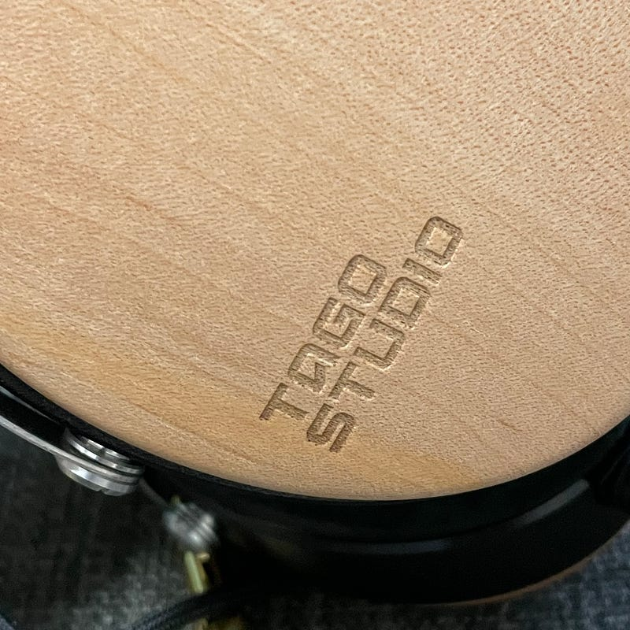

Apple Musicにロスレスがきて、Work From Home している間、ONKYO DA-10 を使って音楽を聴きまくっているのですが、もっといい音で聴きたくなりました。

T3–01を初めて知ったのは、2ヶ月前に公開された動画。TAGO STUDIOで収録されたSalyuさんの歌声と、T3–01のプロモーショントークという構成になっています。当時は、所詮AACを聞くには手軽さを優先したいと思っていたので、そんなに気にはしていませんでした。

Wishlistには他の選択肢もたくさんあったけど、「いい音で聴きたい」と思った時に、急にT3–01を思い出し、そしてたまたま在庫もありました。幸運だったということにしておいてください。

それからずっと使いまくっていますが、いい音ですね。まず、音が素直。もともとレコーディングスタジオで使うことを想定され、モニターヘッドフォンと呼ばれることもあるだけに、音は特徴がなく素直に鳴ります。

DA-10からApple純正の3.5mmジャックに変えてみたのですが、音が細くなったのがはっきりわかりました。このヘッドフォンは音が素直すぎて、音源の良し悪しがわかってしまうほどなのです。これをプロが使うことで、細かい調整も可能になるんだなというのがわかります。

音が素直に鳴るので、空間オーディオ Dolby Atomsも綺麗に鳴らしてくれます。もちろんApple Music側の設定を「常にオン」にしておくのをお忘れなく。

ただし、高音は刺さるような音にはなりません。これは長時間使っていて疲れない理由のひとつ。AirPods Maxだと時折刺さるような高音があり、特にZoom会議とかに使うと、Zoomの音の悪さをAirPods Maxがエンハンスして、頭が痛くなってしまうことがあるですが、これはそんなことはありません。

一番驚いたのは、高級帯のスタジオで使うヘッドフォンであるにもかかわらず、3.5mmミニプラグが標準装備であること、そして、スマホの出力で十分な音が鳴ることです。アンプを使っていますが、音量のメモリも大きく回すことなく音が鳴っています。

音源はロスレス・ハイレゾロスレスが気軽に使える時代になったからこそ、手持ちのアンプの性能をもっと引き出したいとなったらぜひ導入を検討してみてください。

素晴らしいなレビュー記事も見つけたので紹介します。

[**「TAGO STUDIO T3-01」レビュー。音が"視える"極上のナチュラルサウンドヘッドホン - ちゃらんぽらん鍋**  
_TAGO STUDIOのT3-01をレビューします。…_daydreamtraveler.hatenablog.com](https://daydreamtraveler.hatenablog.com/entry/2020/11/08/152853 "https://daydreamtraveler.hatenablog.com/entry/2020/11/08/152853")

福山雅治もT3–01を使っていらっしゃるとのこと。これを知ったのも購入の動機になりました。

[**福山雅治 インタビュー【前編】〜最新作『AKIRA』が秘めるサウンドスケープ - サンレコ 〜音楽制作と音響のすべてを届けるメディア**  
_シンガー・ソングライターとして2020年にデビュー30周年を迎えた福山雅治。俳優や写真家といった顔も持ち、八面六臂（ろっぴ）の活躍を見せる彼だが、音楽活動においても作詞曲のみならずアレンジやセルフ・レコーディングまでこなし、まさに実力派と呼…_www.snrec.jp](https://www.snrec.jp/entry/interview/fukuyama-masaharu_akira_1 "https://www.snrec.jp/entry/interview/fukuyama-masaharu_akira_1")

それでは。