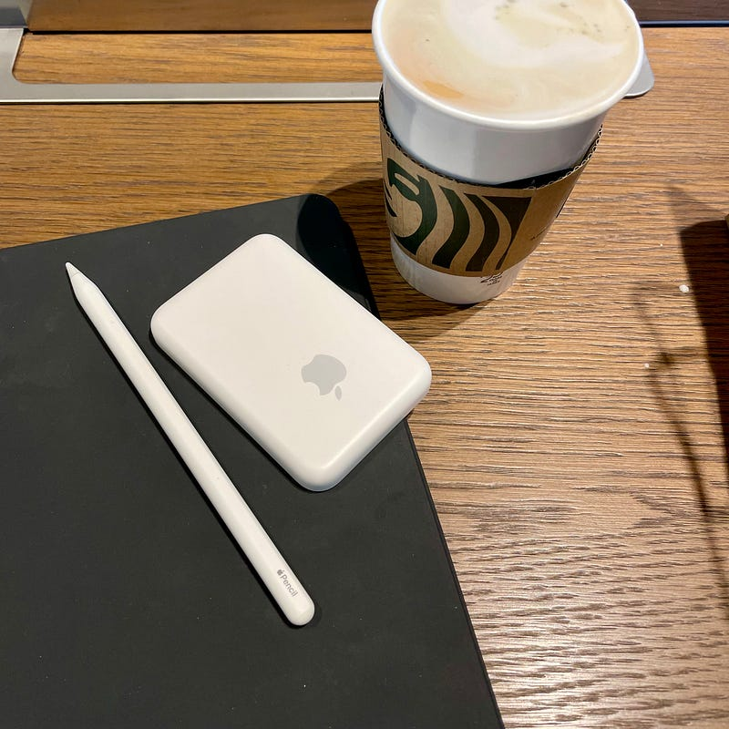

MagSafeバッテリーパックを導入してみました。

長い距離を移動するときは、iPhoneを２回くらいフル充電にできるモバイルバッテリーを持ち歩いていました。ただ、iPhone自体もバッテリーのライフタイムが長くなったこと、あちこちに充電できるポイントも増えてきたことなどがあり、モバイルバッテリーで充電する機会が減りました。

結果として、ただちょっと重いモバイルバッテリーを持ち歩いているだけだったので軽めのバッテリーに切り替えようかと思っていたタイミングでした。

MagSafeバッテリーパックはその名前の通り、iPhone 12のMagSafe機能を使ってiPhoneにくっつけて充電できるモバイルバッテリーです。移動中にモバイルバッテリーを使おうとするとどうしてもケーブルが邪魔になるので便利です。もちろん、MagSafe機能を使ったモバイルバッテリーは、サードパーティのものも発売されています。（そしてそっちの方が安いです）

[**Anker PowerCore Magnetic 5000 (マグネット式ワイヤレス充電機能搭載 5000mAh コンパクト モバイルバッテリー) 【 マグネット式/ワイヤレス出力 (5W) /…**  
_Anker PowerCore Magnetic 5000 (マグネット式ワイヤレス充電機能搭載 5000mAh コンパクト モバイルバッテリー) 【 マグネット式/ワイヤレス出力 (5W) / USB-Cポート出力 (10W) /…_www.amazon.co.jp](https://www.amazon.co.jp/dp/B08TZYQP9J "https://www.amazon.co.jp/dp/B08TZYQP9J")

質感はAppleによくあるホワイト。AirPodsやApple Pencilを持っている方はよくわかると思います。もう 初代iPod Shuffleからずっと続いている質感です。

Lightningポートがついており、Lightningケーブルで充電することができます。MagSafeバッテリーパックの最大の特徴として、ワイヤレス充電器としても使うことができます。なので、使い切ったら、寝ている間にiPhoneと一緒に充電することができます。モバイルバッテリーのために別の電源アダプタを必要とはしません。

充電状況の確認はiPhoneに接続すると教えてくれます。iPhoneやAirPodsと同じようにバッテリーウィジェットで充電状況を確認することができます。

もちろん、ワイヤレス充電はQiなので、iPhone以外にもAirPods Proを充電することも可能です。持ち運び用のワイヤレス充電器としても便利かなと思います。Apple Watchは充電できないようでした。

他のレポートによると、バッテリー容量はそれほど大きくないようなので、iPhoneのバッテリーライフタイムでほとんどのことは事足りるけど、ちょっと心配なときがあるという場合の緊急避難用として、ひとつ持ち歩いておくという感じかもしれません。

個人的には少し荷物が軽くなったことがポイントでした。荷物がそれなりにある時に、ケーブル類と一緒に持ち歩くという形になると思います。