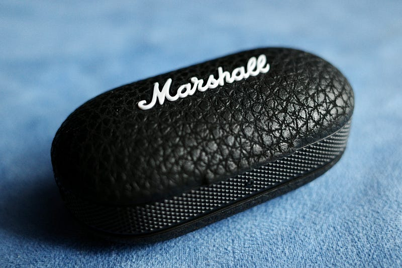
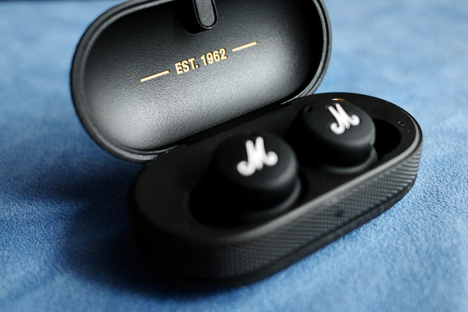

ついTwitterで知りまして、つい…

Marshall Headphonesは、最初のモデルであるMAJORからずっと使っていて、最新のヘッドフォンであるMAJOR IVも所有しています。一方で、インイヤーイヤホンであるMINORは使ってきませんでした。

長くこのシリーズを使っているのは、そのデザイン性と、設計された音のバランスが好きだからです。どう感じるかは人それぞれだと思いますが、音質がいいとは言いません。聞いていて楽しい音作りをしてくれていると感じています。いわゆるファングッズの類ですね。

電車の中でマスクをつけていると、ヘッドフォンはどうしてもマスクと干渉してしまうので、最近はイヤホン、それもケーブルレスの完全ワイヤレスイヤホンの稼働が上がっています。AirPods Proという名前の。

Marshall MODE II は今年3月には海外で発売されていて、日本では8月5日に発売開始となりました。初代MAJORはヤマハが代理店だったと聞いていますが、今は完実電気となっています。

[**【Marshall】MODEⅡ発売!**  
_イギリスの象徴的なブランドとして世界の著名なミュージシャンからも愛用されているMarshall より待望のトゥルーワイヤレスイヤホン ModeⅡが発売。ModeⅡは衝撃的で迫力のあるシグネチャーサウンドを鳴らします。1 回の充電で約 5…_kanjitsu.com](https://kanjitsu.com/release/%E3%80%90marshall%E3%80%91mode%E2%85%B1%E7%99%BA%E5%A3%B2/ "https://kanjitsu.com/release/%E3%80%90marshall%E3%80%91mode%E2%85%B1%E7%99%BA%E5%A3%B2/")

さて、そろそろMODE IIについて。ケースを含めてデザインが素晴らしいと思います。初期のBluetoothイヤホンには、なぜか青く光る（または点滅する）LEDが外側についていることが多かったですが、このMODE IIにはそれがありません。ケース本体も大きすぎることがなく、コンパクトにまとまりつつ、かつ、Marshall Headphonesであることを主張しています。

本体はケースにより充電されますが、ケースはUSB-Cで充電することができます。そして無線充電規格であるQiで充電できます。そうです。MagSafeバッテリーパックでも充電ができるのです。

イヤホンは外耳道に入る部分が少し出っぱっているいわゆるカナル型に近いです。AirPods Proは外耳道の中に入るのがイヤーチップのみであること。そして外音モード（Transparency mode）がついていることを考えると、AirPods Proよりは音漏れしないのかもしれません。

ケースを開けて、それぞれ耳に装着するとペアリングモードになり、デバイス側でペアリングすれば完了です。最大4つまでペアリングするデバイスを追加できるそうでその時はケースについているボタンを押す必要があるそうです（マニュアルによると）

いろんな環境で試せていないのですが、音はやっぱりMarshall headphonesの音。なぜかギターがとてもかっこよく聞こえます。この音が好きという方になら文句なくおすすめできるモデルです。

このイヤホンはスマートフォンアプリと連携することができ、EQを設定変更できるので、自分の好みの音に変更することができるのですが、正直Marshall Headphonesのサウンドが好みでなければ、このイヤホンを買うのは避けた方がいいのではと思います。同じ価格帯でもっと好みに合う音質の良いイヤホンがあるはずです。そういう意味で “ファングッズ” だと思っています。

これから屋外でも常用するかどうかは、電車に乗ったときの騒音とどれくらいマッチするか。そして、駅などでのBluetoothの混線にどれくらい強いかを確認してから決めることにします。なにしろ、このイヤホンはアクティブノイズキャンセリング機能を備えておらず、構造上密閉するという、パッシブノイズキャンセルだけなのです。

#### 追記(2021.8.9):

いわゆるストリートテストというものをやってきたので、追記という形でそれを書いておきたいと思います。

とてもいいイヤホンで、屋外の喧騒を気にせず音楽を楽しむことができます。ANCが欲しいなと思うことはほとんどありません。電車に乗っても電車の騒音が気になることはありませんでした。

右のイヤホンのボタンで音楽の再生・停止を、左のイヤホンのボタンでTransparencyモードのオン・オフを行うことができます。左右のペアリングが不安定なのか、右側だけ止まったり、左側だけTransparencyモードになったりすることがありました。

MODE IIのファームウェアはアップデートすることができるので、いずれ改修されるかもしれませんが、グローバルではすでに発売から半年近くが経っているということを考えると、改修されない可能性もあるかなと思います。

という感じなので、すでに記述している通り「なんでもいいので完全ワイヤレスヘッドフォンが欲しい」という場合はおすすめしません。

自分の場合はAirPods Proをメインに使いつつ、たまに気分を変えてこのイヤホンを使うという形になるかなと思っています。ちなみに、AndroidとペアリングするとaptX HDに対応しているようです。