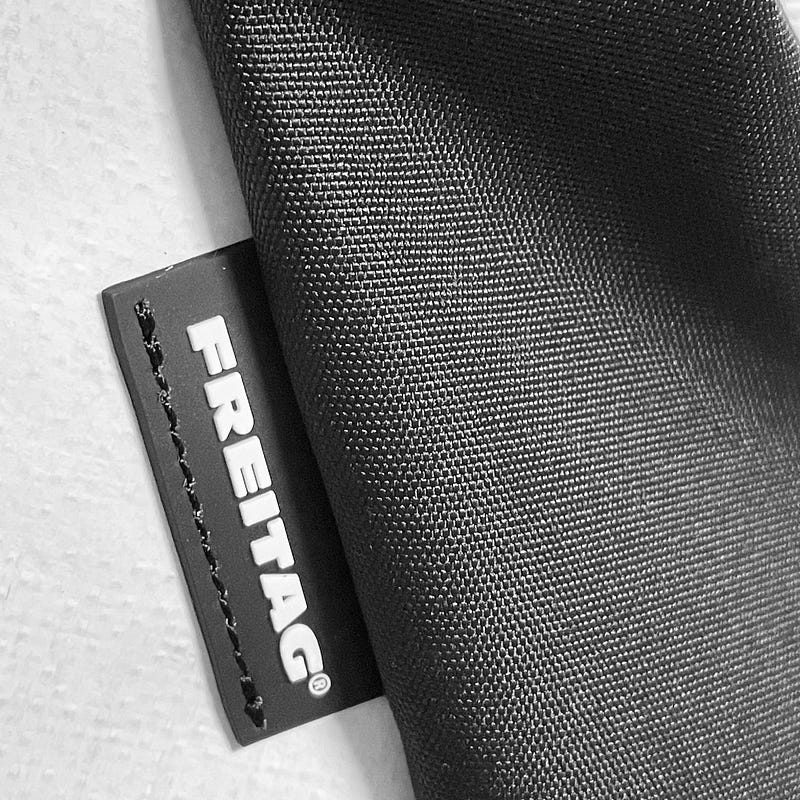

自宅で仕事する生活になって、変わったことの一つに行動範囲が狭くなったことがあります。電車に乗るのがほぼ休日だけになり、ほとんどの生活を自宅と最寄りの商店街で済んでしまうのです。

これまでは、MacBookをもって出社していたので、リュックスタイルの大きめのカバンを使っていました。リュックスタイルのカバンは“近所にちょっとお買い物”に使うにはオーバースペックすぎるので、たまたまタイミングよく入手したノベルティのエコバッグを使っていました。

これまでは、平日の映画やライブイベントなどは仕事おわりにオフィスから直接向かうことが多く、仕事で使うMacBookを抱えて移動することが多かったのですが、今は自宅で仕事を終えてから向かうので、そもそも持ち歩くべき荷物が減り、必然的にカバンが小さくなります。

お財布だけだったら、小さいボディバッグ的なもので十分なのですが、途中スタバに寄る時間があったりして、iPad Proも持ち歩きたいとなるとそうはいかなくなります。試しにエコバッグで移動してみると、これがちょうどよかったのです。サイズ的にもそうですし、カジュアルさ、手軽さがちょうどフィットする感覚がありました。これまでもずっとトートバッグのスタイルにするのであれば、耐久性にも優れ、チャックが付いているトートバッグを導入すべきだなと思っていました。

というわけで、手軽なサイズのトートバッグを探していたのですが、エコバッグ的なカジュアルすぎるものか、皮を使ったちょっと格式が高そうなものばかりが目についてしまいました。

その中で目をつけたのが、Freitag F620 DAVIANです。Freitagはもともと運送用トラックに使われていた幌の生地を使うバッグメーカーですが、ここ数年はペットボトルをリサイクルして作られた柔らかめの素材を導入し、以前のものよりデザイン性に優れ、また使いやすいものが多くなりました。F620もそのシリーズです。

自分がFreitagを選ぶのは、防水性に優れているから。傘をさすのが苦手で、ちょっとした雨だったらそのまま歩いてしまうことが多く、カバンの防水性は大事なのです。

渋谷と銀座に直営店があるので、そこでサイズ感を確認しつつ、サイトから購入しました。Freitagは、幌をリサイクルしている関係で、同じ柄が生まれにくく、自分の好きな柄を探して買うのがポイントです。元々ブラックを狙っていたのですが、もともと黒の面積が多い幌もないんですかね、あんまり出てこないレアアイテムなので、そこは少し妥協しました。

ちなみにFreitagはサイトから買うと、本社であるスイスから発送されます。ドイツ、中国を経て日本に入ってくるのですが、今回は日本の税関で1週間ほど待たされました。

[https://www.freitag.ch/ja](https://www.freitag.ch/ja)

サイズ感はiPad Pro 12.9を入れるのにピッタリ。16インチMacBook Proも問題なく入るサイズです。インナーポケットも2つあり、すぐに取り出したいものを入れることもできますし、アウターにポケットもあるので、そこにペットボトルを入れることもできます。

F620の特徴は長い紐。ちょっと歩きたいときには、反対側の肩にひっかけて簡易的なリュックスタイルにもできます。暑い日にはちょっと背中が蒸れますけど。

トートバッグスタイルはカメラを取り出しやすいというのもポイント。このトートバッグとGR IIIの組み合わせはちょっとしたお出かけの相棒として、活躍してくれると思います。