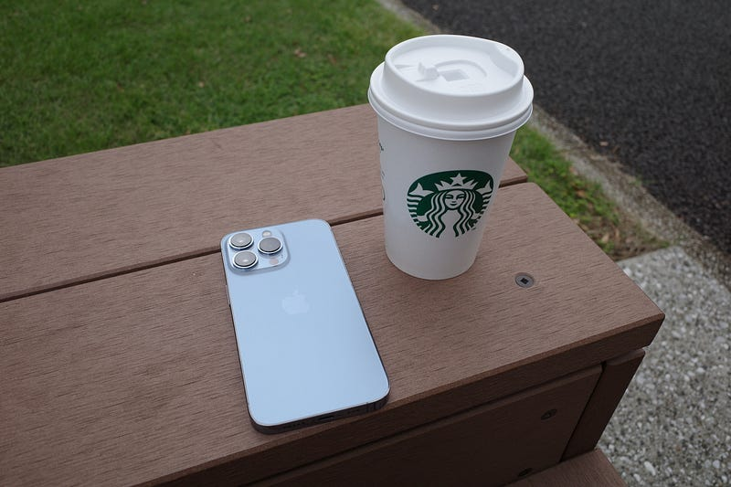

iPhone 13 Pro を金曜日に手に入れました。今回は配送ではなく、Apple Storeでの受け取りにしました。

当日はちょっと早めに到着し、Apple丸の内のカウントダウンを見守るところから。ハイタッチがなくなった発売開始の合図は、それはそれで良いのではと思います。Apple丸の内は、日本におけるメディア対応店舗にされることが多く、今回もたくさんのメディアがいて、最初に購入された方はメディアに囲まれてました。大変だ。

iPhone 13 Pro を受け取り、近くのスタバでそのままセットアップ。セットアップが終わるまではSuicaが使えないので電車に乗れません。

初期セットアップでは、いつもMacを使ったバックアップを使って移行しているのですが、今回はiCloudバックアップを使ってやってみることにしました。結論から言うととてもスムーズ。前のiPhoneとペアリングしていたApple Watchも自動的にペアリングが移行され、よくわからないレベルで快適でした。

移行は大体2時間くらいで終わりました。といってもアプリのダウンロードを待っていたり、このトラブルの検証してたりした時間がほとんどでした。

注意したいのは、SuicaとLINEの移行だけ。Suicaは同じカードの複製がNGなので、前のiPhoneから削除しないと新しいiPhoneのウォレットに追加することができません。LINEはアプリ内で移行の手続きをする必要があります。

移行は大体2時間くらいで終わりました。といってもアプリのダウンロードを待っていたり、このトラブルの検証してたりした時間がほとんどでした。

[**iPhone 13 で「Apple Watch でロック解除」が機能しない場合**  
_この問題は、今後のソフトウェアアップデートで解決する見込みです。アップデートが公開されるまでの間は、「Apple Watch でロック解除」をオフにして、パスコードを使って iPhone 13 のロックを解除してください。_support.apple.com](https://support.apple.com/ja-jp/HT212828 "https://support.apple.com/ja-jp/HT212828")

iPhone 13 Proは、なぜか1年前にiPhone 12 Pro を初めて触ったときと比べると、ものとしての進化を感じることが多いです。

そして今回の注目である接写を少しやってみることにしました。結論から書くと、距離感を掴むのにとても苦労しました。

iPhone 13 Proには３つのレンズがついています。そして、それとは別にカメラアプリには主に３つの倍率が選べます。倍率によってどのレンズが使われるかが選択されるのではなく、被写体との距離と撮りたい倍率によってどのレンズを使うかが選ばれ、そのまま被写体に近づくことで、アプリ側が勝手にマクロ撮影モードに切り替わります。マクロだとレンズと被写体の距離が近すぎるため、倍率に応じてレンズが切り替わると写ってるものが変わります。

この辺りの感覚を掴むには、何度も失敗を繰り返しながら身につけていく必要がありそうです。

ちなみに上の写真は3mmくらいのつぼみを撮ったものですが、被写体が揺れていたこともあり、フォーカスが甘い状態になってしまっています。

以上、iPhone 13 Pro のとても簡単なファーストインプレッションでした。動画撮影は滅多にしないので、シネマティック撮影を試すのはいつのことになるかわかりません。それでは。