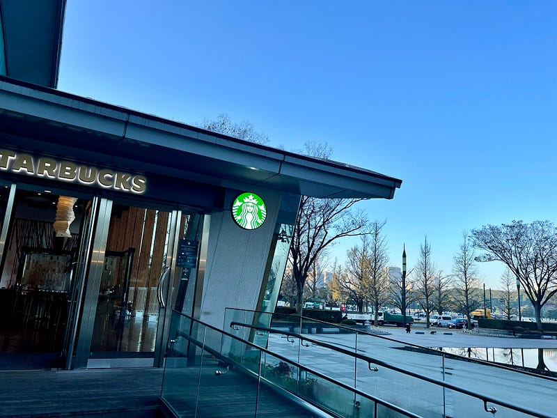
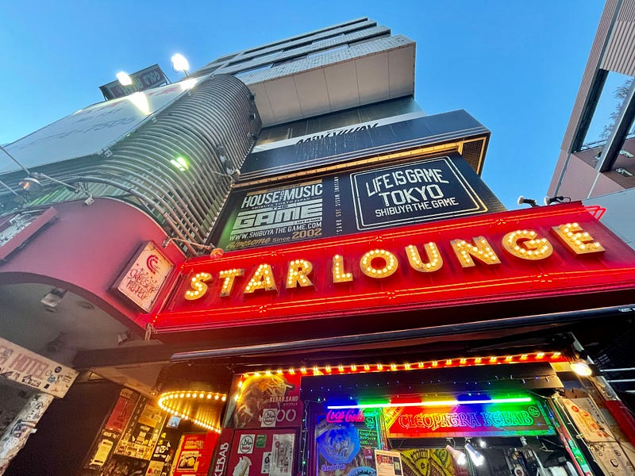
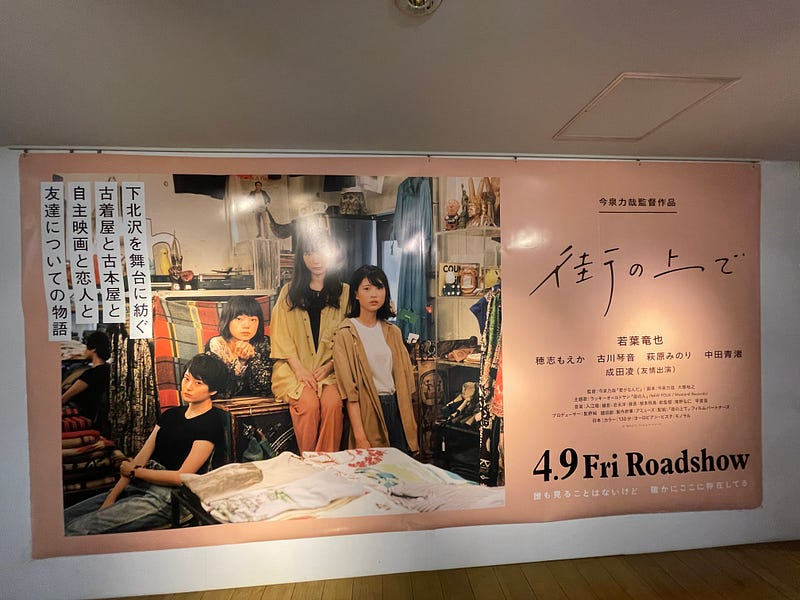

2021年ももうすぐ終わり、ということで、年1回のまとめです。「ライブ・イベント」「音楽」「映画」とまとめていますが、全体的に長くなってしまったので、興味があるところだけ読んでいただければ。

#### ライブ・イベント

今年は、感染症の状況や、ハコやイベントごとに違う感染対策の状況を見ながらおそるおそるイベントに参加してみた、というそんな年だったと思います。結果的には、ライブハウスの中よりも、駅からライブハウスの間の夜の繁華街の方がとてもリスクが高いように感じていました。

今年の初ライブは1月30日に開催された “Head of Triangle リリースツアー” @ Star Launge。このハコに来ること自体も初めてということもあり、不安な気持ちを抱えながらの参加でした。その場にいる時点で不安になっても仕方ないんですけどね。昨年は年末のフェスをたくさん失くなってしまったので、このライブが本当に久しぶりのライブになりました。

赤い公園がラストライブをやりきって解散したのは今年5月28日。感染症対策のため、中野サンプラザのキャパの半分で開催されたライブは、チケットが当たらずオンラインで視聴。最後の最後まで、赤い公園らしい、ほのぼのとした空気感に溢れた素晴らしいライブでした。

ライブにはオンライン配信があるのが当たり前になってきていますが、そういう視聴機会の拡大も手伝って、昨年後半から少しずつアイドルのステージを見るようになってきました。ロックバンドのライブとは造りや考え方が違うステージに戸惑いはあったのですが、ステージ上の動線の作り方、大道具の使い方、そのステージだけの特別な振りなど、いろんなことを知っていくうちに、これはストーリーのないミュージカルと思って向き合うとよいのではと感じるようになりました。

ロックバンドは、端的にいえば、路上ライブがハコ付きになり、大きくなったというステージであることが多く、音とともに演奏を楽しむというものになっていますが、それとは違う、大きなギミックがあるセットなどステージングを楽しむという感覚は新鮮で、そういう形だからこそオンラインでも十分楽しめるようにも感じました。

音楽はオンライン・サブスクで楽しむような時代になったということを強く感じています。CDは音楽を楽しむために買うのではなく、ノベルティグッズを買う感覚で購入されていることが多いのではないでしょうか。

その中で、日本でだけ、ロック、バンドサウンドが聞かれているという状況が生まれつつあります。DTMの文脈から出てきたYOASOBIも、テレビなどではバンドの形態でライブをやっています。世界的に稀有な文化をこれからも生み出しそうな気配を感じています。

#### 音楽

年末の投稿では、その年にリリースされたアルバムの中から自分がよく聴いているものを毎年紹介しています。そして、この2021年末に自分が紹介したいバンドが3つあります。 For Tracy Hyde / My Lucky Day / snooty の3バンドです。難しいことは書かないので、まずは聞いてみてください。もし好きな音楽になってくれたら嬉しいです。

My Lucky Day は熊本、snootyは福岡を拠点にしているバンドで、実はまだライブで見たことはないので、来年こそはと思っています。

他にあげるとすれば、くるり、そして Laura day romance ですかね。「野球」は名曲だと思いますし、「fever」のどことなく人懐っこいメロディは落ち着きます。

#### 映画

今年もライブイベントは中止や延期が続いたりしていて、Jリーグもアウェイ席設置なしなどの対策が続いていたこともあり、出かける場所といえば公園か映画館かというくらい、映画館にはよく通った一年だったと思います。

そんな中で、今年見てよかった映画を紹介します。絞りきれないので列挙するとこんな感じでした。

**「あの頃」**

[**映画『あの頃。』の感想・レビュー\[17412件\] | Filmarks**  
_レビュー数：17412件 ／ 平均スコア：★★★★3.6点_filmarks.com](https://filmarks.com/movies/88689 "https://filmarks.com/movies/88689")

**「あのこは貴族」**

[**映画『あのこは貴族』の感想・レビュー\[13682件\] | Filmarks**  
_レビュー数：13682件 ／ 平均スコア：★★★★4.0点_filmarks.com](https://filmarks.com/movies/91050 "https://filmarks.com/movies/91050")

**「まともじゃないのは君と一緒」**

[**映画『まともじゃないのは君も一緒』の感想・レビュー\[22761件\] | Filmarks**  
_まともじゃないのは君も一緒の映画情報。7197件のレビュー(口コミ・感想・評価)、内容・ネタバレ、あらすじ、予告編・予告動画、公開映画館情報、公開スケジュール、監督・出演者の関連映画情報、まともじゃないのは君も一緒の動画を配信している動画配…_filmarks.com](https://filmarks.com/movies/89314 "https://filmarks.com/movies/89314")

**「街の上で」**

[**映画『街の上で』の感想・レビュー\[17603件\] | Filmarks**  
_レビュー数：17603件 ／ 平均スコア：★★★★4.1点_filmarks.com](https://filmarks.com/movies/85972 "https://filmarks.com/movies/85972")

**「サマーフィルムにのって」**

[**映画『サマーフィルムにのって』の感想・レビュー\[10833件\] | Filmarks**  
_全力で駆け抜けていく青春映画最高でした。映像の色彩も淡くてキラキラしてるんだけどどこか儚い感じ。非常に満足感のある映画で、今求めていた感情を味わうことができた。なんか頑張れる気がした。創作意欲が湧いた。何かに全力になって悩みもがきながらも突…_filmarks.com](https://filmarks.com/movies/93097 "https://filmarks.com/movies/93097")

**「かけそきサンカヨウ」**

[**映画『かそけきサンカヨウ』の感想・レビュー\[1694件\] | Filmarks**  
_レビュー数：1694件 ／ 平均スコア：★★★★3.8点_filmarks.com](https://filmarks.com/movies/96796 "https://filmarks.com/movies/96796")

**「ひらいて」**

[**映画『ひらいて』の感想・レビュー\[3594件\] | Filmarks**  
_レビュー数：3594件 ／ 平均スコア：★★★★3.9点_filmarks.com](https://filmarks.com/movies/95431 "https://filmarks.com/movies/95431")

**「彼女が好きなものは」**

[**映画『彼女が好きなものは』の感想・レビュー\[1654件\] | Filmarks**  
_レビュー数：1654件 ／ 平均スコア：★★★★4.1点_filmarks.com](https://filmarks.com/movies/95899 "https://filmarks.com/movies/95899")

昨年の緊急事態宣言による映画館の営業中止に伴う公開延期された映画が、今年上映になるということもあって、映画に関わる方々は大変だったんじゃないかと思います。

すでに配信されているものもあれば、まだ劇場公開されている映画もあるので、気になるものがあればチェックしてみてください。

#### 最後に

今年はミニシアターに通って映画を見て、ライブイベントを主にオンラインで楽しみ、たまにハコに行き、そして日常のBGMとしてたくさんの音楽を聴き、という一年でした。

特に、ライブイベントでは発声が禁止されているので、鳴っている音・意図された演出をじっくり楽しめる状況が続いたのは、稀有な経験だなと思っています。

一方で、Jリーグでは、チャントを聞くこともなく、チームを離れてしまった選手もいたりします。そのことには、とても残念な気持ちを持っています。

同じような状況があと数年続くような感覚もあります。ちょっとずつ、楽しい気持ちを味わいながら、生活していけるといいなと思います。来年も、これからも。