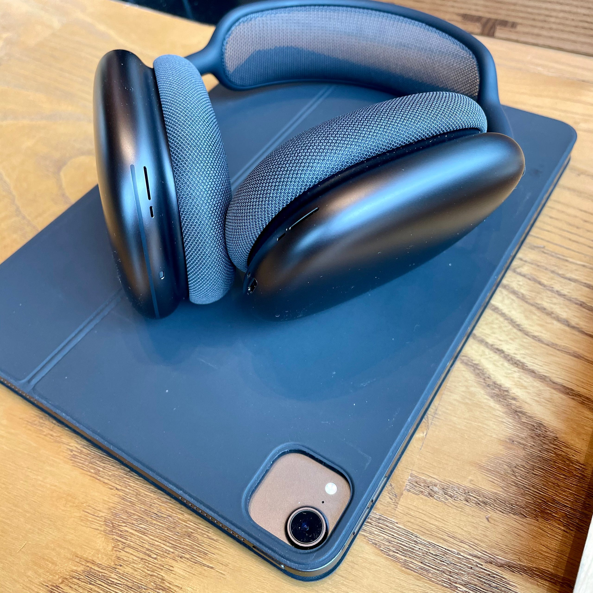

AirPods Maxが発売されて1ヶ月が経った、ということで、改めてレビューを。

1ヶ月間ほぼ毎日のように使っていて、これからも使っていきたいと思う。他のヘッドフォンとも併用して使っていて、従来のヘッドフォンとは使いたいシーンが異なるヘッドフォンだ、とも思う。

一番使いたくなるシーンは、自宅やカフェで、ディスプレイに向き合っている時。これはファーストインプレッションでも言及した通りだ。作業をしているときのBGMとして、映画を見るときに音を聞く装置として、使うのが一番しっくりくる。

映画は音量を大きめにすることで映画館に近い状況を簡単に作り出せる。パーソナルシアターが簡単に作れる。Apple TVを使ってテレビで映画を再生しながら、サウンドをAirPods Maxで爆音で聴くというのがとても心地よい。Apple TVは空間オーディオに対応していないが、いまのところ空間オーディオ（というかDolby Atoms）に対応したコンテンツを見る機会が多くなさそうなので十分だ。

ミュージシャンのライブをストリーミングで見る機会も増えてきた。そういう時にAirPods Maxを使うと、臨場感のあるライブステージを楽しめる。自宅で迫力を求めるには画質よりも音質なのだということを感じる。ドライバが大きく、空気を振動させることができるので、バスドラムやベースの迫力ある振動を耳元で再現してくれる。AirPods Maxの登場で、ライブストリーミングを見るための環境が完成した感覚もある。ライブストリーミングプラットフォームがまだまだブラウザベースで、なかなかアプリ化されないのが残念ではある。

また、バッテリーが40時間なので、ビデオ会議などでのスピーカーとして使うことも十分可能だ。

要するに、室内にいる間ずっと使ってられるヘッドフォンなのだ。あまりにも快適なので、テレビの音声をBluetoothで飛ばすようにしようかと考えてしまうほど。テレビよりもWOWOWオンデマンドやTVerで見たいという気持ちも出てきている。日本の住宅事情を考えれば、HomePodをステレオペアするよりもよっぽどおすすめできる。

一方、散歩のお供には向かない。どうしても爆音で聴きたくなるが故、音を聞く以外の動作をしたくなくなるのだ。BGMとして音楽を聞く場合は、AirPods Proを今後も使うことになるだろう。もしかしたら、Beats Solo Proでもいいかもしれない。

今後、iPadのサウンド面の機能を削減していくのではという噂も出ていた。

[**iPad Pro 2021年モデル、サウンド回りを見直し？ | Rumor | Macお宝鑑定団 blog（羅針盤）**  
_中国サプライヤーの情報として、2021年3月に発表されると噂されている、iPad Pro 11-inch (3rd generation)、iPad Pro 12.9-inch (5th generation)に関して、iPad Pro…_www.macotakara.jp](http://www.macotakara.jp/blog/rumor/entry-40808.html "http://www.macotakara.jp/blog/rumor/entry-40808.html")

AirPods Maxでサウンド面が十分にカバーできるとなれば、iPadは映像に注力できるというのはその通りである。いっそのこと、30インチくらいのiPadを作って欲しい。