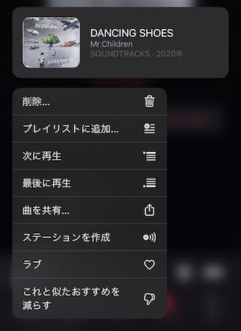

Mr.Children の最新作 SOUNDTRACKS が、2月14日に Apple Musicをはじめとするサブスクリプションサービスで配信開始となりました。12月2日の発売から74日。半年くらい待たされるかなと思っていたので、正直驚きの速さでした。

SOUNDTRACKSはもちろんCDで購入し、リッピングしたため「アップロード済み」としてライブラリに入っています。

「アップロード済み」のままでは、Apple Musicと連携が取れていないので、例えばメニューから「共有」が選べず、TwitterやInstagramにシェアできなかったり、共有プレイリストに入れることができなかったり、さまざまな制約が存在します。

「アップロード済み」を再生回数を残したまま「マッチ」にすることにしました。準備するのは macOS と iOS のそれぞれのデバイスです。

#### 1\. iOSで「ライブラリから削除」を選ぶ

iOSで「ライブラリから削除」すると、iOSのライブラリからその音楽が消えます。ところがmacOSのMusicアプリでは消えず残ってくれています。クラウド側のライブラリからは削除されるが、macOSのライブラリには残っているという状態になります。

#### 2\. macOS Musicアプリで「ライブラリに追加」する

ここでライブラリに追加をすると、「マッチ」しているかどうかを確認する処理が始まります。Apple Musicのライブラリにある曲と照合して、Apple Musicに曲があれば「マッチ」になります。

比較的簡単にできます。というわけで、CDフラゲしてリッピングしてるけど、「マッチ」にしたい、などというときにお使いください。

**追記（2022/12/09）**

この記事たくさん参照されているようなので追記。この方法で確かにマッチにはできるのですが、この記事の後に出てきた「ハイレゾ」とか「歌詞」とかそういう機能が利用できない可能性もあり、今では推奨しません。一旦削除して追加し直しましょう。