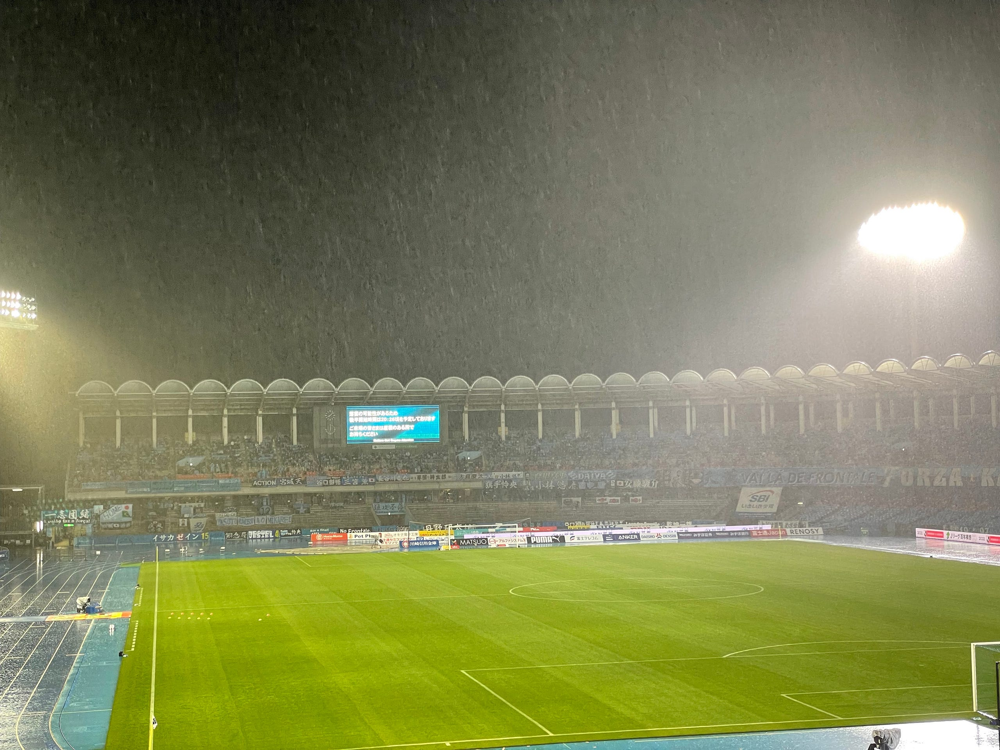

2021年J1も第10節が終わったのでここで振り返りをしたいと思います。今年の試合は38試合。約2カ月間で1/4を走り抜けた形になります。過密すぎます。

ここでこれまでの結果をざっと見てみます。

#1 ホーム 1–2 vs 名古屋グランパス

#2 アウェイ 2–2 vs 清水エスパルス

#3 ホーム 1–3 vs 横浜F・マリノス

#4 アウェイ 2–1 vs 徳島ヴォルティス

#5 ホーム 1–0 vs 鹿島アントラーズ

#6 アウェイ 0–0 vs サガン鳥栖

#7 ホーム 1–2 vs 北海道コンサドーレ札幌

#8 アウェイ 0–0 vs ガンバ大阪

#9 アウェイ 2–2 vs セレッソ大阪

#10 ホーム 1–0 vs FC東京

#19 アウェイ 1–3 vs 川崎フロンターレ

勝ち点 13 / 平均勝ち点 1.18 / ゴール数 12

#### これまでの感想と総括

過密日程が続いているわけですが、その最中FW陣に怪我、そのほかのコンディション不良で試合に出られない選手が多くあり、うまくケアをしながら戦ったと言えると思います。

J2 2位で上がったチームとしては、J1最下位からのスタートというわけで、その目線から見ればよくやっていると言える。ただし、目指してるのは勝ち点50、平均勝ち点1.3。その目線から見れば勝ち点が（少し）物足りない。

ガンバ、セレッソ、フロンターレにはいい試合ができました。FC東京には勝ち切ることができました。最初はJ1のJ2との違いを見せられてもいましたが、「惜しい」「もう少しで勝てる」というタラレバが言えるほどにまでは成長してきたチーム。昨年J2から始まった流れがいい方向に継続できているのを感じます。勝ち切る試合をもっと多くみたいです。

合流が遅れていた、外国籍枠の選手も無事加入し、あとはどれだけ早くチームにフィットして、いつ試合に出れるかというところに興味が集まります。外国籍枠に8人抱えるチームの悩ましい選択が早く始まって欲しいと思います。

過密スケジュールは５月も続きます。試合をこなしながらどこまで個々のレベルを、チームのレベルをどこまで上げていけるか、楽しみながら見ていきたいと思います。

１周目が終わる第18節は6月19日。あと2カ月余りです。その時にどの立ち位置にいるか、楽しみです。